<h1 align="center">Kubernetes CKA 学习笔记</h1>

- [0 Docker 快速入门](#0-docker-快速入门)
  - [0.1 Docker 概念和安装](#01-docker-概念和安装)
    - [0.1.1 Docker 是什么](#011-docker-是什么)
    - [0.1.2 Docker 基本组成](#012-docker-基本组成)
    - [0.1.3 版本与支持平台](#013-版本与支持平台)
    - [0.1.4 Docker 安装](#014-docker-安装)
  - [0.2 镜像管理](#02-镜像管理)
    - [0.2.1 镜像是什么](#021-镜像是什么)
    - [0.2.2 配置加速器](#022-配置加速器)
    - [0.2.3 镜像常用管理命令](#023-镜像常用管理命令)
  - [0.3 容器管理](#03-容器管理)
    - [0.3.1 创建容器常用选项](#031-创建容器常用选项)
    - [0.3.2 常用管理命令](#032-常用管理命令)
    - [0.3.3 容器数据持久化](#033-容器数据持久化)
    - [0.3.4 容器网络](#034-容器网络)
  - [0.4 Dockerfile 构建镜像](#04-dockerfile-构建镜像)
    - [0.4.1 Dockerfile 概述](#041-dockerfile-概述)
    - [0.4.2 Dockerfile 常用指令](#042-dockerfile-常用指令)
    - [0.4.3 构建镜像命令](#043-构建镜像命令)
    - [0.4.4 构建 Nginx 镜像](#044-构建-nginx-镜像)
    - [0.4.5 构建 Tomcat 镜像](#045-构建-tomcat-镜像)
  - [0.5 Harbor 镜像仓库搭建与使用](#05-harbor-镜像仓库搭建与使用)
    - [0.5.1 Harbor 概述](#051-harbor-概述)
    - [0.5.2 部署先决条件和部署](#052-部署先决条件和部署)
    - [0.5.3 基本使用](#053-基本使用)
- [1 Kubernetes 核心概念](#1-kubernetes-核心概念)
  - [1.1 有 Docker 为什么还用 Kubernetes](#11-有-docker-为什么还用-kubernetes)
  - [1.2 Kubernetes 是什么](#12-kubernetes-是什么)
  - [1.3 Kubernetes 集群架构和组件](#13-kubernetes-集群架构和组件)
  - [1.4 熟悉官方文档](#14-熟悉官方文档)
- [2 Kubernetes 集群搭建](#2-kubernetes-集群搭建)
  - [2.1 生产环境部署 K8s 的两种方式](#21-生产环境部署-k8s-的两种方式)
  - [2.2 服务器硬件配置推荐](#22-服务器硬件配置推荐)
  - [2.3 使用 kubeadm 快速部署一个 K8s 集群](#23-使用-kubeadm-快速部署一个-k8s-集群)
    - [2.3.1 操作系统初始化配置](#231-操作系统初始化配置)
    - [2.3.2 安装 Docker](#232-安装-docker)
    - [2.3.3 创建一个 Master 节点](#233-创建一个-master-节点)
    - [2.3.4 将一个 Node 节点加入到当前集群中](#234-将一个-node-节点加入到当前集群中)
    - [2.3.5 部署容器网络（CNI）](#235-部署容器网络cni)
    - [2.3.6 部署 Web UI（Dashboard）](#236-部署-web-uidashboard)
  - [2.4 部署的网络组件起什么作用](#24-部署的网络组件起什么作用)
  - [2.5 Kubernetes 将弃用 Docker](#25-kubernetes-将弃用-docker)
    - [2.5.1 弃用原因](#251-弃用原因)
    - [2.5.2 切换容器引擎为 Containerd](#252-切换容器引擎为-containerd)
  - [2.6 Kubeconfig 配置文件](#26-kubeconfig-配置文件)
  - [2.7 kubectl 命令行管理工具](#27-kubectl-命令行管理工具)
  - [2.8 牛刀小试快速部署一个网站](#28-牛刀小试快速部署一个网站)
  - [2.9 基本资源概念](#29-基本资源概念)
- [3 Kubernetes 监控和日志](#3-kubernetes-监控和日志)
  - [3.1 查看集群资源状况](#31-查看集群资源状况)
  - [3.2 监控集群资源利用率](#32-监控集群资源利用率)
  - [3.3 管理 K8s 组件日志](#33-管理-k8s-组件日志)
  - [3.4 管理 K8s 应用日志](#34-管理-k8s-应用日志)
  - [3.5 收集 K8s 日志思路](#35-收集-k8s-日志思路)
- [4 Kubernetes 管理应用生命周期](#4-kubernetes-管理应用生命周期)
  - [4.1 在 Kubernetes 中部署应用流程](#41-在-kubernetes-中部署应用流程)
  - [4.2 服务编排（YAML）](#42-服务编排yaml)
    - [4.2.1 YAML 文件格式说明](#421-yaml-文件格式说明)
    - [4.2.2 YAML 文件创建资源对象](#422-yaml-文件创建资源对象)
  - [4.3 Deployment 工作负载均衡器](#43-deployment-工作负载均衡器)
    - [4.3.1 介绍](#431-介绍)
    - [4.3.2 应用生命周期管理流程](#432-应用生命周期管理流程)
    - [4.3.3 应用部署](#433-应用部署)
    - [4.3.4 应用升级](#434-应用升级)
    - [4.3.5 水平扩缩容](#435-水平扩缩容)
    - [4.3.6 回滚](#436-回滚)
    - [4.3.7 滚动升级与回滚实现机制](#437-滚动升级与回滚实现机制)
  - [4.4 Pod 对象](#44-pod-对象)
    - [4.4.1 基本概念](#441-基本概念)
    - [4.4.2 存在的意义](#442-存在的意义)
    - [4.4.3 资源共享实现机制](#443-资源共享实现机制)
    - [4.4.4 管理命令](#444-管理命令)
    - [4.4.5 应用自修复（重启策略+健康检查）](#445-应用自修复重启策略健康检查)
    - [4.4.6 环境变量](#446-环境变量)
    - [4.4.7 Init container](#447-init-container)
    - [4.4.8 静态 Pod](#448-静态-pod)
- [5 Kubernetes 调度](#5-kubernetes-调度)
  - [5.1 创建一个 Pod 的工作流程](#51-创建一个-pod-的工作流程)
  - [5.2 Pod 中影响调度的主要属性](#52-pod-中影响调度的主要属性)
  - [5.3 资源限制对 Pod 调度的影响](#53-资源限制对-pod-调度的影响)
  - [5.4 nodeSelector & nodeAffinity](#54-nodeselector--nodeaffinity)
    - [5.4.1 nodeSelector](#541-nodeselector)
    - [5.4.2 nodeAffinity](#542-nodeaffinity)
  - [5.5 Taints & Tolerations](#55-taints--tolerations)
  - [5.6 nodeName](#56-nodename)
  - [5.7 DaemonSet 控制器](#57-daemonset-控制器)
  - [5.8 调度失败原因分析](#58-调度失败原因分析)
- [6 Kubernetes 网络](#6-kubernetes-网络)
  - [6.1 Service 控制器](#61-service-控制器)
    - [6.1.1 Service 存在意义](#611-service-存在意义)
    - [6.1.2 Pod 与 Service 的关系](#612-pod-与-service-的关系)
    - [6.1.3 Service 定义与创建](#613-service-定义与创建)
    - [6.1.4 Service 三种类型](#614-service-三种类型)
    - [6.1.5 Service 代理模式](#615-service-代理模式)
    - [6.1.6 Service DNS 名称](#616-service-dns-名称)
  - [6.2 Ingress 对象](#62-ingress-对象)
    - [6.2.1 Ingress 为弥补 NodePort 不足而生](#621-ingress-为弥补-nodeport-不足而生)
    - [6.2.2 Pod 与 Ingress 的关系](#622-pod-与-ingress-的关系)
    - [6.2.3 Ingress Controller](#623-ingress-controller)
    - [6.2.4 Ingress 规则配置](#624-ingress-规则配置)
    - [6.2.5 Ingress 规则配置 HTTPS](#625-ingress-规则配置-https)
    - [6.2.6 小结](#626-小结)
- [7 Kubernetes 存储](#7-kubernetes-存储)
  - [7.1 数据卷与数据持久卷](#71-数据卷与数据持久卷)
    - [7.1.1 为什么需要数据卷](#711-为什么需要数据卷)
    - [7.1.2 临时数据卷 emptyDir](#712-临时数据卷-emptydir)
    - [7.1.3 节点数据卷 hostPath](#713-节点数据卷-hostpath)
    - [7.1.4 网络数据卷 NFS](#714-网络数据卷-nfs)
    - [7.1.5 持久数据卷概述](#715-持久数据卷概述)
    - [7.1.6 PV 和 PVC 使用流程](#716-pv-和-pvc-使用流程)
    - [7.1.7 PV 生命周期](#717-pv-生命周期)
    - [7.1.8 PV 动态供给（StorageClass）](#718-pv-动态供给storageclass)
  - [7.2 有状态应用部署初探](#72-有状态应用部署初探)
    - [7.2.1 StatefulSet 控制器介绍](#721-statefulset-控制器介绍)
    - [7.2.2 StatefulSet 部署应用实践](#722-statefulset-部署应用实践)
  - [7.3 应用程序数据存储](#73-应用程序数据存储)
    - [7.3.1 应用程序数据存储](#731-应用程序数据存储)
    - [7.3.2 ConfigMap 存储应用配置](#732-configmap-存储应用配置)
    - [7.3.3 Secret 存储敏感信息](#733-secret-存储敏感信息)
- [8 Kubernetes 安全](#8-kubernetes-安全)
  - [8.1 Kubernetes RBAC 授权](#81-kubernetes-rbac-授权)
    - [8.1.1 Kubernetes 安全框架](#811-kubernetes-安全框架)
    - [8.1.2 基于角色的权限访问控制 RBAC](#812-基于角色的权限访问控制-rbac)
    - [8.1.3 RBAC 授权案例](#813-rbac-授权案例)
  - [8.2 网络访问控制](#82-网络访问控制)
    - [8.2.1 网络访问控制应用场景](#821-网络访问控制应用场景)
    - [8.2.2 网络策略概述](#822-网络策略概述)
    - [8.2.3 网络访问控制 3 个案例](#823-网络访问控制-3-个案例)
- [9 Kubernetes 集群维护](#9-kubernetes-集群维护)
  - [9.1 Etcd 数据库备份与恢复](#91-etcd-数据库备份与恢复)
  - [9.2 K8s 集群版本升级](#92-k8s-集群版本升级)
  - [9.3 K8s 集群节点正确下线流程](#93-k8s-集群节点正确下线流程)
  - [9.4 K8s 集群故障排查](#94-k8s-集群故障排查)
    - [9.4.1 案例一](#941-案例一)
    - [9.4.2 案例二](#942-案例二)
    - [9.4.3 案例三](#943-案例三)
- [10 网站项目部署案例](#10-网站项目部署案例)
  - [10.1 容器交付流程](#101-容器交付流程)
  - [10.2 在 K8s 平台部署项目流程](#102-在-k8s-平台部署项目流程)
  - [10.3 在 K8s 平台部署 Java 网站项目](#103-在-k8s-平台部署-java-网站项目)
- [11 Jenkins 自动化发布网站项目（CI/CD）](#11-jenkins-自动化发布网站项目cicd)
  - [11.1 发布流程](#111-发布流程)
  - [11.2 使用 Gitlab 作为代码仓库 & 使用 Harbor 作为镜像仓库](#112-使用-gitlab-作为代码仓库--使用-harbor-作为镜像仓库)
  - [11.3 Jenkins 发布系统部署](#113-jenkins-发布系统部署)
  - [11.4 Jenkins 主从架构](#114-jenkins-主从架构)
    - [11.4.1 介绍](#1141-介绍)
    - [11.4.2 Kubernetes 插件配置](#1142-kubernetes-插件配置)
    - [11.4.3 自定义 Jenkins-Slave 镜像](#1143-自定义-jenkins-slave-镜像)
    - [11.4.4 测试主从架构是否正常](#1144-测试主从架构是否正常)
  - [11.5 Jenkins Pipeline（流水线）](#115-jenkins-pipeline流水线)
    - [11.5.1 介绍](#1151-介绍)
    - [11.5.2 语法](#1152-语法)
    - [11.5.3 案例](#1153-案例)
  - [11.6 Jenkins 流水线自动发布项目](#116-jenkins-流水线自动发布项目)
    - [11.6.1 思路](#1161-思路)
    - [11.6.2 部署到 K8s 平台](#1162-部署到-k8s-平台)
  - [11.7 流水线脚本与源代码一起版本管理](#117-流水线脚本与源代码一起版本管理)
  - [11.8 总结](#118-总结)

# 0 Docker 快速入门

## 0.1 Docker 概念和安装

### 0.1.1 Docker 是什么

- 使用最广泛的开源容器引擎
- 一种操作系统级别的虚拟化技术
- 依赖于 Linux 内核特性：Namespace（资源隔离）和 Cgroups（资源限制）
- 一个简单的应用程序打包工具

### 0.1.2 Docker 基本组成

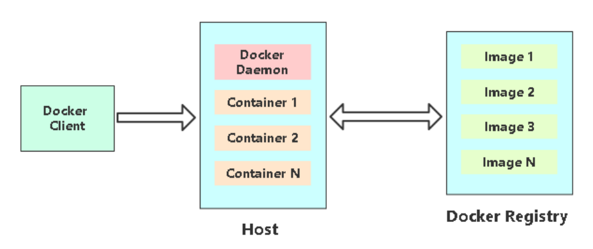

### 0.1.3 版本与支持平台

**Docker 版本：**

- 社区版（Community Edition，CE）
- 企业版（Enterprise Edition，EE）

**支持平台:**

- Linux（CentOS，Debian，Fedora，Oracle Linux，RHEL，SUSE 和 Ubuntu）
- Mac
- Windows

### 0.1.4 Docker 安装

```shell
# 安装前建议关闭 selinux 和 firewalld
sed -i 's/SELINUX=enforcing/SELINUX=disabled/g'/etc/sysconfig/selinux
setenforce 1
systemctl stop firewalld
systemctl disable firewalld
# 安装依赖包
yum install -y yum-utils 
# 添加 Docker 软件包源
yum-config-manager \
    --add-repo \
    https://download.docker.com/linux/centos/docker-ce.repo
# 安装 Docker CE
yum install -y docker-ce
# 启动 Docker 服务并设置开机启动
systemctl start docker
systemctl enable docker
```

相关链接：

- https://docs.docker.com/engine/install/centos/
- https://docs.docker.com
- http://mirrors.aliyun.com/docker-ce/linux/centos/docker-ce.repo

## 0.2 镜像管理

### 0.2.1 镜像是什么

- 一个分层存储的文件，不是一个单一的文件

- 一个软件的环境

- 一个镜像可以创建N个容器

- 一种标准化的交付

- 一个不包含 Linux 内核而又精简的 Linux 操作系统

### 0.2.2 配置加速器

Docker Hub 是由 Docker 公司负责维护的公共镜像仓库，包含大量的容器镜像，Docker 工具默认从这个公共镜像库下载镜像。

地址：https://hub.docker.com

配置镜像加速器：

```shell
cat > /etc/docker/daemon.json << EOF
{
  "registry-mirrors": ["https://b9pmyelo.mirror.aliyuncs.com"]
}
EOF

# 重启 Docker
systemctl restart docker
```

### 0.2.3 镜像常用管理命令

**命令格式：**`docker image COMMAND`

| 指令    | 描述                                       |
| ------- | ------------------------------------------ |
| ls      | 列出镜像                                   |
| build   | 构建镜像来自 Dockerfile                    |
| history | 查看镜像历史                               |
| inspect | 显示一个或多个镜像详细信息                 |
| pull    | 从镜像仓库拉取镜像                         |
| push    | 推送一个镜像到镜像仓库                     |
| rm      | 移除一个或多个镜像                         |
| prune   | 移除没有被标记或者没有被任何容器引用的镜像 |
| tag     | 创建一个引用源镜像标记目标镜像             |
| save    | 保存一个或多个镜像到一个 tar 归档文件      |
| load    | 加载镜像来自 tar 归档或者标准输入          |

## 0.3 容器管理

### 0.3.1 创建容器常用选项

**命令格式：**`docker run [OPTIONS] IMAGE [COMMAND] [ARG...]`

| 选项                                       | 描述                                                      |
| ------------------------------------------ | --------------------------------------------------------- |
| -i, --interactive                          | 交互式                                                    |
| -t, --tty                                  | 分配一个伪终端                                            |
| -d, --detach                               | 运行容器到后台                                            |
| -e, --env                                  | 设置环境变量                                              |
| -p, --publish list                         | 发布容器端口到主机                                        |
| -P, --publish-all                          | 发布容器所有 EXPOSE 的端口到宿主机随机端口                |
| --name string                              | 制定容器名称                                              |
| -h, --hostname                             | 设置容器主机名                                            |
| --ip string                                | 指定容器 IP，只能用于自定义网络                           |
| --network                                  | 连接容器到一个网络                                        |
| -v, --volume list; --mount mount（新方式） | 将文件系统附加到容器                                      |
| --restart string                           | 容器退出时重启策略，默认 no，可选值：[always\|on-failure] |
| -m, --memory                               | 容器可以使用的最大内存量                                  |
| --memory-swap                              | 允许交换到磁盘的内存量                                    |
| --memory-swappiness=<0-100>                | 容器使用 SWAP 分区交换的百分比（0-100，默认为-1）         |
| --oom-kill-disable                         | 禁用 OOM Killer                                           |
| --cpus                                     | 可以使用的 CPU 数量                                       |
| --cpuset-cpus                              | 限制容器使用特定的 CPU 核心，如（0-3, 0, 1）              |
| --cpu-shares                               | CPU 共享（相对权重）                                      |

### 0.3.2 常用管理命令

**命令格式：**`docker container COMMAND`

| 选项               | 描述                       |
| ------------------ | -------------------------- |
| ls                 | 列出容器                   |
| inspect            | 查看一个或多个容器详细信息 |
| exec               | 在运行容器中执行命令       |
| commit             | 从一个容器创建一个新镜像   |
| cp                 | 拷贝文件/文件夹到一个容器  |
| logs               | 获取一个容器的日志         |
| port               | 列出或指定端口映射         |
| top                | 显示一个容器运行的进程     |
| stats              | 显示容器资源使用统计       |
| stop/start/restart | 停止/启动一个或多个容器    |
| rm                 | 删除一个或多个容器         |
| prune              | 移除已停止的容器           |

### 0.3.3 容器数据持久化

Docker 提供 2 种方式将数据从宿主机挂载到容器中：

- Volumes：Docker管理宿主机文件系统的一部分（/var/lib/docker/volumes）

- Bind mounts：将宿主机上的任意位置的文件或者目录挂载到容器中

**Volumes 示例：**

- **创建数据卷**

  ```shell
  docker volume create nginx-vol
  docker volume ls
  docker volume inspect nginx-vol
  ```

- **使用数据卷**

  ```shell
  docker run -d --name=nginx-test --mount src=nginx-vol,dst=/usr/share/nginx/html nginx
  docker run -d --name=nginx-test -v nginx-vol:/usr/share/nginx/html nginx
  ```

**Bind mounts 示例：**

- **挂载宿主机目录到容器**

  ```shell
  docker run -d --name=nginx-test --mount type=bind,src=/app/wwwroot,dst=/usr/share/nginx/html nginx
  docker run -d --name=nginx-test -v /app/wwwroot:/usr/share/nginx/html nginx
  ```
  

### 0.3.4 容器网络

- veth pair：成对出现的一种虚拟网络设备，数据从一端进，从另一端出。 用于解决网络命名空间之间隔离。

- docker0：网桥是一个二层网络设备，通过网桥可以将 Linux 支持的不同的端口连接起来，并实现类似交换机那样的多对多的通信。

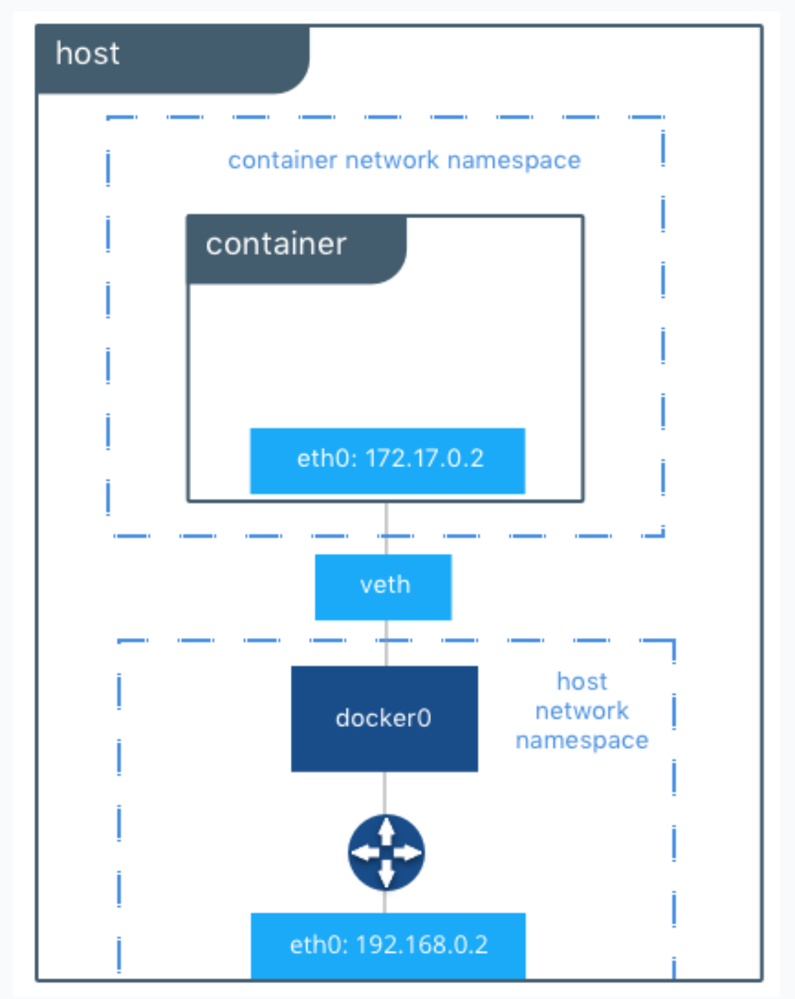

Docker使用iptables实现网络通信。

**外部访问容器：**

```shell
iptables -t nat -vnL DOCKER
```

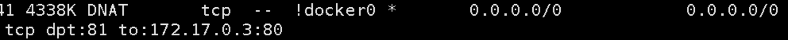

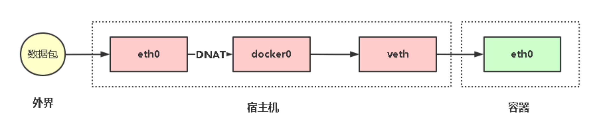

<h4 align="center">外部访问容器</h4>

**容器访问外部：**

```shell
iptables -t nat -vnL POSTROUTING
```


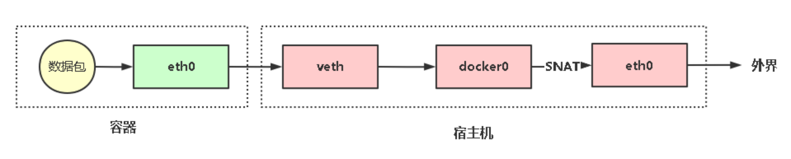

<h4 align="center">容器访问外部</h4>

## 0.4 Dockerfile 构建镜像

### 0.4.1 Dockerfile 概述

Docker 通过 Dockerfile 自动构建镜像，Dockerfile 是一个包含用于组建镜像的文本文件，由一条一条的指令组成。

```dockerfile
FROM centos:latest
RUN yum install gcc -y
COPY run.sh /usr/bin
EXPOSE 80
CMD [“run.sh”]
```

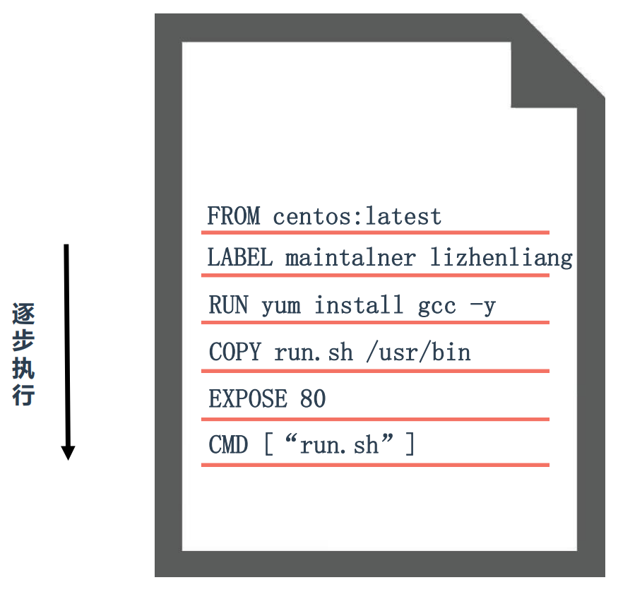

### 0.4.2 Dockerfile 常用指令

| 指令    | 描述                                                  |
| ------- | ----------------------------------------------------- |
| FROM    | 构建新镜像是基于哪个镜像                              |
| LABEL   | 标签                                                  |
| RUN     | 构建镜像时运行的 Shell 命令                           |
| COPY    | 拷贝文件或目录到镜像中                                |
| ADD     | 解压压缩包并拷贝                                      |
| ENV     | 设置边境变量                                          |
| USER    | 为 RUN、CMD 和 ENTRYPOINT 执行命令指定运行用户        |
| EXPOSE  | 声明容器运行的服务端口                                |
| WORKDIR | 为 RUN、CMD、ENTRYPOINT、COPY 和 ADD 设置工作目录     |
| CMD     | 运行容器时默认执行，如果有多个 CMD 指令，最后一个生效 |

### 0.4.3 构建镜像命令

Usage: `docker build [OPTIONS] PATH | URL | - [flags]`

Options:

- -t, --tag list    # 镜像名称

- -f, --file string    # 指定Dockerfile文件位置

```shell
docker build -t shykes/myapp .
docker build -t shykes/myapp -f /path/Dockerfile /path
docker build -t shykes/myapp http://www.example.com/Dockerfile
```

### 0.4.4 构建 Nginx 镜像

```dockerfile
FROM centos:7
LABEL maintainer www.iuskye.com
RUN yum install -y gcc gcc-c++ make \
    openssl-devel pcre-devel gd-devel \
    iproute net-tools telnet wget curl && \
    yum clean all && \
    rm -rf /var/cache/yum/*
ADD nginx-1.15.5.tar.gz /
RUN cd nginx-1.15.5 && \
    ./configure --prefix=/usr/local/nginx \
    --with-http_ssl_module \
	--with-http_stub_status_module && \
	make -j 4 && make install && \
	mkdir /usr/local/nginx/conf/vhost && \
	cd / && rm -rf nginx* && \
	ln -sf /usr/share/zoneinfo/Asia/Shanghai /etc/localtime
ENV PATH $PATH:/usr/local/nginx/sbin
COPY nginx.conf /usr/local/nginx/conf/nginx.conf
WORKDIR /usr/local/nginx
EXPOSE 80
CMD ["nginx", "-g", "daemon off;"]
```

### 0.4.5 构建 Tomcat 镜像

```dockerfile
FROM centos:7
MAINTAINER www.iuskye.com
ENV VERSION=8.5.43
RUN yum install java-1.8.0-openjdk wget curl unzip iproute net-tools -y && \
	yum clean all && \
	rm -rf /var/cache/yum/*
	ADD apache-tomcat-${VERSION}.tar.gz /usr/local/
RUN mv /usr/local/apache-tomcat-${VERSION} /usr/local/tomcat && \
	sed -i '1a JAVA_OPTS="-Djava.security.egd=file:/dev/./urandom"' 
	/usr/local/tomcat/bin/catalina.sh && \
	ln -sf /usr/share/zoneinfo/Asia/Shanghai /etc/localtime
ENV PATH $PATH:/usr/local/tomcat/bin
WORKDIR /usr/local/tomcat
EXPOSE 8080
CMD ["catalina.sh", "run"]
```

## 0.5 Harbor 镜像仓库搭建与使用

### 0.5.1 Harbor 概述

Harbor 是由 VMWare 公司开源的容器镜像仓库。事实上，Harbor 是在 Docker Registry 上进行了相应的企业级扩展，从而获得了更加广泛的应用，这些新的企业级特性包括：管理用户界面，基于角色的访问控制 ，AD/LDAP 集成以及审计日志等，足以满足基本企业需求。

- 官方：https://goharbor.io/

- Github：https://github.com/goharbor/harbor

### 0.5.2 部署先决条件和部署

**服务器硬件配置：**

- 最低要求：CPU 2核/内存4G/硬盘40GB
- 推荐：CPU 4核/内存8G/硬盘160GB

**软件：**

- Docker CE 17.06版本+ 
- Docker Compose 1.18版本+

**Harbor 安装有 2 种方式：**

- 在线安装：从 Docker Hub 下载 Harbor 相关镜像，因此安装软件包非常小 
- 离线安装：安装包包含部署的相关镜像，因此安装包比较大

**先安装 Docker 和 Docker Compose：**

- https://github.com/docker/compose/releases

**部署 Harbor HTTP：**

```shell
tar zxvf harbor-offline-installer-v2.0.0.tgz
cd harbor
cp harbor.yml.tmpl harbor.yml
vi harbor.yml
hostname: reg.iuskye.com
https: # 先注释 https 相关配置
harbor_admin_password: Harbor12345
./prepare
./install.sh
```

### 0.5.3 基本使用

**配置 http 镜像仓库可信任：**

```shell
vi /etc/docker/daemon.json
  {"insecure-registries":["reg.iuskye.com"]}

# 重启 Docker
systemctl restart docker
```

**打标签：**

```shell
docker tag centos:7 reg.iuskye.com/library/centos:7
```

**上传：**

```shell
docker push reg.iuskye.com/library/centos:7
```

**下载：**

```shell
docker pull reg.iuskye.com/library/centos:7
```

# 1 Kubernetes 核心概念

## 1.1 有 Docker 为什么还用 Kubernetes

企业需求：为提高业务并发和高可用，会使用多台服务器。

- 多容器跨主机提供服务

- 多容器分布节点部署

- 多容器怎么升级

- 高效管理这些容器

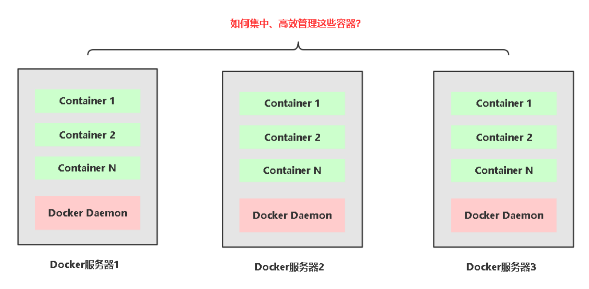

容器编排系统：

- **Kubernetes**

- **Swarm** 

- **Mesos Marathon**

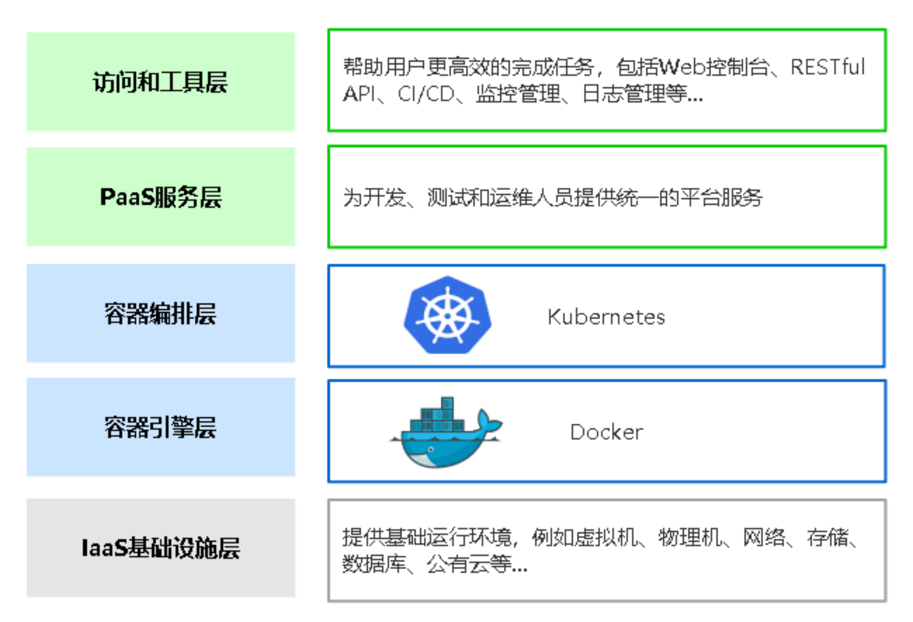

## 1.2 Kubernetes 是什么

Kubernetes 是 Google 在 2014 年开源的一个容器集群管理系统，Kubernetes 简称 K8s。 

Kubernetes 用于容器化应用程序的部署，扩展和管理，目标是让部署容器化应用简单高效。

官方网站：http://www.kubernetes.io

官方文档：https://kubernetes.io/zh/docs/home/

## 1.3 Kubernetes 集群架构和组件

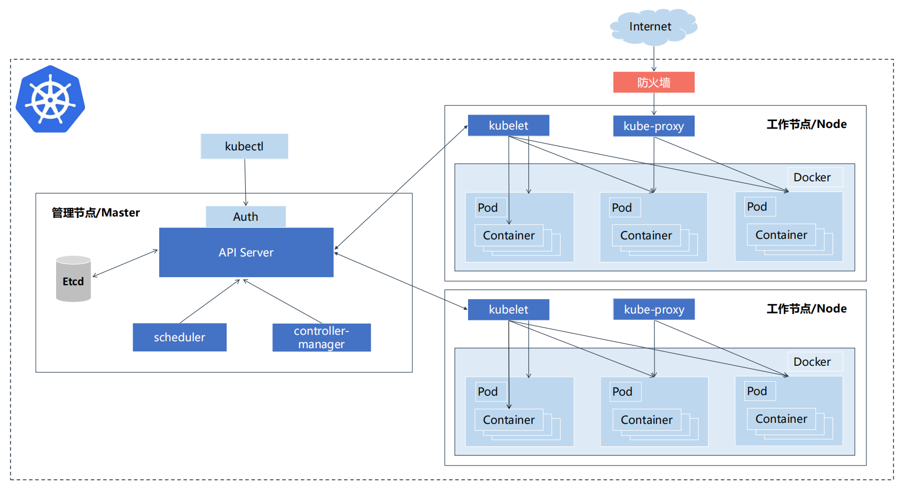

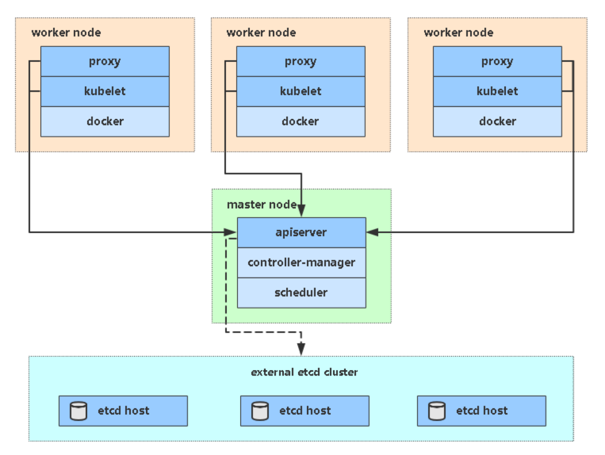

**Master 组件**

- **kube-apiserver**
  - Kubernetes API，集群的统一入口，各组件协调者，以 RESTful API 提供接口服务，所有对象资源的增删改查和监听操作都交给 APIServer 处理后再提交给 Etcd 存储；

- **kube-controller-manager**
  - 处理集群中常规后台任务，一个资源对应一个控制器，而 ControllerManager 就是负责管理这些控制器的，例如 Deployment、Service；

- **kube-scheduler**
  - 根据调度算法为新创建的 Pod 选择一个 Node 节点，可以任意部署, 可以部署在同一个节点上，也可以部署在不同的节点上；

- **etcd**
  - 分布式键值存储系统，用于保存集群状态数据，比如 Pod、Service 等对象信息。

**Node 组件**

- **kubelet**
  - kubelet 是 Master 在 Node 节点上的 Agent，管理本机运行容器的生命周期，比如创建容器、Pod 挂载数据卷、下载 secret、获取容器和节点状态等工作。kubelet 将每个 Pod 转换成一组容器。

- **kube-proxy**
  - 在 Node 节点上实现 Pod 网络代理，维护网络规则和四层负载均衡工作。

- **第三方容器引擎，例如 docker、containerd、podman**
  - 容器引擎，运行容器。

## 1.4 熟悉官方文档

官网文档：https://kubernetes.io/zh/docs/home/

重点熟悉：概念和任务。

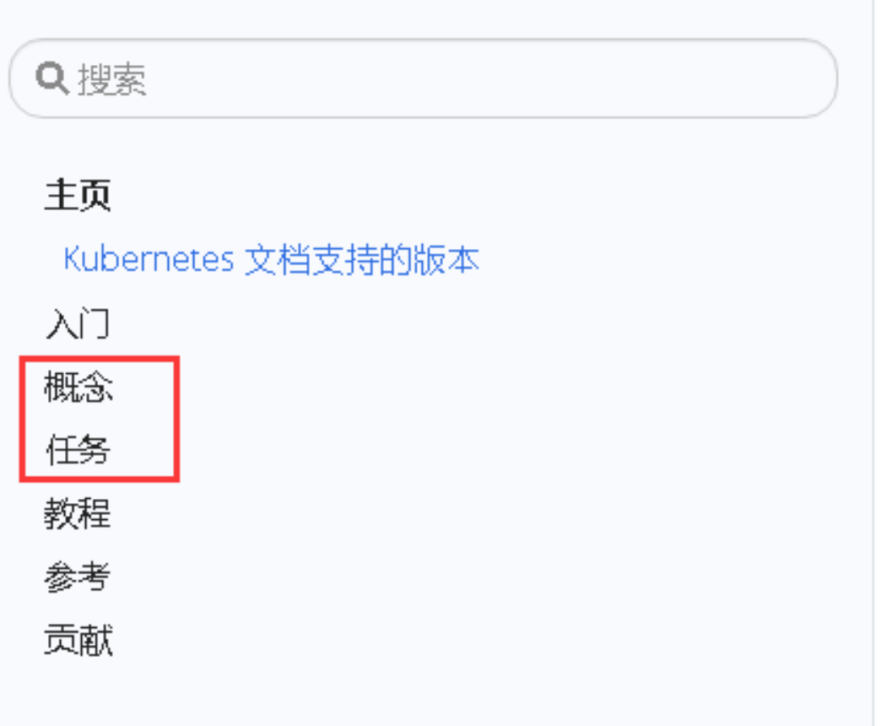

# 2 Kubernetes 集群搭建

## 2.1 生产环境部署 K8s 的两种方式

**kubeadm**

Kubeadm 是一个工具，提供 `kubeadm init` 和 `kubeadm join`，用于快速部署 Kubernetes 集群。

部署地址：https://kubernetes.io/docs/reference/setup-tools/kubeadm/kubeadm/

**二进制**

从官方下载发行版的二进制包，手动部署每个组件，组成 Kubernetes 集群。

下载地址：https://github.com/kubernetes/kubernetes/releases

**第三方工具或者 Web**

## 2.2 服务器硬件配置推荐

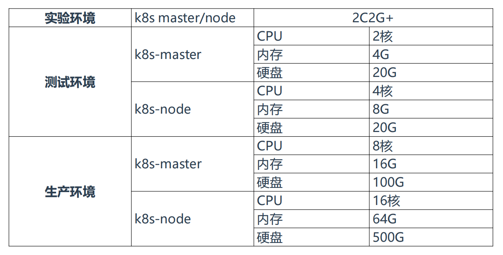

## 2.3 使用 kubeadm 快速部署一个 K8s 集群

### 2.3.1 操作系统初始化配置

```shell
# 关闭防火墙
systemctl stop firewalld
systemctl disable firewalld

# 关闭 selinux
sed -i 's/enforcing/disabled/' /etc/selinux/config  # 永久
setenforce 0  # 临时

# 关闭 swap
swapoff -a  # 临时
sed -ri 's/.*swap.*/#&/' /etc/fstab    # 永久

# 根据规划设置主机名
hostnamectl set-hostname <hostname>

# 在 master 添加 hosts
cat >> /etc/hosts << EOF
192.168.31.71 k8s-master
192.168.31.72 k8s-node1
192.168.31.73 k8s-node2
EOF

# 将桥接的 IPv4 流量传递到 iptables 的链
cat > /etc/sysctl.d/k8s.conf << EOF
net.bridge.bridge-nf-call-ip6tables = 1
net.bridge.bridge-nf-call-iptables = 1
EOF
sysctl --system  # 生效

# 时间同步
yum install ntpdate -y
ntpdate time.windows.com
```

### 2.3.2 安装 Docker

```shell
wget https://mirrors.aliyun.com/docker-ce/linux/centos/docker-ce.repo -O /etc/yum.repos.d/docker-ce.repo
yum -y install docker-ce
systemctl enable docker && systemctl start docker
```

```shell
cat > /etc/docker/daemon.json << EOF
{
  "registry-mirrors": ["https://b9pmyelo.mirror.aliyuncs.com"],
  "exec-opts": ["native.cgroupdriver=systemd"]
}
EOF

systemctl restart docker
docker info
```

### 2.3.3 创建一个 Master 节点

**添加阿里云 YUM 源**

```shell
cat > /etc/yum.repos.d/kubernetes.repo << EOF
[kubernetes]
name=Kubernetes
baseurl=https://mirrors.aliyun.com/kubernetes/yum/repos/kubernetes-el7-x86_64
enabled=1
gpgcheck=0
repo_gpgcheck=0
gpgkey=https://mirrors.aliyun.com/kubernetes/yum/doc/yum-key.gpg https://mirrors.aliyun.com/kubernetes/yum/doc/rpm-package-key.gpg
EOF
```

**安装 kubeadm、kubelet、kubectl**

```shell
yum install -y kubelet-1.23.5 kubeadm-1.23.5 kubectl-1.23.5
systemctl enable kubelet
```

**部署 Master**

```shell
# 192.168.31.71 为 master 节点 IP 地址
# 10.96.0.0/12 为 service IP 网段
# 10.244.0.0/16 为 pod IP 网段
kubeadm init \
  --apiserver-advertise-address=192.168.31.71 \
  --image-repository registry.aliyuncs.com/google_containers \
  --kubernetes-version v1.23.5 \
  --service-cidr=10.96.0.0/12 \
  --pod-network-cidr=10.244.0.0/16 \
  --ignore-preflight-errors=all
```

- --apiserver-advertise-address: 集群通告地址
- --image-repository: 由于默认拉取镜像地址 `k8s.gcr.io` 国内无法访问，这里指定阿里云镜像仓库地址
- --kubernetes-version: K8s 版本，与上面安装的一致
- --service-cidr: 集群内部虚拟网络，Pod 统一访问入口
- --pod-network-cidr: Pod 网络，与下面部署的 CNI 网络组件 yaml 中保持一致

初始化完成后，最后会输出一个 join 命令，先记住，下面用。

拷贝 kubectl 使用的连接 k8s 认证文件到默认路径：

```shell
mkdir -p $HOME/.kube
sudo cp -i /etc/kubernetes/admin.conf $HOME/.kube/config
sudo chown $(id -u):$(id -g) $HOME/.kube/config
```

查看工作节点：

```shell
kubectl get nodes
NAME               STATUS     ROLES            AGE   VERSION
k8s-master   NotReady   control-plane,master   20s   v1.23.5
```

注：由于网络插件还没有部署，还没有准备就绪 NotReady，先继续。

### 2.3.4 将一个 Node 节点加入到当前集群中

在 Node 节点执行。

向集群添加新节点，执行在 `kubeadm init` 输出的 `kubeadm join` 命令：

```shell
kubeadm join 192.168.31.71:6443 --token 7gqt13.kncw9hg5085iwclx \
--discovery-token-ca-cert-hash sha256:66fbfcf18649a5841474c2dc4b9ff90c02fc05de0798ed690e1754437be35a01
```

默认 token 有效期为 24 小时，当过期之后，该 token 就不可用了。这时就需要重新创建 token，可以直接使用命令快捷生成：

```shell
kubeadm token create --print-join-command
```

### 2.3.5 部署容器网络（CNI）

Calico 是一个纯三层的数据中心网络方案，是目前 Kubernetes 主流的网络方案。

下载 YAML：

```shell
wget https://docs.projectcalico.org/manifests/calico.yaml
```

下载完后还需要修改里面定义 Pod 网络（CALICO_IPV4POOL_CIDR），与前面 `kubeadm init` 的 `--pod-network-cidr` 指定的一样，还要修改一个 `policy api` 的版本，在 v1.25+ 版本中已经废弃 `v1beta1`，改为 `v1`。

```shell
vim calico.yaml

            # - name: CALICO_IPV4POOL_CIDR
            #   value: "192.168.0.0/16"
# 修改为：
            - name: CALICO_IPV4POOL_CIDR
              value: "10.244.0.0/16"

apiVersion: policy/v1beta1
# 修改为：
apiVersion: policy/v1
```

修改完后文件后，部署：

```shell
kubectl apply -f calico.yaml
kubectl get pods -n kube-system
```

等 Calico Pod 都 Running，节点也会准备就绪。

注：以后所有 yaml 文件都只在 Master 节点执行。

- 安装目录：`/etc/kubernetes/`

- 组件配置文件目录：`/etc/kubernetes/manifests/`

### 2.3.6 部署 Web UI（Dashboard）

Dashboard 是官方提供的一个 UI，可用于基本管理 K8s 资源。

YAML下载地址：

```shell
wget https://raw.githubusercontent.com/kubernetes/dashboard/v2.5.1/aio/deploy/recommended.yaml
```

默认 Dashboard 只能集群内部访问，修改 Service 为 NodePort 类型，暴露到外部：

```yaml
vi recommended.yaml

...
kind: Service
apiVersion: v1
metadata:
  labels:
    k8s-app: kubernetes-dashboard
  name: kubernetes-dashboard
  namespace: kubernetes-dashboard
spec:
  type: NodePort
  ports:
  - port: 443
    targetPort: 8443
    nodePort: 30001
  selector:
    k8s-app: kubernetes-dashboard
...
```

另外由于镜像在 `gcr.k8s.io` 上，国内无法访问，因此需要修改为阿里云镜像（搜索 image）：

```shell
image: registry.cn-hangzhou.aliyuncs.com/google_containers/dashboard:v2.5.1
image: registry.cn-hangzhou.aliyuncs.com/google_containers/metrics-scraper:v1.0.7
```

```shell
kubectl apply -f recommended.yaml
kubectl get pods -n kubernetes-dashboard
```

访问地址：https://NodeIP:30001

创建 service account 并绑定默认 cluster-admin 管理员集群角色：

```shell
# 创建用户
kubectl create serviceaccount dashboard-admin -n kube-system
# 用户授权
kubectl create clusterrolebinding dashboard-admin --clusterrole=cluster-admin --serviceaccount=kube-system:dashboard-admin
# 获取用户 Token
kubectl describe secrets -n kube-system $(kubectl -n kube-system get secret | awk '/dashboard-admin/{print $1}')
```

使用输出的 token 登录 Dashboard。

## 2.4 部署的网络组件起什么作用

<h4 align="center">两台 Docker 主机如何实现容器互通？</h4>

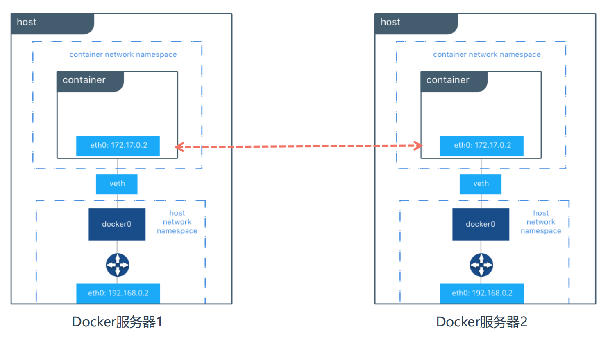

部署网络组件的目的是打通 Pod 到 Pod 之间网络、Node 与 Pod 之间网络，从而集群中数据包可以任意传输，形成了一个扁平化网络。

主流网络组件有：Flannel、Calico 等。

而所谓的 CNI（ Container Network Interface，容器网络接口）就是 k8s 对接这些第三方网络组件的接口。

## 2.5 Kubernetes 将弃用 Docker

### 2.5.1 弃用原因

在 Kubernetes 平台中，为了解决与容器运行时（例如 Docker）集成问题，在早期社区推出了 CRI（Container Runtime Interface，容器运行时接口），以支持更多的容器运行时。 

当我们使用 Docker 作为容器运行时之后，架构是这样的，如图所示：

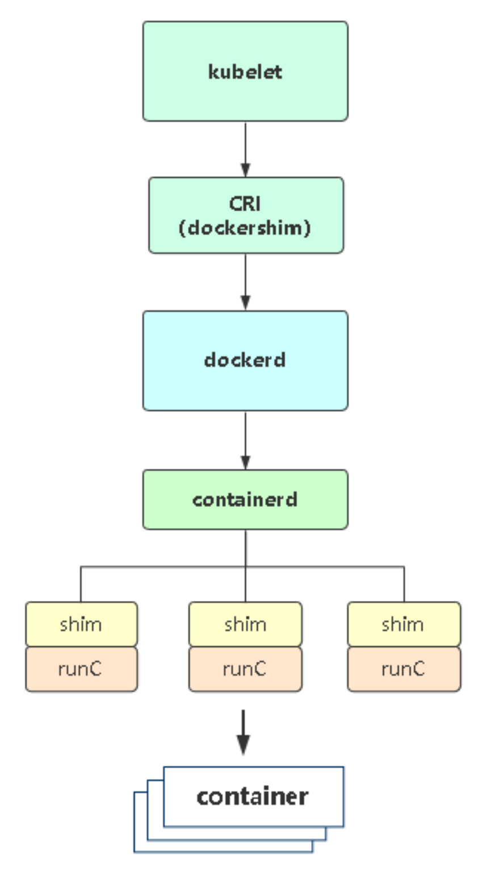

Kubernetes 计划弃用就是 kubelet 中 dockershim。即 Kubernetes kubelet 实现中的组件之一，它能够与 Docker Engine 进行通信。

**为什么这么做？**

- Docker 内部调用链比较复杂，多层封装和调用，导致性能降低、提升故障率、不易排查

- Docker 还会在宿主机创建网络规则、存储卷，也带来了安全隐患

**如何应对？**

在未来的 Kubernetes 版本彻底放弃 Docker 支持之前，引入受支持的容器运行时。

除了 docker 之外，CRI 还支持很多容器运行时，例如：

- containerd：containerd 与 Docker 相兼容，相比 Docker 轻量很多，目前较为成熟

- cri-o，podman：都是红帽（RedHat）项目，目前红帽主推 podman

### 2.5.2 切换容器引擎为 Containerd

参考资料：https://kubernetes.io/zh/docs/setup/production-environment/container-runtimes/#containerd

**配置先决条件**

```shell
cat <<EOF | sudo tee /etc/modules-load.d/containerd.conf
overlay
br_netfilter
EOF

sudo modprobe overlay
sudo modprobe br_netfilter

# 设置必需的 sysctl 参数，这些参数在重新启动后仍然存在。
cat <<EOF | sudo tee /etc/sysctl.d/99-kubernetes-cri.conf
net.bridge.bridge-nf-call-iptables  = 1
net.bridge.bridge-nf-call-ip6tables = 1
net.ipv4.ip_forward                 = 1
EOF

sudo sysctl --system
```

**安装 containerd**

```shell
yum install -y yum-utils device-mapper-persistent-data lvm2
yum-config-manager \
    --add-repo \
    https://download.docker.com/linux/centos/docker-ce.repo
yum install -y containerd.io
mkdir -p /etc/containerd
containerd config default > /etc/containerd/config.toml
```

**修改配置文件**

- pause 镜像设置过阿里云镜像仓库地址

- cgroups 驱动设置为 systemd

- 拉取 Docker Hub 镜像配置加速地址设置为阿里云镜像仓库地址

```shell
vi /etc/containerd/config.toml
   [plugins."io.containerd.grpc.v1.cri"]
      sandbox_image = "registry.aliyuncs.com/google_containers/pause:3.2"  
         ...
         [plugins."io.containerd.grpc.v1.cri".containerd.runtimes.runc.options]
             SystemdCgroup = true
             ...
        [plugins."io.containerd.grpc.v1.cri".registry.mirrors."docker.io"]
          endpoint = ["https://b9pmyelo.mirror.aliyuncs.com"]
          
systemctl restart containerd
```

**配置 kubelet 使用 containerd**

```shell
vi /etc/sysconfig/kubelet 
KUBELET_EXTRA_ARGS=--container-runtime=remote --container-runtime-endpoint=unix:///run/containerd/containerd.sock --cgroup-driver=systemd

systemctl restart kubelet
```

**验证**

```shell
kubectl get node -o wide
k8s-node1  xxx  containerd://1.4.4
```

**管理容器工具**

containerd 提供了 ctr 命令行工具管理容器，但功能比较简单，所以一般会用 crictl 工具检查和调试容器。

项目地址：https://github.com/kubernetes-sigs/cri-tools/

设置 crictl 连接 containerd：

```shell
vi /etc/crictl.yaml
runtime-endpoint: unix:///run/containerd/containerd.sock
image-endpoint: unix:///run/containerd/containerd.sock
timeout: 10
debug: false
```

**下面是 docker 与 crictl 命令对照表：**

| 镜像相关功能     | Docker                  | Containerd               |
| ---------------- | ----------------------- | ------------------------ |
| 显示本地镜像列表 | docker images           | crictl images            |
| 下载镜像         | docker pull             | crictl pull              |
| 上传镜像         | docker push             | 无，例如 buildk          |
| 删除本地镜像     | docker rmi              | crictl rmi               |
| 查看镜像详情     | docker inspect IMAGE-ID | crictl inspecti IMAGE-ID |

| 容器相关功能 | Docker         | Containerd     |
| ------------ | -------------- | -------------- |
| 显示容器列表 | docker ps      | crictl ps      |
| 创建容器     | docker create  | crictl create  |
| 启动容器     | docker start   | crictl start   |
| 停止容器     | docker stop    | crictl stop    |
| 删除容器     | docker rm      | crictl rm      |
| 查看容器详情 | docker inspect | crictl inspect |
| 附加容器     | docker attach  | crictl attach  |
| 执行命令     | docker exec    | crictl exec    |
| 查看日志     | docker logs    | crictl logs    |
| 查看容器资源 | docker stats   | crictl stats   |

| POD 相关功能  | Docker | Containerd      |
| ------------- | ------ | --------------- |
| 显示 POD 列表 | 无     | crictl pods     |
| 查看 POD 详情 | 无     | crictl inspectp |
| 运行 POD      | 无     | crictl runp     |
| 停止 POD      | 无     | crictl stopp    |

## 2.6 Kubeconfig 配置文件

kubectl 使用 kubeconfig 认证文件连接 K8s 集群，使用 `kubectl config` 指令生成 kubeconfig 文件。

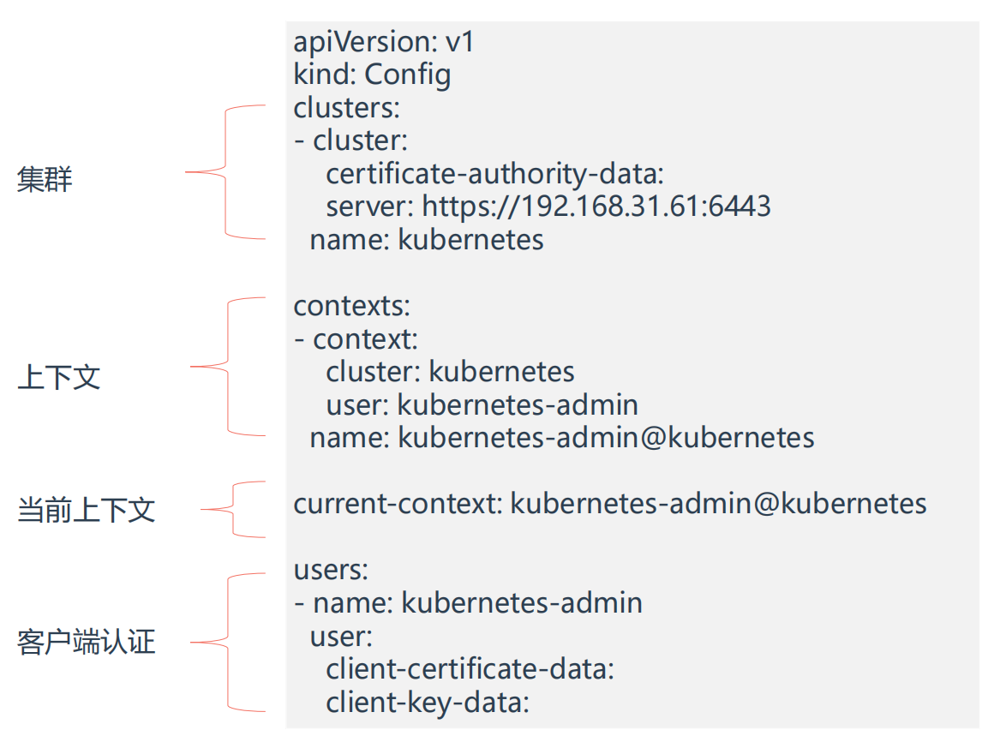

<h4 align="center">kubeconfig 连接 K8s 认证文件</h4>

## 2.7 kubectl 命令行管理工具

官方参考文档：https://kubernetes.io/zh/docs/reference/kubectl/overview/

| 类型               | 命令          | 描述                                                         |
| ------------------ | ------------- | ------------------------------------------------------------ |
| 基础命令           | create        | 通过文件名或标准输入创建资源                                 |
| 基础命令           | expose        | 为 Deployment，Pod 创建 Service                              |
| 基础命令           | run           | 在集群中运行一个特定的镜像                                   |
| 基础命令           | set           | 在对象上设置特定的功能                                       |
| 基础命令           | explain       | 文档参考资料                                                 |
| 基础命令           | get           | 显示一个或多个资源                                           |
| 基础命令           | edit          | 使用系统编辑器编辑一个资源                                   |
| 基础命令           | delete        | 通过文件名、标准输入、资源名称或标签选择器来删除资源         |
| 部署命令           | rollout       | 管理 Deployment，Daemonset 资源的发布（例如状态、发布记录、回滚等） |
| 部署命令           | scale         | 对 Deployment、ReplicaSet、RC 或 Job 资源扩容或缩容 Pod 数量 |
| 部署命令           | autoscale     | 为 Deploy, RS, RC 配置自动伸缩规则（依赖 metrics-server 和 hpa） |
| 集群管理命令       | certificate   | 修改证书资源                                                 |
| 集群管理命令       | cluster-info  | 显示集群信息                                                 |
| 集群管理命令       | top           | 查看资源利用率（依赖 metrics-server）                        |
| 集群管理命令       | cordon        | 标记节点不可调度                                             |
| 集群管理命令       | uncordon      | 标记节点可调度                                               |
| 集群管理命令       | drain         | 驱逐节点上的应用，准备下线维护                               |
| 集群管理命令       | taint         | 修改节点taint标记                                            |
| 故障诊断和调试命令 | describe      | 显示资源详细信息                                             |
| 故障诊断和调试命令 | logs          | 查看Pod内容器日志，如果Pod有多个容器，-c参数指定容器名称     |
| 故障诊断和调试命令 | attach        | 附加到Pod内的一个容器                                        |
| 故障诊断和调试命令 | exec          | 在容器内执行命令                                             |
| 故障诊断和调试命令 | port-forward  | 为Pod创建本地端口映射                                        |
| 故障诊断和调试命令 | proxy         | 为 Kubernetes API server 创建代理                            |
| 故障诊断和调试命令 | cp            | 拷贝文件或目录到容器中，或者从容器内向外拷贝                 |
| 故障诊断和调试命令 | auth          | 检查授权                                                     |
| 故障诊断和调试命令 | debug         | 创建调试会话，用于排查工作负载和工作节点故障                 |
| 高级命令           | diff          | 将在线配置与指定的文件对比                                   |
| 高级命令           | apply         | 从文件名或标准输入对资源创建/更新                            |
| 高级命令           | patch         | 使用补丁方式修改、更新资源的某些字段                         |
| 高级命令           | replace       | 从文件名或标准输入替换一个资源                               |
| 高级命令           | kustomize     | 从目录或者 URL 构建 kustomization 目标                       |
| 设置命令           | label         | 给资源设置、更新标签                                         |
| 设置命令           | annotate      | 给资源设置、更新注解                                         |
| 设置命令           | completion    | kubectl 工具自动补全，source <(kubectl completion bash) （依赖软件包 bash-completion） |
| 其它命令           | api-resources | 查看所有资源                                                 |
| 其它命令           | api-versions  | 打印受支持的 API 版本                                        |
| 其它命令           | config        | 修改 kubeconfig 文件（用于访问 API，比如配置认证信息）       |
| 其它命令           | version       | 查看 kubectl 和 k8s 版本                                     |

## 2.8 牛刀小试快速部署一个网站

**使用 Deployment 控制器部署镜像：**

```shell
kubectl create deployment web --image=lizhenliang/java-demo 
kubectl get deployment,pods
```

**使用 Service 将 Pod 暴露出去：**

```shell
kubectl expose deployment web --port=80 --type=NodePort --target-port=8080 --name=web
kubectl get service
```

**访问应用：**

http://NodeIP:Port

端口随机生成，通过 kubectl get service 获取。

## 2.9 基本资源概念

- **Pod：** K8s 最小部署单元，一组容器的集合

- **Deployment：** 最常见的控制器，用于更高级别部署和管理 Pod

- **Service：** 为一组 Pod 提供负载均衡，对外提供统一访问入口

- **Label ：** 标签，附加到某个资源上，用于关联对象、查询和筛选

- **Namespaces ：** 命名空间，将对象逻辑上隔离，也利于权限控制

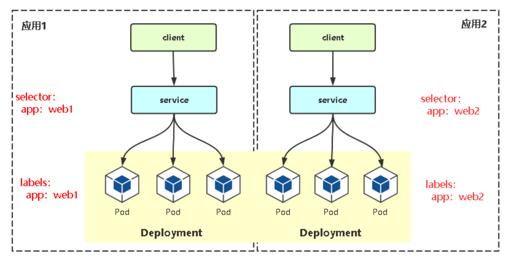

<h4 align="center">常用资源关系图</h4>

**命名空间（Namespace）**：

- Kubernetes 将资源对象逻辑上隔离，从而形成多个虚拟集群

**应用场景：**

- 根据不同团队划分命名空间

- 根据项目划分命名空间

**kubectl get namespace：**

- default：默认命名空间

- kube-system：K8s 系统方面的命名空间

- kube-public：公开的命名空间，谁都可以访问

- kube-node-lease：K8s 内部命名空间

**两种方法指定资源命名空间：**

- 命令行加 `-n` 

- yaml 资源元数据里指定 namespace 字段

# 3 Kubernetes 监控和日志

## 3.1 查看集群资源状况

**查看 master 组件状态：**

```shell
kubectl get cs
```

**查看 node 状态：**

```shell
kubectl get node 
```

**查看资源的详细：**

```shell
kubectl describe <资源类型> <资源名称> -n <命名空间>
kubectl describe pod kube-apiserver-k8s-allinone -n kube-system
kubectl describe svc coredns -n kube-system
```

**查看资源信息：**

```shell
kubectl get <资源类型> <资源名称> -n <命名空间> -o wide
kubectl get <资源类型> <资源名称> -n <命名空间> -o yaml
kubectl get pod kube-apiserver-k8s-allinone -n kube-system -o wide
kubectl get pod kube-apiserver-k8s-allinone -n kube-system -o yaml
```

## 3.2 监控集群资源利用率

**查看 Node 资源消耗：**

```shell
kubectl top node <node name>
```

**查看 Pod 资源消耗：**

```shell
kubectl top pod <pod name>
```

**执行时会提示错误：**`error: Metrics API not available `

这是因为这个命令需要由 metric-server 服务提供数据，而这个服务默认没有安装，还需要手动部署下。

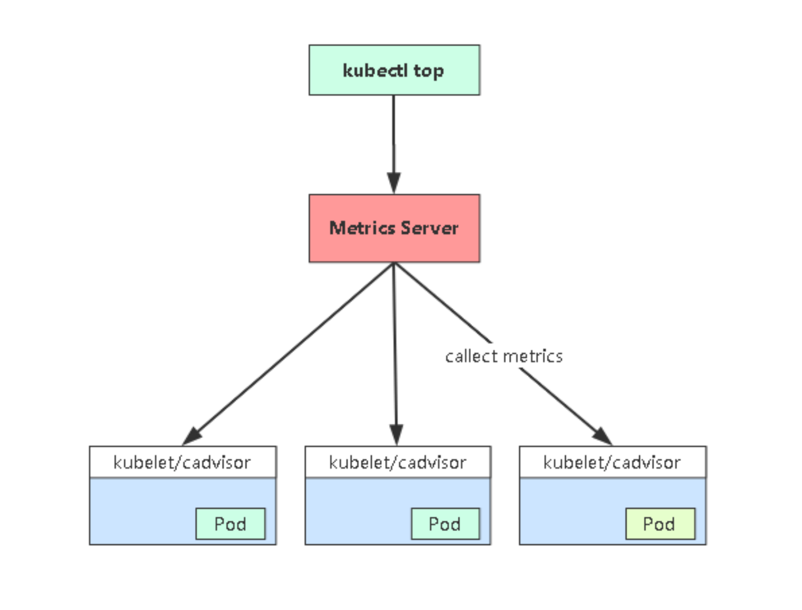

Metrics Server 是一个集群范围的资源使用情况的数据聚合器。作为一个应用部署在集群中。Metric server 从每个节点上 Kubelet API 收集指标，通过 Kubernetes 聚合器注册在 Master APIServer 中。为集群提供 Node、Pods 资源利用率指标。

项目地址：https://github.com/kubernetes-sigs/metrics-server

**Metrics Server 部署：**

```shell
wget https://github.com/kubernetes-sigs/metrics-server/releases/download/v0.6.1/components.yaml

vi components.yaml
...
containers:
- args:
- --cert-dir=/tmp
- --secure-port=4443
- --kubelet-preferred-address-types=InternalIP
- --kubelet-use-node-status-port
- --kubelet-insecure-tls
image: registry.cn-hangzhou.aliyuncs.com/google_containers/metrics-server:v0.6.1
...
```

增加一个 `kubelet-insecure-tls` 参数，这个参数作用是告诉 metrics-server 不验证 kubelet 提供的 https 证书。

```shell
kubectl apply -f components.yaml
```

**检查是否部署成功：**

```shell
kubectl get apiservices | grep metrics
kubectl get --raw /apis/metrics.k8s.io/v1beta1/nodes
```

如果状态 True 并能返回数据说明 Metrics Server 服务工作正常。

## 3.3 管理 K8s 组件日志

- K8S 系统的组件日志

- K8S Cluster 里面部署的应用程序日志

  - 标准输出

  - 日志文件

- systemd 守护进程管理的组件
  - `journalctl -u kubelet`

- Pod 部署的组件
  - `kubectl logs kube-proxy-btz4p -n kube-system`

- 系统日志
  - `/var/log/messages`

## 3.4 管理 K8s 应用日志

查看容器标准输出日志：

```shell
kubectl logs <Pod名称> -n <命名空间>
kubectl logs -f <Pod名称> -n <命名空间>
kubectl logs ks-apiserver-9f986b7ff-fkr8v -n kubesphere-system
kubectl logs -f ks-apiserver-9f986b7ff-fkr8v -n kubesphere-system
```

标准输出在宿主机的路径：

```shell
/var/lib/docker/containers/<container-id>/<container-id>-json.log
```

日志文件，进入到终端日志目录查看：

```shell
kubectl exec -it <Pod名称> -- /bin/sh
kubectl exec -it prometheus-k8s-0 -n kubesphere-monitoring-system -- /bin/sh
```

## 3.5 收集 K8s 日志思路

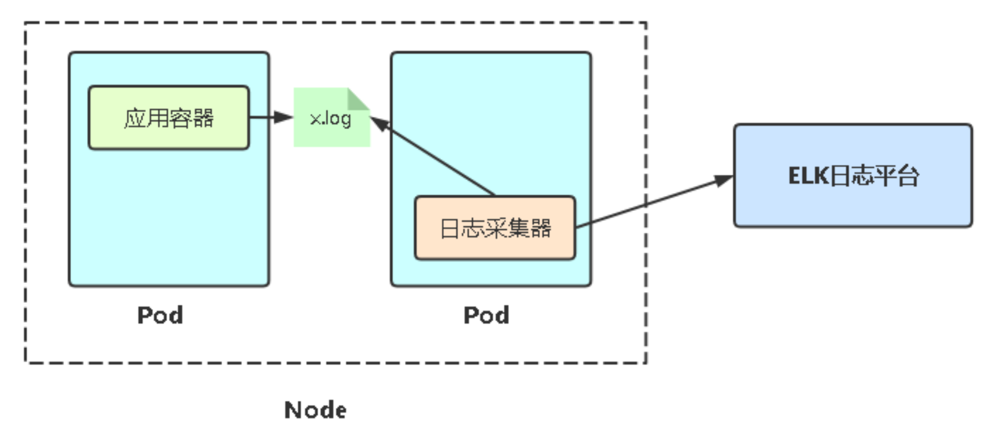

**针对标准输出：**以 DaemonSet 方式在每个 Node 上部署一个日志收集程序，采集 `/var/lib/docker/containers/` 目录下所有容器日志。

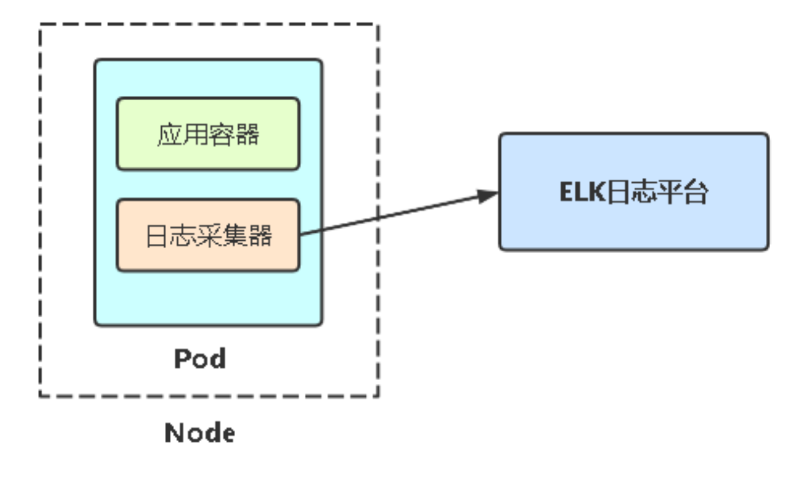

**针对容器中日志文件：**在 Pod 中增加一个容器运行日志采集器，使用 emtyDir 共享日志目录让日志采集器读取到日志文件。

# 4 Kubernetes 管理应用生命周期

## 4.1 在 Kubernetes 中部署应用流程

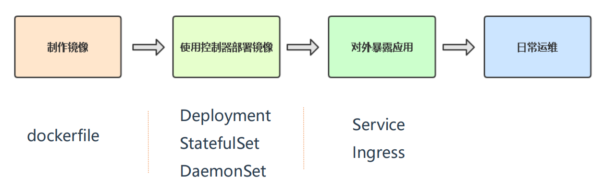

**使用 Deployment 控制器部署镜像：**

```shell
kubectl create deployment web --image=lizhenliang/java-demo 
kubectl get deployment,pods
```

**使用 Service 发布 Pod：**

```shell
kubectl expose deployment web --port=80 --type=NodePort --target-port=8080 --name=web
kubectl get service
```

## 4.2 服务编排（YAML）

### 4.2.1 YAML 文件格式说明

K8s 是一个容器编排引擎，使用 YAML 文件编排要部署应用，因此在学习之前，应先了解 YAML 语法格式：

- 缩进表示层级关系

- 不支持制表符 “tab” 缩进，使用空格缩进

- 通常开头缩进 2 个空格

- 字符后缩进 1 个空格，如冒号、逗号等

- “---” 表示 YAML 格式，一个文件的开始

- “#” 注释

### 4.2.2 YAML 文件创建资源对象

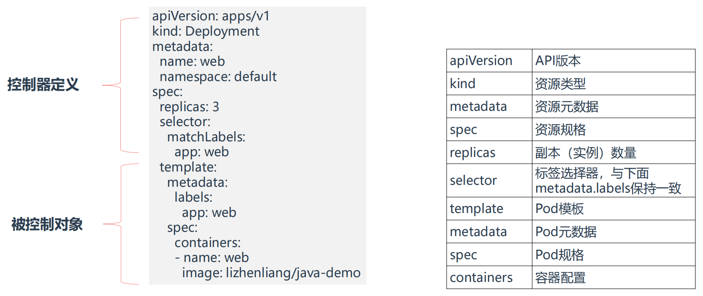

等同于：`kubectl create deployment web --image=lizhenliang/java-demo --replicas=3 -n default`

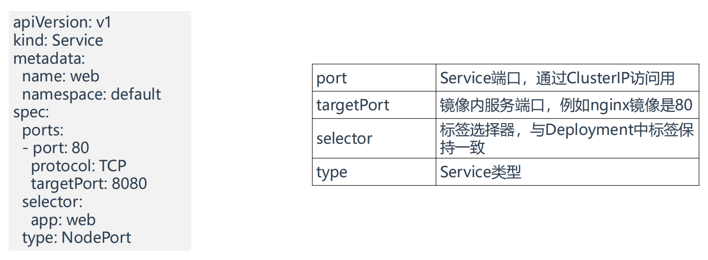

等同于：`kubectl expose deployment web --port=80 --target-port=8080 --type=NodePort -n default`

**将你需要创建的资源描述到 YAML 文件中：**

```shell
# 部署：
kubectl apply -f xxx.yaml 
# 卸载：
kubectl delete -f xxx.yaml
```

**资源字段太多，记不住怎么办：**

```shell
# 用 create 命令生成
kubectl create deployment nginx --image=nginx:1.16 -o yaml --dry-run=client > my-deploy.yaml
# 用 get 命令导出
kubectl get deployment nginx -o yaml > my-deploy.yaml
# Pod 容器的字段拼写忘记了
kubectl explain pods.spec.containers
kubectl explain deployment
```

## 4.3 Deployment 工作负载均衡器

### 4.3.1 介绍

Deployment 是最常用的 K8s 工作负载控制器（Workload Controllers），是 K8s 的一个抽象概念，用于更高级层次对象，部署和管理 Pod。其他控制器还有 DaemonSet、StatefulSet 等。

**Deployment 的主要功能：**

- 管理 Pod 和 ReplicaSet

- 具有上线部署、副本设定、滚动升级、回滚等功能

**应用场景：**网站、API、微服务。

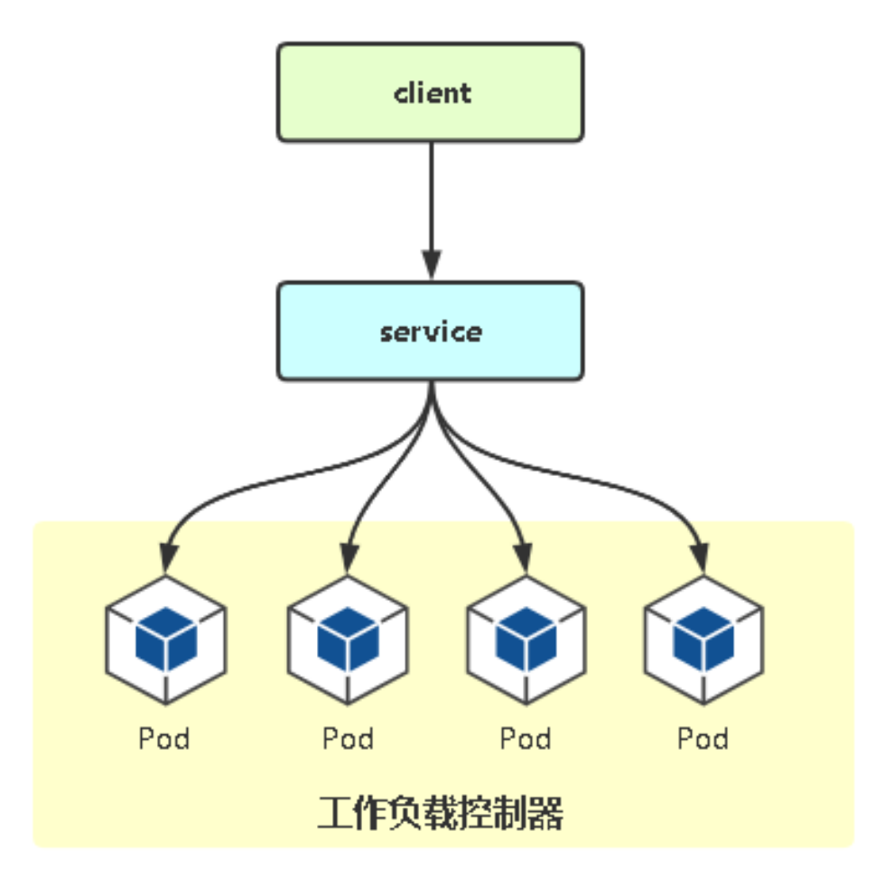

<h4 align="center">Pod 与控制器的关系图</h4>

### 4.3.2 应用生命周期管理流程


<h4 align="center">项目生命周期</h4>

### 4.3.3 应用部署

```yaml
apiVersion: apps/v1
kind: Deployment
metadata:
  name: web
  namespace: default
spec:
  replicas: 3 # Pod 副本预期数量
  selector:
    matchLabels:
	  app: web
  template:
	metadata:
	  labels:
		app: web # Pod 副本的标签
	spec:
	  containers:
	  - name: web
        image: nginx:1.16
```

**部署镜像：**

```shell
kubectl apply -f xxx.yaml
kubectl create deployment web --image=nginx:1.16 --replicas=3
```

### 4.3.4 应用升级

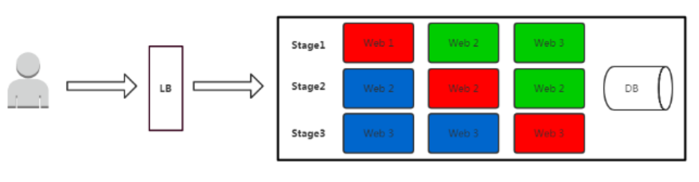

**应用升级：**

```shell
kubectl apply -f xxx.yaml
kubectl set image deployment/web nginx=nginx:1.17
kubectl edit deployment/web    # 使用系统编辑器打开
```

**滚动升级：**

滚动发布是指每次只升级一个或多个服务，升级完成后加入生产环境，不断执行这个过程，直到集群中的全部旧版本升级新版本。

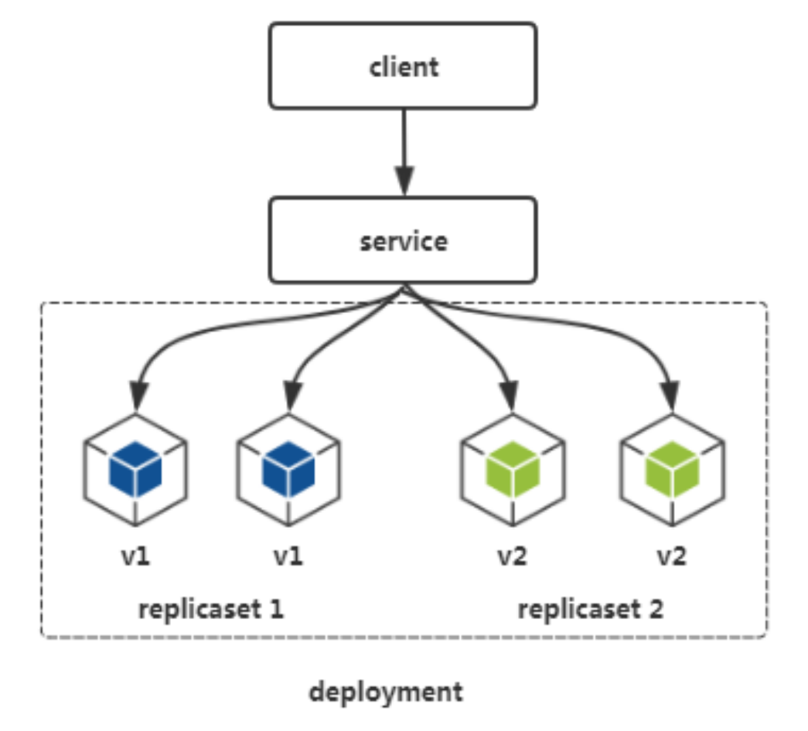

滚动升级在 K8s 中的实现： 

- 1个Deployment

- 2个ReplicaSet

滚动更新一次只升级一小部分 Pod，成功后，再升级一部分 Pod，最终完成所有 Pod 升级，整个过程始终有 Pod 在运行，从而保证了业务的连续性。

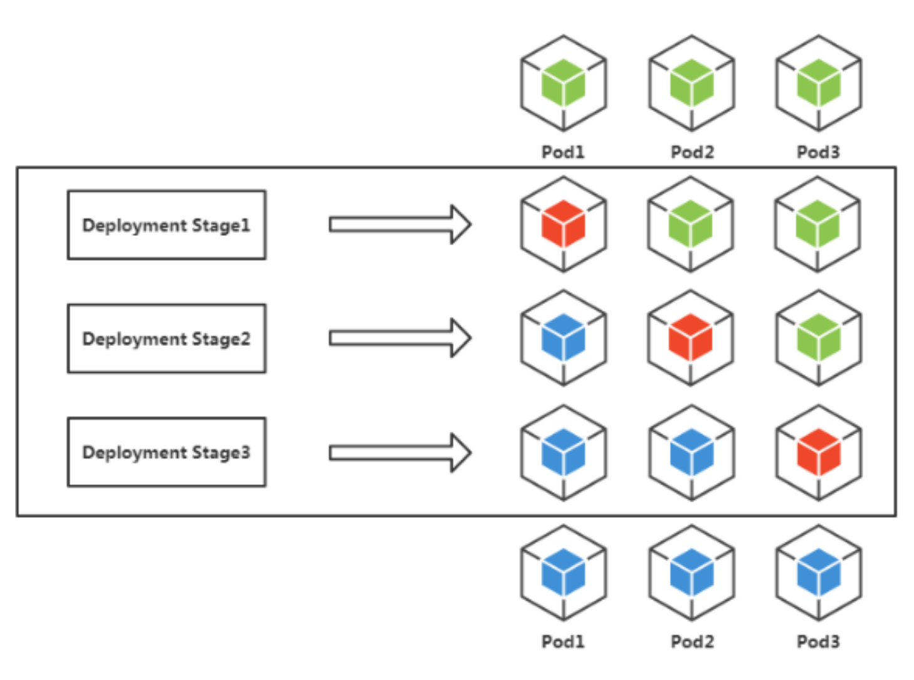

<h4 align="center">滚动升级流程</h4>

查看滚动升级过程：

```shell
kubectl describe deployment web
```

### 4.3.5 水平扩缩容

**水平扩缩容（启动多实例，提高并发）：**

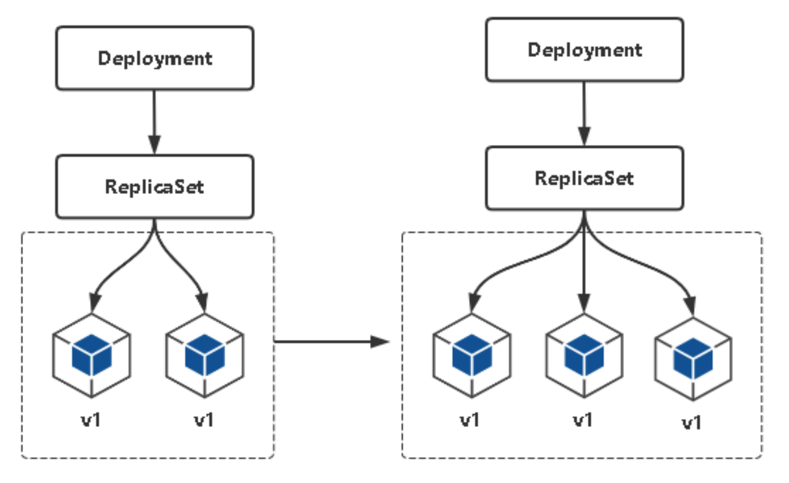

修改 yaml 里 replicas 值，再 apply：

- kubectl scale deployment web --replicas=10

注：replicas 参数控制 Pod 副本数量。

### 4.3.6 回滚

**回滚（项目升级失败恢复到正常版本）：**

```shell
kubectl rollout history deployment/web    # 查看历史发布版本
kubectl rollout undo deployment/web    # 回滚上一个版本
kubectl rollout undo deployment/web --to-revision=2    # 回滚历史指定版本
```

注：回滚是重新部署某一次部署时的状态，即当时版本所有配置。

**项目下线：**

```shell
kubectl delete deploy/web
kubectl delete svc/web
```

### 4.3.7 滚动升级与回滚实现机制

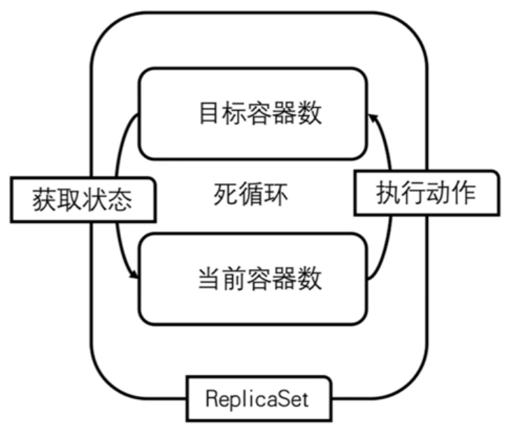

**ReplicaSet：**副本集，主要维护 Pod 副本数量，不断对比当前 Pod 数量与期望 Pod 数量。

**ReplicaSet 用途：**Deployment 每次发布都会创建一个 RS 作为记录，用于实现滚动升级和回滚。

```shell
kubectl get rs    # 查看 RS 记录
kubectl rollout history deployment web    # 版本对应 RS 记录
```

## 4.4 Pod 对象

### 4.4.1 基本概念


Pod 是一个逻辑抽象概念，Kubernetes 创建和管理的最小单元，一个 Pod 由一个容器或多个容器组成。

**Pod 特点：**

- 一个 Pod 可以理解为是一个应用实例，提供服务

- Pod 中容器始终部署在一个 Node 上

- Pod 中容器共享网络、存储资源

### 4.4.2 存在的意义


Pod 主要用法：

- **运行单个容器：**最常见的用法，在这种情况下，可以将Pod看做是单个容器的抽象封装；

- **运行多个容器：**边车模式（Sidecar） ，通过在 Pod 中定义专门容器，来执行主业务容器需要的辅助工作，这样好处是将辅助功能同主业务容器解耦，实现独立发布和能力重用。

例如：

- 日志收集

- 应用监控

### 4.4.3 资源共享实现机制

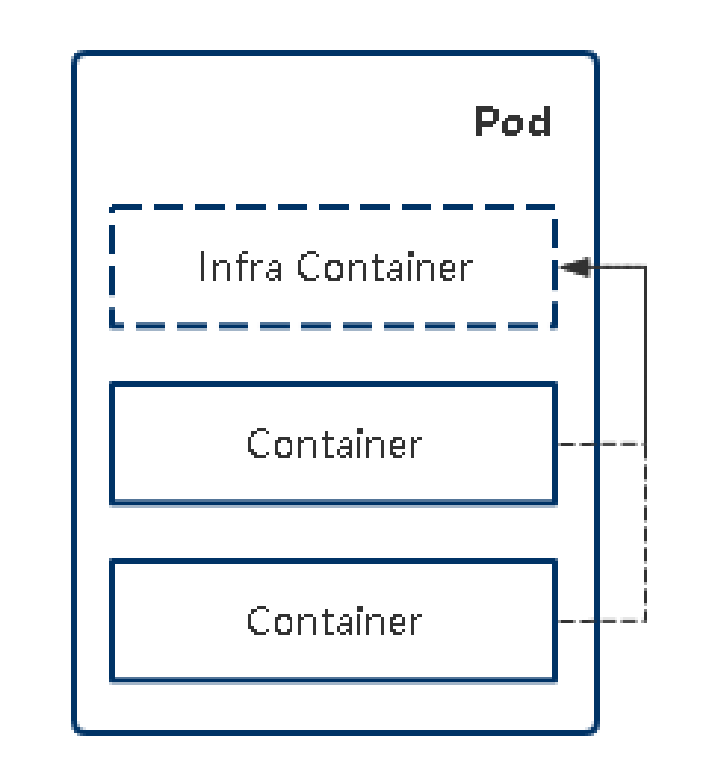

共享网络：将业务容器网络加入到“负责网络的容器”实现网络共享。

```yaml
apiVersion: v1
kind: Pod
metadata:
  labels:
    app: test
  name: pod-net-test 
  namespace: default
spec:
  containers:
  - image: busybox 
    name: test
    command: ["/bin/sh","-c","sleep 12h"]
  - image: nginx
    name: web
```

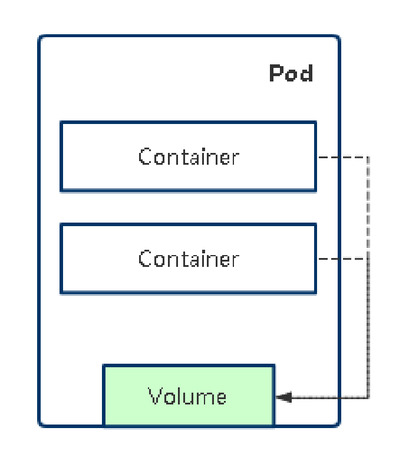

共享存储：容器通过数据卷共享数据。

```yaml
apiVersion: v1
kind: Pod
metadata:
  labels:
    app: test
  name: pod-volume-test 
  namespace: default
spec:
  containers:
  - image: busybox 
    name: test
    command: ["/bin/sh","-c","sleep 12h"]
    volumeMounts:    # 数据卷挂载
    - name: log    # 指定挂载的数据卷名称
      mountPath: /data    # 数据卷挂载到容器中的路径
  - image: nginx
    name: web
    volumeMounts:
    - name: log
      mountPath: /usr/share/nginx/html
  volumes:    # 定义数据卷
  - name: log    # 数据卷名称
    emptyDir: {}    # 数据卷类型
```

### 4.4.4 管理命令

定义 Pod：

```yaml
apiVersion: v1
kind: Pod
metadata:
  name: my-pod
spec:
  containers:
  - name: container1
    image: nginx
  - name: container2
    image: centos
```

创建 Pod：

```shell
kubectl apply -f pod.yaml
```

或者使用命令：

```shell
kubectl run nginx --image=nginx
```

查看 Pod：

```shell
kubectl get pods
kubectl describe pod <Pod名称>
```

查看日志：

```shell
kubectl logs <Pod名称> [-c CONTAINER]
kubectl logs <Pod名称> [-c CONTAINER] -f
```

进入容器终端：

```shell
kubectl exec <Pod名称> [-c CONTAINER] -- bash
```

删除 Pod：

```shell
kubectl delete pod <Pod名称>
```

### 4.4.5 应用自修复（重启策略+健康检查）

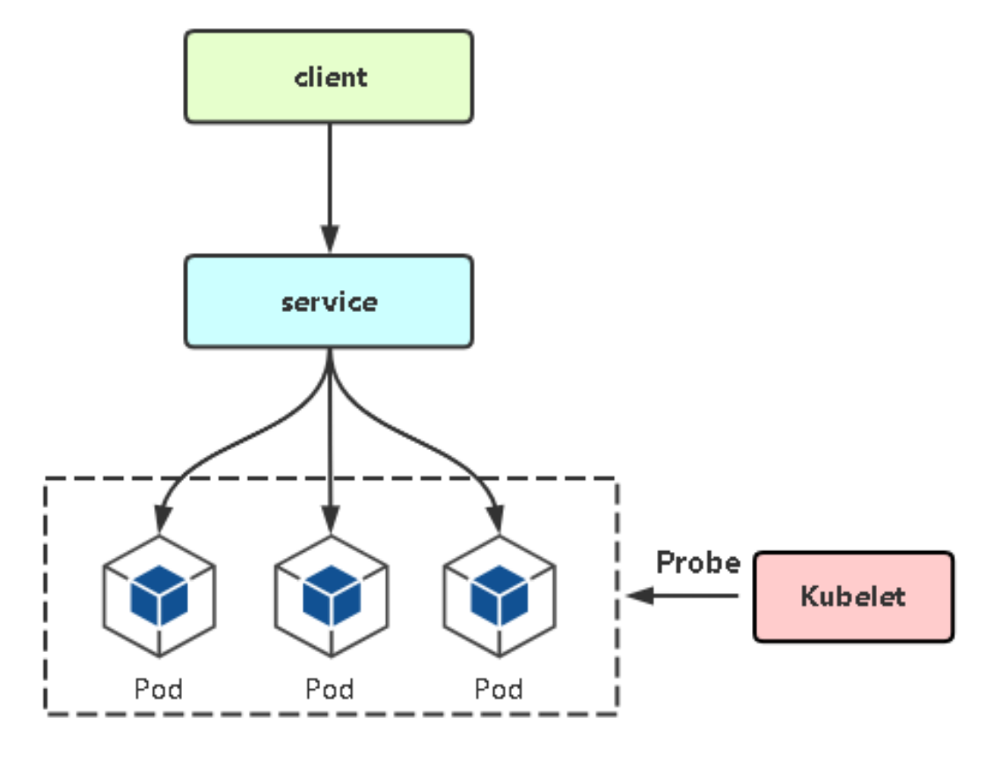

**重启策略（restartPolicy）：**

- Always：当容器终止退出后，总是重启容器，默认策略。

- OnFailure：当容器异常退出（退出状态码非0）时，才重启容器。

- Never：当容器终止退出，从不重启容器。

**健康检查有以下两种类型：**

- livenessProbe（存活检查）：如果检查失败，将杀死容器，根据 Pod 的 restartPolicy 来操作。

- readinessProbe（就绪检查）：如果检查失败，Kubernetes 会把 Pod 从 service endpoints 中剔除。 

- startupProbe（启动检查）：检查成功才由存活检查接手，用于保护慢启动容器

**支持以下三种检查方法：**

- httpGet：发送 HTTP 请求，返回 200-400 范围状态码为成功。

- exec：执行 Shell 命令返回状态码是 0 为成功。

- tcpSocket：发起 TCP Socket 建立成功。

示例：模拟HTTP请求

```yaml
apiVersion: v1
kind: Pod
metadata:
  name: probe-demo
spec:
  containers:
  - name: web
    image: nginx
	livenessProbe: # 存活检查，重启容器
	  httpGet:
		path: /
		port: 80
	  initialDelaySeconds: 5 #启动容器后多少秒健康检查
	  periodSeconds: 10 #以后每间隔多少秒检查一次
	readinessProbe: # 就绪检查，从Service中剔除容器
	  httpGet:
		path: /
		port: 80
	  initialDelaySeconds: 5
	  periodSeconds: 10
```

示例：执行Shell命令

```yaml
livenessProbe:
  exec:
    command:
    - cat
    - /tmp/healthy
```

示例：端口探测

```yaml
livenessProbe:
  tcpSocket:
    port: 80
```

### 4.4.6 环境变量

创建 Pod 时，可以为其下的容器设置环境变量。

**应用场景：**

- 容器内应用程序获取 Pod 信息

- 容器内应用程序通过用户定义的变量改变默认行为

**变量值几种定义方式：**

- 自定义变量值

- 变量值从 Pod 属性获取

- 变量值从 Secret、ConfigMap 获取

```yaml
apiVersion: v1
kind: Pod
metadata:
  name: pod-envars
spec:
  containers:
  - name: test
    image: busybox
    command: [ "sh", "-c", "sleep 36000"]
    env:
      # 变量值从Pod属性获取
      - name: MY_NODE_NAME
        valueFrom:
          fieldRef:
            fieldPath: spec.nodeName
      - name: MY_POD_NAME
        valueFrom:
      	  fieldRef:
            fieldPath: metadata.name
      - name: MY_POD_NAMESPACE
        valueFrom:
          fieldRef:
            fieldPath: metadata.namespace
      - name: MY_POD_IP
        valueFrom:
          fieldRef:
            fieldPath: status.podIP
      - name: ABC # 自定义变量值
        value: "123456"
```

### 4.4.7 Init container

**Init Container：**顾名思义，用于初始化工作，执行完就结束，可以理解为一次性任务。

- 支持大部分应用容器配置，但不支持健康检查

- 优先应用容器执行

**应用场景：**

- 环境检查：例如确保应用容器依赖的服务启动后再启动应用容器

- 初始化配置：例如给应用容器准备配置文件

示例：部署一个 web 网站，网站程序没有打到镜像中，而是希望从代码仓库中动态拉取放到应用容器中。

```yaml
apiVersion: v1
kind: Pod
metadata:
  name: init-demo
spec:
  initContainers:
  - name: download
	image: busybox
	command:
	- wget
	- "-O"
	- "/opt/index.html"
	- http://www.aliangedu.cn
	volumeMounts:
	- name: wwwroot
	  mountPath: "/opt"
  containers:
  - name: nginx
	image: nginx
	ports:
	- containerPort: 80
	volumeMounts:
	- name: wwwroot
	  mountPath: /usr/share/nginx/html
  volumes:
	- name: wwwroot
	  emptyDir: {}
```

**因此，Pod 中会有这几种类型的容器：**

- **Infrastructure Container：**基础容器
  - 维护整个 Pod 网络空间

- **InitContainers：**初始化容器
  - 先于业务容器开始执行

- **Containers：**业务容器
  - 并行启动

### 4.4.8 静态 Pod

静态 Pod 特点：

- Pod 由特定节点上的 kubelet 管理

- 不能使用控制器

- Pod 名称标识当前节点名称

在 kubelet 配置文件启用静态 Pod 的参数：

```shell
vi /var/lib/kubelet/config.yaml
...
staticPodPath: /etc/kubernetes/manifests
...
```

注：将部署的 pod yaml 放到该目录会由 kubelet 自动创建。

# 5 Kubernetes 调度

## 5.1 创建一个 Pod 的工作流程

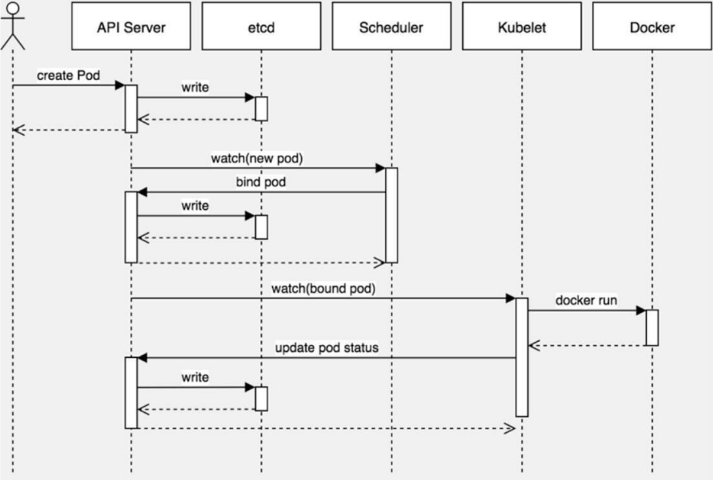

Kubernetes 基于 list-watch 机制的控制器架构，实现组件间交互的解耦。其他组件监控自己负责的资源，当这些资源发生变化时，kube-apiserver 会通知这些组件，这个过程类似于发布与订阅。

## 5.2 Pod 中影响调度的主要属性

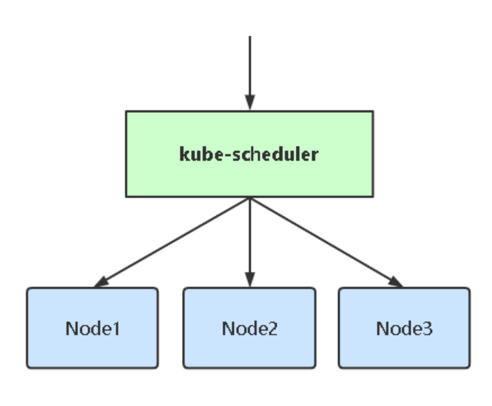

```yaml
apiVersion: apps/v1
kind: Deployment
metadata:
  name: web
  namespace: default
spec:
...
	containers:
	- image: lizhenliang/java-demo
	  name: java-demo
	  imagePullPolicy: Always
	  livenessProbe:
		initialDelaySeconds: 30
		periodSeconds: 20
		tcpSocket:
		  port: 8080
      resources: {}    # 资源调度依据
	restartPolicy: Always
	schedulerName: default-scheduler    # 以下为调度策略
	nodeName: "" 
	nodeSelector: {}
	affinity: {}
	tolerations: []
```

## 5.3 资源限制对 Pod 调度的影响

容器资源限制：

- resources.limits.cpu

- resources.limits.memory

容器使用的最小资源需求，作为容器调度时资源分配的依据：

- resources.requests.cpu

- resources.requests.memory

CPU单位：可以写 m 也可以写浮点数，例如 0.5=500m，1=1000m

```yaml
apiVersion: v1
kind: Pod
metadata:
  name: my-pod
spec:
  containers:
  - name: web
    image: nginx
	resources:
	  requests:
		memory: "64Mi"
		cpu: "250m"
	  limits:
		memory: "128Mi"
		cpu: "500m"
```

K8s 会根据 Request 的值去查找有足够资源的Node来调度此 Pod。

## 5.4 nodeSelector & nodeAffinity

### 5.4.1 nodeSelector

**nodeSelector：**用于将 Pod 调度到匹配 Label 的 Node 上，如果没有匹配的标签会调度失败。

作用： 

- 约束 Pod 到特定的节点运行

- 完全匹配节点标签

应用场景：

- 专用节点：根据业务线将 Node 分组管理

- 配备特殊硬件：部分 Node 配有 SSD 硬盘、GPU

**示例：确保 Pod 分配到具有 SSD 硬盘的节点上**

**第一步：给节点添加标签**

格式：`kubectl label nodes <node-name> <label-key>=<label-value> `

例如：`kubectl label nodes k8s-node1 disktype=ssd `

验证：`kubectl get nodes --show-labels`

**第二步：添加 nodeSelector 字段到 Pod 配置中**

**最后，验证：**

`kubectl get pods -o wide`

删除节点标签：`kubectl label node k8s-node1 <label-key>`

```yaml
apiVersion: v1
kind: Pod
metadata:
  name: my-pod
spec:
  nodeSelector:
    disktype: “ssd”
  containers:
  - name: nginx
    image: nginx:1.19
```

### 5.4.2 nodeAffinity

**nodeAffinity：**节点亲和，类似于 nodeSelector，可以根据节点上的标签来约束Pod可以调度到哪些节点。

相比 nodeSelector： 

- 匹配有更多的逻辑组合，不只是字符串的完全相等，支持的操作符有：In、NotIn、Exists、DoesNotExist、Gt、Lt

- 调度分为软策略和硬策略，而不是硬性要求

- 硬（required）：必须满足

- 软（preferred）：尝试满足，但不保证

```yaml
apiVersion: v1
kind: Pod
metadata:
  name: with-node-affinity
spec:
  affinity:
	nodeAffinity:
	  requiredDuringSchedulingIgnoredDuringExecution:
		nodeSelectorTerms:
		- matchExpressions:
		  - key: disktype
			operator: In
			values:
			- ssd
	  preferredDuringSchedulingIgnoredDuringExecution:
	  - weight: 1
		preference:
		  matchExpressions:
		  - key: disktype
			operator: In
			values:
			- ssd2
containers:
- name: web
  image: nginx
```

## 5.5 Taints & Tolerations

基于节点标签分配是站在 Pod 的角度上，通过在 Pod 上添加属性，来确定 Pod 是否要调度到指定的 Node 上，其实我们也可以站在 Node 的角度上，通过在 Node 上添加污点属性，来**避免 Pod 被分配到不合适的节点上**。

**Taints：**避免 Pod 调度到特定 Node上 

**Tolerations：**允许 Pod 调度到持有 Taints 的 Node 上

**第一步：给节点添加污点**

格式：`kubectl taint node [node] key=value:[effect]` 

例如：`kubectl taint node k8s-node1 gpu=yes:NoSchedule`

验证：`kubectl describe node k8s-node1 |grep Taint `

其中 [effect] 可取值：

- NoSchedule ：一定不能被调度

- PreferNoSchedule：尽量不要调度，非必须配置容忍

- NoExecute：不仅不会调度，还会驱逐 Node 上已有的 Pod

**第二步：如果希望 Pod 可以被分配到带有污点的节点上，要在 Pod 配置中添加污点容忍（tolrations）字段**

删除污点：`kubectl taint node [node] key:[effect]`

```yaml
apiVersion: v1
kind: Pod
metadata:
  name: my-pod
spec:
  containers:
  - name: test
	image: busybox
  tolerations: 
  - key: "gpu"
	operator: "Equal"
	value: "yes"
	effect: "NoSchedule"
```

## 5.6 nodeName

**nodeName：**指定节点名称，用于将 Pod 调度到指定的 Node 上，不经过调度器。

```yaml
apiVersion: v1
kind: Pod
metadata:
  name: my-pod
spec:
  nodeName: k8s-node2
  containers:
  - name: web
	image: nginx
```

## 5.7 DaemonSet 控制器

DaemonSet 功能：

- 在每一个Node上运行一个 Pod

- 新加入的Node也同样会自动运行一个 Pod

应用场景：网络插件、监控 Agent、日志 Agent。

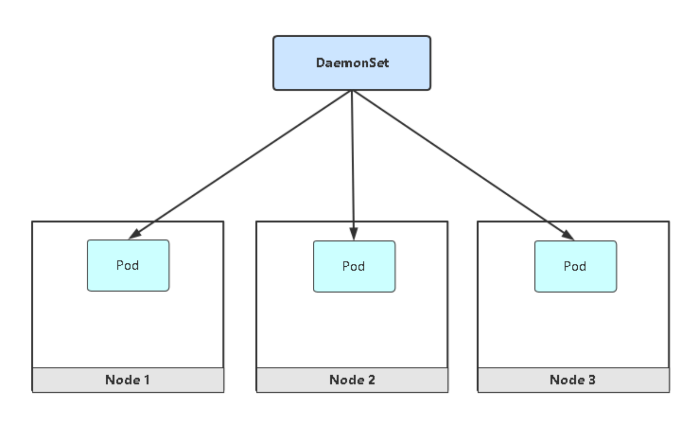

示例：部署一个日志采集程序

```yaml
apiVersion: apps/v1
kind: DaemonSet
metadata:
  name: filebeat
  namespace: kube-system
spec:
  selector:
    matchLabels:
      name: filebeat
  template:
	metadata:
	  labels:
		name: filebeat
	spec:
	  containers:
	  - name: log
		image: elastic/filebeat:7.3.2
```

## 5.8 调度失败原因分析

查看调度结果：`kubectl get pod <NAME> -o wide`

查看调度失败原因：`kubectl describe pod <NAME>`

- 节点 CPU/内存不足

- 有污点，没容忍

- 没有匹配到节点标签

# 6 Kubernetes 网络

## 6.1 Service 控制器

### 6.1.1 Service 存在意义

**Service 引入主要是解决 Pod 的动态变化，提供统一访问入口：**

- 防止Pod失联，找到提供同一个服务的 Pod（服务发现）

- 定义一组Pod的访问策略（负载均衡）

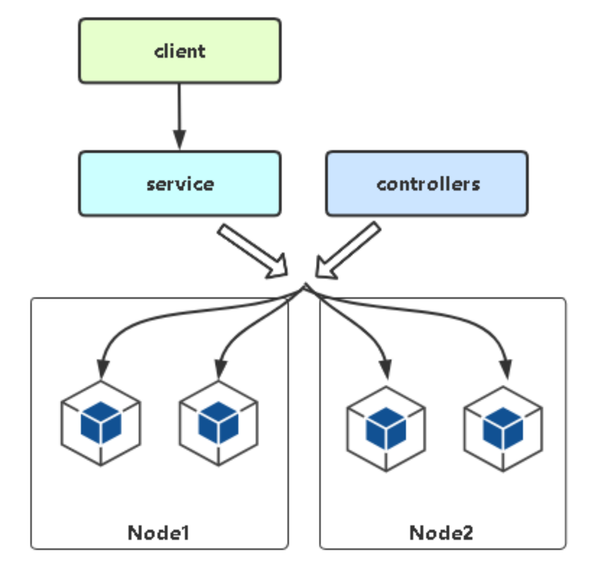

### 6.1.2 Pod 与 Service 的关系

- Service 通过标签关联一组 Pod

- Service 为一组Pod提供负载均衡能力

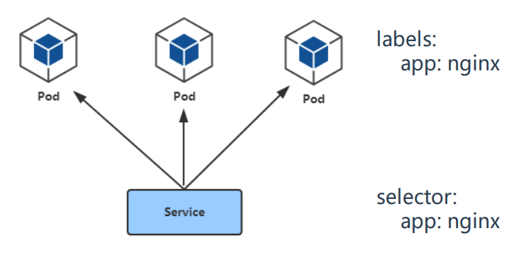

### 6.1.3 Service 定义与创建

创建 service：

```shell
kubectl apply -f service.yaml
```

查看 service：

```shell
kubectl get service
```

定义 Service：

```yaml
apiVersion: v1
kind: Service
metadata:
  name: web
spec:
  type: ClusterIP # 服务类型
  ports: 
  - port: 80 # Service 端口
	protocol: TCP # 协议
	targetPort: 80 # 容器端口（应用程序监听端口）
  selector: 
	app: web # 指定关联 Pod 的标签
```

**多端口 Service 定义：** 对于某些服务，需要公开多个端口，Service 也需要配置多个端口定义，通过端口名称区分。

```yaml
apiVersion: v1
kind: Service
metadata:
  name: web
spec:
  type: ClusterIP
  ports:
  - name: http
	port: 80 
	protocol: TCP
	targetPort: 80
  - name: https
	port: 443 
	protocol: TCP 
	targetPort: 443
  selector: 
	app: web
```

### 6.1.4 Service 三种类型

| 类型        | 描述                       |
| ----------- | -------------------------- |
| ClusterIP   | 集群内部使用（Pod）        |
| NodePort    | 对外暴露应用（浏览器）     |
| LoadBalance | 对外暴露应用，适用于公有云 |

**ClusterIP：**默认**，**分配一个稳定的 IP 地址，即 VIP，只能在集群内部访问。

```yaml
spec:
  type: ClusterIP
  ports:
  - port: 80 
	protocol: TCP 
	targetPort: 80 
  selector: 
	app: web
```

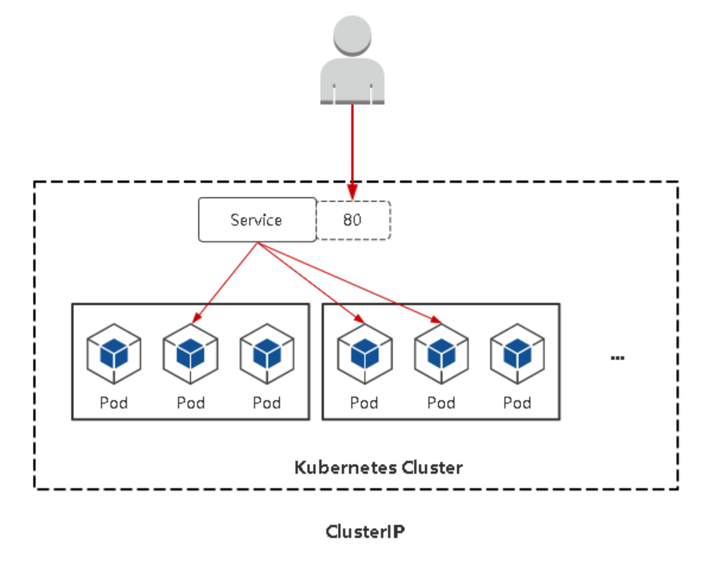

**NodePort：**在每个节点上启用一个端口来暴露服务，可以在集群外部访问。也会分配一个稳定内部集群IP地址。

访问地址：`<任意NodeIP>:<NodePort>`

端口范围：`30000-32767`

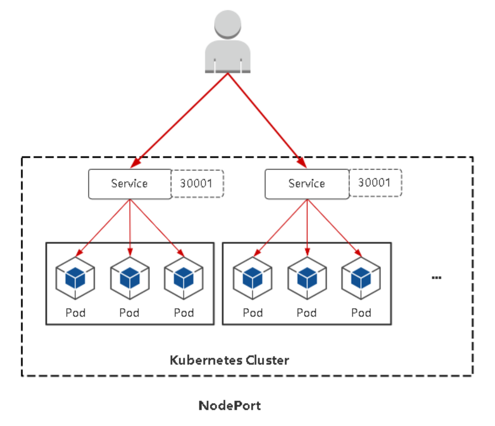

**NodePort：**会在每台 Node 上监听端口接收用户流量，在实际情况下，对用户暴露的只会有一个 IP 和端口，那这么多台 Node 该使用哪台让用户访问呢？

这时就需要前面加一个公网负载均衡器为项目提供统一访问入口了。

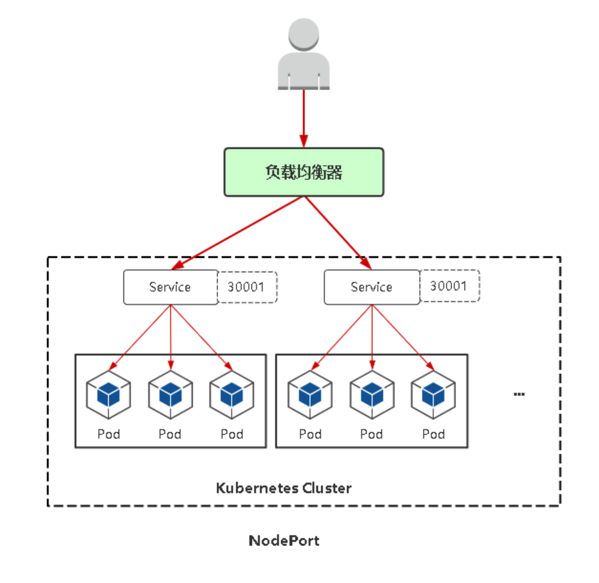

**LoadBalancer：**与 NodePort 类似，在每个节点上启用一个端口来暴露服务。除此之外，Kubernetes 会请求底层云平台（例如阿里云、腾讯云、AWS等）上的负载均衡器，将每个 Node（[NodeIP]:[NodePort]）作为后端添加进去。

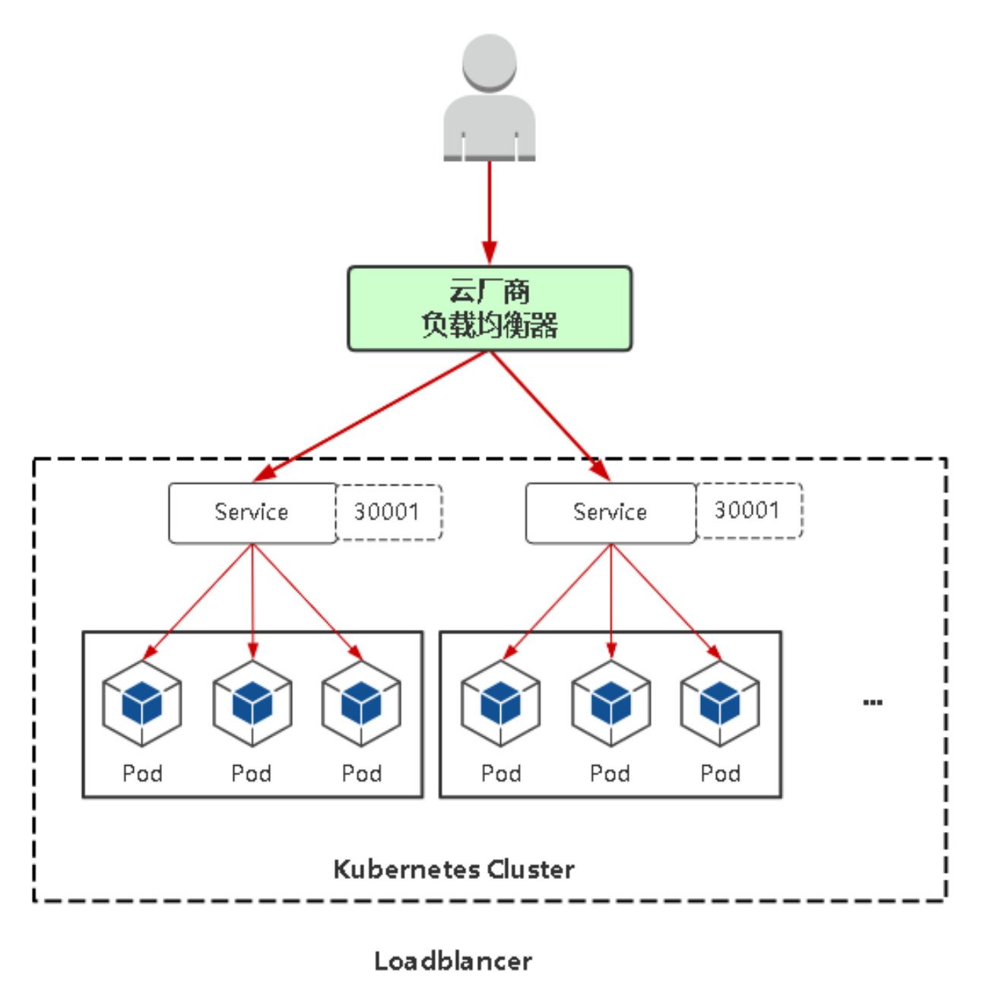

### 6.1.5 Service 代理模式

Service 的底层实现主要有 iptables 和 ipvs 二种网络模式，决定了如何转发流量。

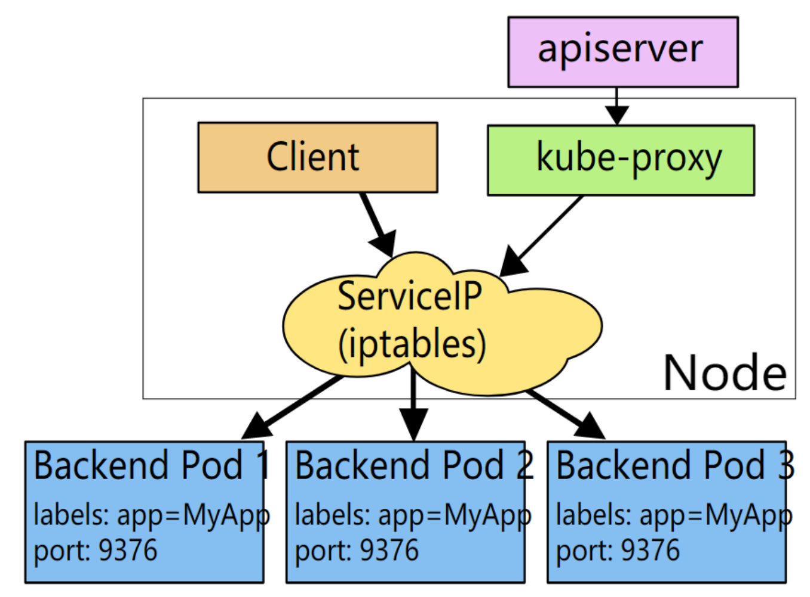

<h4 align="center">Iptables</h4>

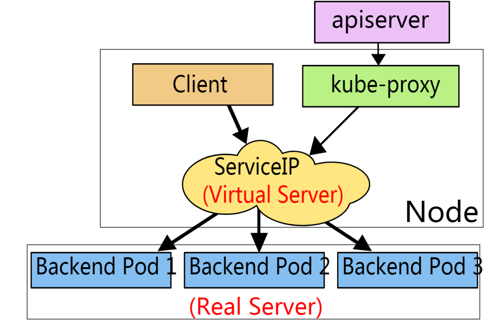

<h4 align="center">IPVS</h4>

kubeadm 方式修改 ipvs 模式：

```shell
kubectl edit configmap kube-proxy -n kube-system
...
mode: “ipvs“
...
kubectl delete pod kube-proxy-btz4p -n kube-system
```

注：

- kube-proxy 配置文件以 configmap 方式存储

- 如果让所有节点生效，需要重建所有节点 kube-proxy pod

二进制方式修改 ipvs 模式：

```shell
vi kube-proxy-config.yml

mode: ipvs
ipvs:
  scheduler: "rr"

systemctl restart kube-proxy
```

注：配置文件路径根据实际安装目录为准。

**流程包流程：客户端 -> NodePort/ClusterIP（iptables/Ipvs负载均衡规则） -> 分布在各节点Pod**

**查看负载均衡规则：**

- iptables 模式

```shell
iptables-save | grep <SERVICE-NAME>
```

- ipvs 模式

```shell
ipvsadm -L -n
```

**Iptables VS IPVS：**

**Iptables：** 

- 灵活，功能强大

- 规则遍历匹配和更新，呈线性时延

**IPVS：** 

- 工作在内核态，有更好的性能

- 调度算法丰富：rr，wrr，lc，wlc，ip hash...

### 6.1.6 Service DNS 名称

CoreDNS：是一个 DNS 服务器，Kubernetes 默认采用，以 Pod 部署在集群中，CoreDNS 服务监视 Kubernetes API，为每一个 Service 创建 DNS 记录用于域名解析。

ClusterIP A 记录格式：`<service-name>.<namespace-name>.svc.cluster.local`

示例：`my-svc.my-namespace.svc.cluster.local`

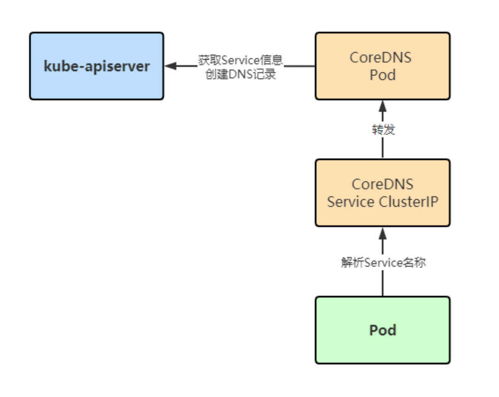

<h4 align="center">工作流程图</h4>

## 6.2 Ingress 对象

### 6.2.1 Ingress 为弥补 NodePort 不足而生

NodePort 存在的不足：

- 一个端口只能一个服务使用，端口需提前规划

- 只支持 4 层负载均衡

### 6.2.2 Pod 与 Ingress 的关系

- **Ingress：** K8s 中的一个抽象资源，给管理员提供一个暴露应用的入口定义方法

- **Ingress Controller：** 负责流量路由，根据 Ingress 生成具体的路由规则，并对 Pod 负载均衡器

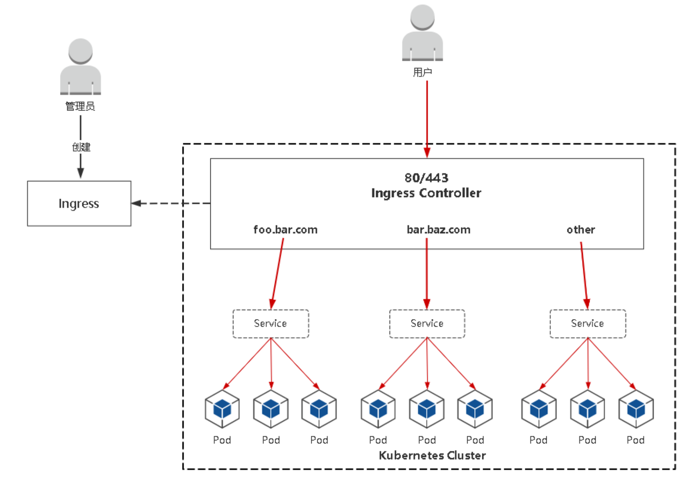

### 6.2.3 Ingress Controller

**Ingress Controller 是什么？**

Ingress 管理的负载均衡器，为集群提供全局的负载均衡能力。

使用流程：

- 部署 Ingress Controller

- 创建 Ingress 规则

Ingress Controller 有很多实现，我们这里采用官方维护的 Nginx 控制器。

项目地址：https://github.com/kubernetes/ingress-nginx

下载 YAML 文件：

```shell
wget https://raw.githubusercontent.com/kubernetes/ingress-nginx/controller-v1.1.2/deploy/static/provider/baremetal/deploy.yaml
mv deploy.yaml ingress-controller.yaml
```

修改 YAML Image Url： 

```yaml
## 过滤出镜像地址，换成国内的，需要换三个地址
grep "image: k8s" ingress-controller.yaml 
registry.cn-hangzhou.aliyuncs.com/google_containers/nginx-ingress-controller:v1.1.2
registry.cn-hangzhou.aliyuncs.com/google_containers/kube-webhook-certgen:v1.1.1
registry.cn-hangzhou.aliyuncs.com/google_containers/kube-webhook-certgen:v1.1.1
```

应用 YAML 文件：

```shell
kubectl apply -f ingress-controller.yaml

## 查看状态
kubectl get all -n ingress-nginx
NAME                                           READY   STATUS      RESTARTS   AGE
pod/ingress-nginx-admission-create-8lc6s       0/1     Completed   0          92s
pod/ingress-nginx-admission-patch-sl79x        0/1     Completed   0          92s
pod/ingress-nginx-controller-5558df4df-nkx2h   1/1     Running     0          92s

NAME                                         TYPE        CLUSTER-IP       EXTERNAL-IP   PORT(S)                      AGE
service/ingress-nginx-controller             NodePort    10.100.110.160   <none>        80:31643/TCP,443:30331/TCP   92s
service/ingress-nginx-controller-admission   ClusterIP   10.107.116.254   <none>        443/TCP                      92s

NAME                                       READY   UP-TO-DATE   AVAILABLE   AGE
deployment.apps/ingress-nginx-controller   1/1     1            1           92s

NAME                                                 DESIRED   CURRENT   READY   AGE
replicaset.apps/ingress-nginx-controller-5558df4df   1         1         1       92s

NAME                                       COMPLETIONS   DURATION   AGE
job.batch/ingress-nginx-admission-create   1/1           12s        92s
job.batch/ingress-nginx-admission-patch    1/1           16s        92s
```

其他控制器：https://kubernetes.io/docs/concepts/services-networking/ingress-controllers/

将 Ingress Controller 暴露，一般使用 NodePort 或者宿主机网络（hostNetwork: true）。

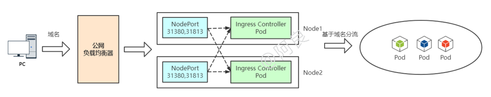

<h4 align="center">Service NodePort 暴露 Ingress Controller</h4>

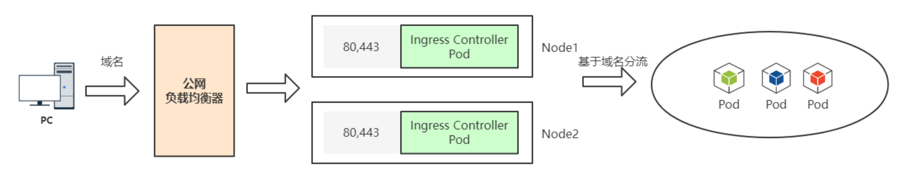

<h4 align="center">共享宿主机网络（ hostNetwork:True ）</h4>

### 6.2.4 Ingress 规则配置

创建：

```shell
kubectl apply -f xxx.yaml
```

查看：

```shell
kubectl get ingress
```

测试：本地电脑绑定 hosts 记录对应 ingress 里面配置的域名。

例：<Ingress Controller Pod 所在 Node IP > web.aliangedu.cn

```yaml
apiVersion: networking.k8s.io/v1
kind: Ingress
metadata:
  name: aliangedu
spec:
  rules:
  - host: web.aliangedu.cn
	http:
	  paths:
	  - path: /
		pathType: Prefix
		backend:
		  service:
			name: web
			port:
			  number: 80
```

### 6.2.5 Ingress 规则配置 HTTPS

配置 HTTPS 步骤：

- 准备域名证书文件（来自：openssl/cfssl 工具自签或者权威机构颁发）

- 将证书文件保存到 Secret

- Ingress 规则配置 tls

### 6.2.6 小结

**Ingress Controller 怎么工作的？**

Ingress Controller 通过与 Kubernetes API 交互，动态的去感知集群中 Ingress 规则变化，然后读取它，按照自定义的规则，规则就是写明了哪个域名对应哪个 service，生成一段 Nginx 配置，应用到管理的 Nginx 服务，然后热加载生效。以此来达到 Nginx 负载均衡器配置及动态更新的问题。

**流程包流程：客户端 ->Ingress Controller（nginx） -> 分布在各节点 Pod**

# 7 Kubernetes 存储

## 7.1 数据卷与数据持久卷

### 7.1.1 为什么需要数据卷

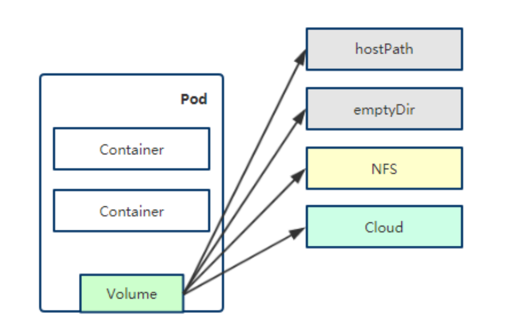

容器中的文件在磁盘上是临时存放的，这给容器中运行比较重要的应用程序带来一些问题。 

- 问题1：当容器升级或者崩溃时，kubelet 会重建容器，容器内文件会丢失

- 问题2：一个 Pod 中运行多个容器并需要共享文件

Kubernetes 卷（Volume） 这一抽象概念能够解决这两个问题。

常用的数据卷：

- 节点本地（hostPath，emptyDir） 

- 网络（NFS，Ceph，GlusterFS） 

- 公有云（AWS EBS） 

- K8S资源（configmap，secret）

### 7.1.2 临时数据卷 emptyDir

**emptyDir卷：**是一个临时存储卷，与 Pod 生命周期绑定一起，如果 Pod 删除了卷也会被删除。

**应用场景：**Pod 中容器之间数据共享。

```yaml
apiVersion: v1
kind: Pod
metadata:
  name: my-pod
spec:
  containers:
  - name: write
	image: centos
	command: ["bash","-c","for i in {1..100};do echo $i >> /data/hello;sleep 1;done"]
    volumeMounts:
    - name: data
	  mountPath: /data
  - name: read
	image: centos
	command: ["bash","-c","tail -f /data/hello"]
	volumeMounts:
  	- name: data
	  mountPath: /data
  volumes:
  - name: data
	emptyDir: {}
```

<h4 align="center">示例：Pod 内容器之前共享数据</h4>

### 7.1.3 节点数据卷 hostPath

**hostPath卷：**挂载 Node 文件系统（Pod所在节点）上文件或者目录到 Pod 中的容器。

**应用场景：**Pod 中容器需要访问宿主机文件。

```yaml
apiVersion: v1
kind: Pod
metadata:
  name: my-pod
spec:
  containers:
  - name: busybox
	image: busybox
	args:
	- /bin/sh
	- -c - sleep 36000
	volumeMounts:
	- name: data
	  mountPath: /data
  volumes:
  - name: data
	hostPath:
	  path: /tmp
	  type: Directory
```

<h4 align="center">示例：将宿主机 /tmp 目录挂载到容器 /data 目录</h4>

### 7.1.4 网络数据卷 NFS

**NFS 卷：** 提供对 NFS 挂载支持，可以自动将 NFS 共享路径挂载到 Pod 中。

**NFS：**是一个主流的文件共享服务器。

```shell
# yum install nfs-utils
# vi /etc/exports
/ifs/kubernetes *(rw,no_root_squash)
# mkdir -p /ifs/kubernetes
# systemctl start nfs
# systemctl enable nfs
```

注：每个 Node 上都要安装 nfs-utils 包。

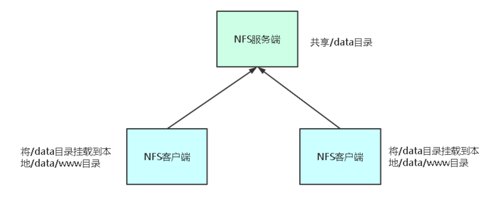

示例：将 Nginx 网站程序根目录持久化到 NFS 存储，为多个 Pod 提供网站程序文件。

```yaml
apiVersion: apps/v1
kind: Deployment
metadata:
  name: web
spec:
  selector:
    matchLabels:
      app: nginx
  replicas: 3
  template:
	metadata:
	  labels:
	    app: nginx
	spec:
	  containers:
	  - name: nginx
		image: nginx
	    volumeMounts:
		- name: wwwroot
		  mountPath: /usr/share/nginx/html
	volumes:
	- name: wwwroot
	  nfs:
		server: 192.168.31.63
		path: /ifs/kubernetes
```

### 7.1.5 持久数据卷概述

**PersistentVolume（PV）：** 对存储资源创建和使用的抽象，使得存储作为集群中的资源管理

**PersistentVolumeClaim（PVC）：** 让用户不需要关心具体的Volume实现细节

Pod 申请 PVC 作为卷来使用，Kubernetes 通过 PVC 查找绑定的 PV，并 Mount 给 Pod。

### 7.1.6 PV 和 PVC 使用流程

数据卷定义：

```yaml
cat > pv.yaml << EOF
apiVersion: v1
kind: PersistentVolume
metadata:
  name: nfs-pv
spec:
  capacity:
    storage: 5Gi
  accessModes:
  - ReadWriteMany
  nfs:
    path: /nfs/mnt
    server: 192.168.2.121
EOF
```

卷需求模板：

```yaml
cat > pvc.yaml << EOF
apiVersion: v1
kind: PersistentVolumeClaim
metadata:
  name: nfs-pvc
spec:
  accessModes:
  - ReadWriteMany
  resources:
    requests:
    storage: 5Gi
EOF
```

容器应用：

```yaml
cat > pod.yaml << EOF
apiVersion: v1
kind: Pod
metadata:
  name: nginx-pod
spec:
  containers: 
  - name: web
	image: nginx
	ports:
    - containerPort: 80
	volumeMounts:
	- name: www
	  mountPath: /usr/share/nginx/html
  volumes:
  - name: www
    persistentVolumeClaim:
	  claimName: nfs-pvc
EOF
```

创建资源：

```shell
kubectl apply -f ./
```

支持持久卷的存储插件：https://kubernetes.io/docs/concepts/storage/persistent-volumes/

### 7.1.7 PV 生命周期

**AccessModes（访问模式）：**

AccessModes 是用来对 PV 进行访问模式的设置，用于描述用户应用对存储资源的访问权限，访问权限包括下面几种方式：

- ReadWriteOnce（RWO）：读写权限，但是只能被单个节点挂载

- ReadOnlyMany（ROX）：只读权限，可以被多个节点挂载

- ReadWriteMany（RWX）：读写权限，可以被多个节点挂载

**RECLAIM POLICY（回收策略）：**

目前 PV 支持的策略有三种：

- Retain（保留）： 保留数据，需要管理员手工清理数据

- Recycle（回收）：清除 PV 中的数据，效果相当于执行 `rm -rf /mnt/nfs/*`

- Delete（删除）：与 PV 相连的后端存储同时删除

**STATUS（状态）：**

一个 PV 的生命周期中，可能会处于 4 种不同的阶段：

- Available（可用）：表示可用状态，还未被任何 PVC 绑定

- Bound（已绑定）：表示 PV 已经被 PVC 绑定

- Released（已释放）：PVC 被删除，但是资源还未被集群重新声明

- Failed（失败）： 表示该 PV 的自动回收失败

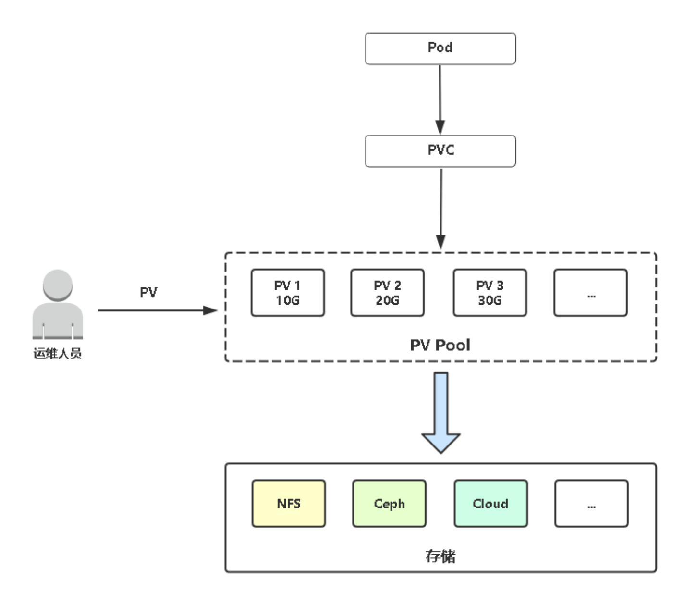

现在 PV 使用方式称为静态供给，需要 K8s 运维工程师提前创建一堆 PV，供开发者使用。

### 7.1.8 PV 动态供给（StorageClass）

PV 静态供给明显的缺点是维护成本太高了！因此，K8s 开始支持 PV 动态供给，使用 StorageClass 对象实现。

支持动态供给的存储插件：https://kubernetes.io/docs/concepts/storage/storage-classes/

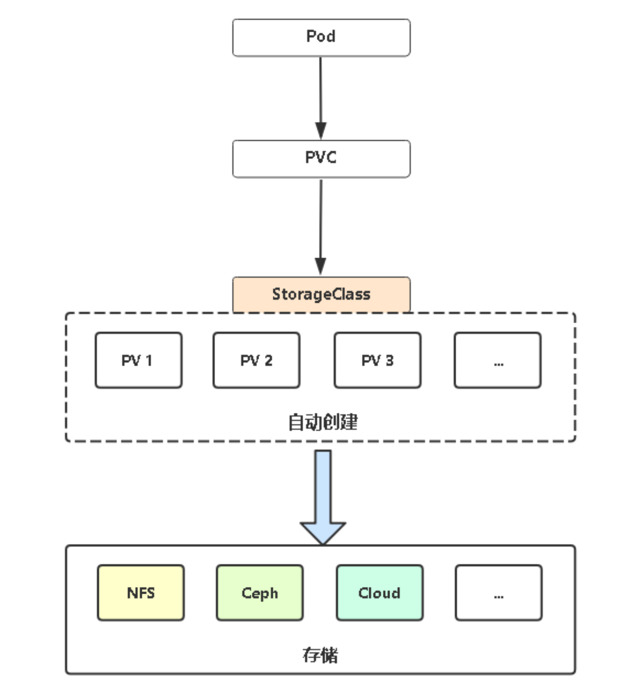

K8s 默认不支持 NFS 动态供给，需要单独部署社区开发的插件。

项目地址：https://github.com/kubernetes-sigs/nfs-subdir-external-provisioner

部署：

```shell
## 安装 NFS 服务端，在所有节点安装
yum install -y nfs-utils
mkdir -p /ifs/kubernetes
echo "/ifs/kubernetes 192.168.0.0/23(rw,sync,no_subtree_check,no_root_squash)" >> /etc/exports    ## 这里的网段请注意和你的服务器网段一致
## 启动服务
systemctl start nfs-server.service
## 设置开机自启动
systemctl enable nfs-server.service
## 查看启动状态
systemctl status nfs-server.service
exportfs -r
## 查看挂载情况
exportfs

## 下载 yaml 文件并应用
git clone https://github.com/kubernetes-sigs/nfs-subdir-external-provisioner
cd nfs-subdir-external-provisioner/deploy
kubectl apply -f rbac.yaml # 授权访问 apiserver
## 修改镜像地址为国内地址，NFS 服务端地址
vim deployment.yaml
```


```shell
kubectl apply -f deployment.yaml # 部署插件，需修改里面 NFS 服务器地址与共享目录
kubectl apply -f class.yaml # 创建存储类
kubectl get sc # 查看存储类
```

测试：在创建 pvc 时指定存储类名称：

```yaml
cat > test-pod-pvc.yaml << EOF
apiVersion: v1
kind: PersistentVolumeClaim
metadata:
  name: test-pvc
spec:
  storageClassName: "nfs-client"
  accessModes:
  - ReadWriteMany
  resources:
    requests:
      storage: 1Gi
---
apiVersion: v1
kind: Pod
metadata:
  name: test-pod
spec:
  containers:
  - name: test-pod
    image: nginx
    volumeMounts:
    - name: nfs-pvc
      mountPath: "/usr/share/nginx/html"
  volumes:
  - name: nfs-pvc
    persistentVolumeClaim:
      claimName: test-pvc
EOF

kubectl apply -f test-pod-pvc.yaml
```

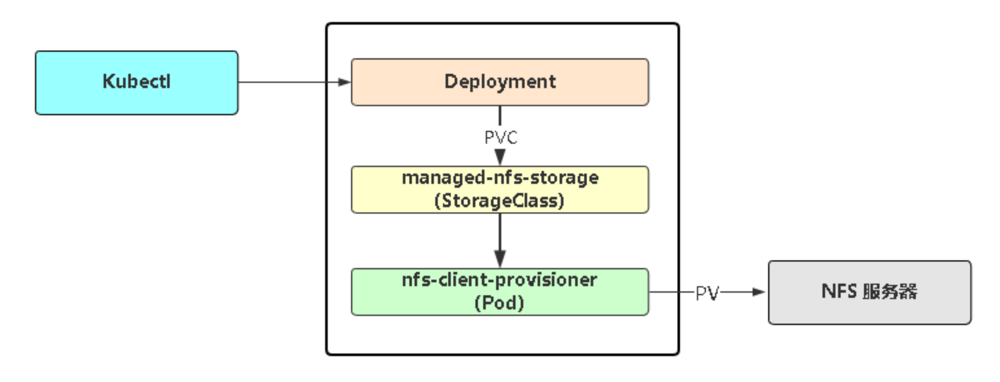

<h4 align="center">基于 NFS 实现 PV 动态供给流程图</h4>

## 7.2 有状态应用部署初探

### 7.2.1 StatefulSet 控制器介绍

**无状态与有状态：**

Deployment 控制器设计原则：管理的所有 Pod 一模一样，提供同一个服务，也不考虑在哪台 Node 运行，可随意扩容和缩容。这种应用称为“无状态”，例如 Web 服务。

在实际的场景中，这并不能满足所有应用，尤其是分布式应用，会部署多个实例，这些实例之间往往有依赖关系，例如主从关系、主备关系，这种应用称为“有状态”，例如 MySQL 主从、Etcd 集群。

StatefulSet 控制器用于部署有状态应用，满足一些有状态应用的需求：

- Pod 有序的部署、扩容、删除和停止

- Pod 分配一个稳定的且唯一的网络标识

- Pod 分配一个独享的存储

### 7.2.2 StatefulSet 部署应用实践

**稳定的网络 ID（域名）**

使用 Headless Service（相比普通 Service 只是将 `spec.clusterIP` 定义为 None）来维护 Pod 网络身份。并且添加 `serviceName: "nginx"` 字段指定 StatefulSet 控制器要使用这个 Headless Service。

DNS 解析名称：`<statefulsetName-index>.<service-name>.<namespace-name>.svc.cluster.local`

**稳定的存储**

StatefulSet 的存储卷使用 VolumeClaimTemplate 创建，称为卷申请模板，当 StatefulSet 使用 VolumeClaimTemplate 创建一个 PersistentVolume 时，同样也会为每个 Pod 分配并创建一个编号的 PVC。

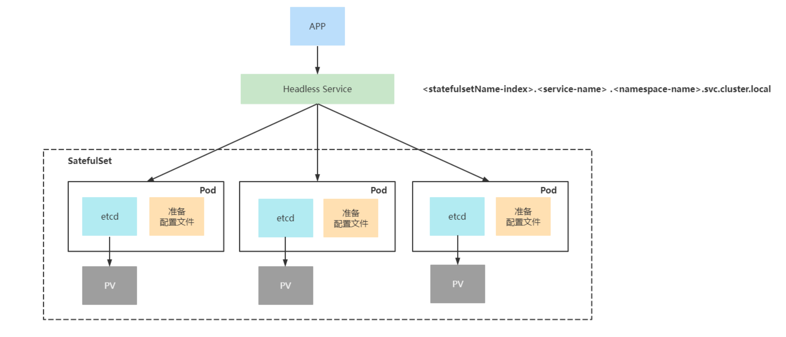

**示例**

参考：https://github.com/lizhenliang/k8s-statefulset

```shell
vim etcd.yaml
```

```yaml
apiVersion: apps/v1
kind: StatefulSet
metadata:
  labels:
    k8s-app: infra-etcd-cluster
    app: etcd
  name: infra-etcd-cluster
  namespace: default
spec:
  replicas: 3
  selector:
    matchLabels:
      k8s-app: infra-etcd-cluster
      app: etcd
  serviceName: infra-etcd-cluster
  template:
    metadata:
      labels:
        k8s-app: infra-etcd-cluster
        app: etcd
      name: infra-etcd-cluster
    spec:
      containers:
      - image: lizhenliang/etcd:v3.3.8
        imagePullPolicy: Always
        command:
        - /bin/sh
        - -ec
        - |
          HOSTNAME=$(hostname)
          echo "etcd api version is ${ETCDAPI_VERSION}"
          # 生成连接 etcd 集群节点字符串
          # 例如 http://etcd-0.etcd.default:2379,http://etcd-1.etcd.default:2379,http://etcd-2.etcd.default:2379
          eps() {
              EPS=""
              for i in $(seq 0 $((${INITIAL_CLUSTER_SIZE} - 1))); do
                  EPS="${EPS}${EPS:+,}http://${SET_NAME}-${i}.${SET_NAME}.${CLUSTER_NAMESPACE}:2379"
              done
              echo ${EPS}
          }
          # 获取 etcd 节点成员 hash 值，例如 740e031d5b17222d
          member_hash() {
              etcdctl member list | grep http://${HOSTNAME}.${SET_NAME}.${CLUSTER_NAMESPACE}:2380 | cut -d':' -f1 | cut -d'[' -f1
          }
          # 生成初始化集群节点连接字符串
          # 例如 etcd-0=http://etcd-0.etcd.default:2380,etcd-1=http://etcd-1.etcd.default:2380,etcd-2=http://etcd-1.etcd.default:2380
          initial_peers() {
                PEERS=""
                for i in $(seq 0 $((${INITIAL_CLUSTER_SIZE} - 1))); do
                PEERS="${PEERS}${PEERS:+,}${SET_NAME}-${i}=http://${SET_NAME}-${i}.${SET_NAME}.${CLUSTER_NAMESPACE}:2380"
                done
                echo ${PEERS}
          }
          # etcd-SET_ID
          SET_ID=${HOSTNAME##*-}
          # 向已有集群添加成员 (假设所有 pod 都初始化完成)
          if [ "${SET_ID}" -ge ${INITIAL_CLUSTER_SIZE} ]; then
              export ETCDCTL_ENDPOINTS=$(eps)
              # 判断成员是否添加
              MEMBER_HASH=$(member_hash)
              if [ -n "${MEMBER_HASH}" ]; then
                  # 成员 hash 存在，但由于某种原因失败
                  # 如果 datadir 目录没创建，可以删除该成员
                  # 检索新的 hash 值
                  if [ "${ETCDAPI_VERSION}" -eq 3 ]; then
                      ETCDCTL_API=3 etcdctl --user=root:${ROOT_PASSWORD} member remove ${MEMBER_HASH}
                  else
                      etcdctl --username=root:${ROOT_PASSWORD} member remove ${MEMBER_HASH}
                  fi
              fi
              echo "添加成员"
              rm -rf /var/run/etcd/*
              # 确保 etcd 目录存在
              mkdir -p /var/run/etcd/
              # 休眠 60s，等待端点准备好
              echo "sleep 60s wait endpoint become ready,sleeping..."
              sleep 60
              if [ "${ETCDAPI_VERSION}" -eq 3 ]; then
                  ETCDCTL_API=3 etcdctl --user=root:${ROOT_PASSWORD} member add ${HOSTNAME} --peer-urls=http://${HOSTNAME}.${SET_NAME}.${CLUSTER_NAMESPACE}:2380 | grep "^ETCD_" > /var/run/etcd/new_member_envs
              else
                  etcdctl --username=root:${ROOT_PASSWORD} member add ${HOSTNAME} http://${HOSTNAME}.${SET_NAME}.${CLUSTER_NAMESPACE}:2380 | grep "^ETCD_" > /var/run/etcd/new_member_envs
              fi
              if [ $? -ne 0 ]; then
                  echo "member add ${HOSTNAME} error."
                  rm -f /var/run/etcd/new_member_envs
                  exit 1
              fi
              cat /var/run/etcd/new_member_envs
              source /var/run/etcd/new_member_envs
              # 启动 etcd
              exec etcd --name ${HOSTNAME} \
                  --initial-advertise-peer-urls http://${HOSTNAME}.${SET_NAME}.${CLUSTER_NAMESPACE}:2380 \
                  --listen-peer-urls http://0.0.0.0:2380 \
                  --listen-client-urls http://0.0.0.0:2379 \
                  --advertise-client-urls http://${HOSTNAME}.${SET_NAME}.${CLUSTER_NAMESPACE}:2379 \
                  --data-dir /var/run/etcd/default.etcd \
                  --initial-cluster ${ETCD_INITIAL_CLUSTER} \
                  --initial-cluster-state ${ETCD_INITIAL_CLUSTER_STATE}
          fi
          # 检查前面 etcd 节点是否启动，启动后再启动本节点
          for i in $(seq 0 $((${INITIAL_CLUSTER_SIZE} - 1))); do
              while true; do
                  echo "Waiting for ${SET_NAME}-${i}.${SET_NAME}.${CLUSTER_NAMESPACE} to come up"
                  ping -W 1 -c 1 ${SET_NAME}-${i}.${SET_NAME}.${CLUSTER_NAMESPACE} > /dev/null && break
                  sleep 1s
              done
          done
          echo "join member ${HOSTNAME}"
          # 启动 etcd 节点
          exec etcd --name ${HOSTNAME} \
              --initial-advertise-peer-urls http://${HOSTNAME}.${SET_NAME}.${CLUSTER_NAMESPACE}:2380 \
              --listen-peer-urls http://0.0.0.0:2380 \
              --listen-client-urls http://0.0.0.0:2379 \
              --advertise-client-urls http://${HOSTNAME}.${SET_NAME}.${CLUSTER_NAMESPACE}:2379 \
              --initial-cluster-token etcd-cluster-1 \
              --data-dir /var/run/etcd/default.etcd \
              --initial-cluster $(initial_peers) \
              --initial-cluster-state new
        env:
        - name: INITIAL_CLUSTER_SIZE  # 初始集群节点数量
          value: "3"
        - name: CLUSTER_NAMESPACE
          valueFrom:
            fieldRef:
              fieldPath: metadata.namespace
        - name: ETCDAPI_VERSION
          value: "3"
        - name: ROOT_PASSWORD
          value: '@123#'
        - name: SET_NAME
          value: "infra-etcd-cluster"
        - name: GOMAXPROCS
          value: "4"

        # 关闭 pod，自动清理该节点信息
        lifecycle:
          preStop:
            exec:
              command:
              - /bin/sh
              - -ec
              - |
                HOSTNAME=$(hostname)
                member_hash() {
                    etcdctl member list | grep http://${HOSTNAME}.${SET_NAME}.${CLUSTER_NAMESPACE}:2380 | cut -d':' -f1 | cut -d'[' -f1
                }
                eps() {
                    EPS=""
                    for i in $(seq 0 $((${INITIAL_CLUSTER_SIZE} - 1))); do
                        EPS="${EPS}${EPS:+,}http://${SET_NAME}-${i}.${SET_NAME}.${CLUSTER_NAMESPACE}:2379"
                    done
                    echo ${EPS}
                }
                export ETCDCTL_ENDPOINTS=$(eps)
                SET_ID=${HOSTNAME##*-}
                # 从集群中移出 etcd 节点成员
                if [ "${SET_ID}" -ge ${INITIAL_CLUSTER_SIZE} ]; then
                    echo "Removing ${HOSTNAME} from etcd cluster"
                    if [ "${ETCDAPI_VERSION}" -eq 3 ]; then
                        ETCDCTL_API=3 etcdctl --user=root:${ROOT_PASSWORD} member remove $(member_hash)
                    else
                        etcdctl --username=root:${ROOT_PASSWORD} member remove $(member_hash)
                    fi
                    if [ $? -eq 0 ]; then
                        # 删除数据目录
                        rm -rf /var/run/etcd/*
                    fi
                fi
        name: infra-etcd-cluster
        ports:
        - containerPort: 2380
          name: peer
          protocol: TCP
        - containerPort: 2379
          name: client
          protocol: TCP
        resources:
          limits:
            cpu: "1"
            memory: 1Gi
          requests:
            cpu: "0.3"
            memory: 300Mi
        volumeMounts:
        - mountPath: /var/run/etcd
          name: datadir
  updateStrategy:
    type: OnDelete
  volumeClaimTemplates:
  - metadata:
      name: datadir
    spec:
      storageClassName: "managed-nfs-storage" 
      accessModes:
      - ReadWriteOnce
      resources:
        requests:
          storage: 2Gi
---
apiVersion: v1
kind: Service
metadata:
  labels:
    k8s-app: infra-etcd-cluster
    app: infra-etcd
  name: infra-etcd-cluster
  namespace: default
spec:
  clusterIP: None
  ports:
  - name: infra-etcd-cluster-2379
    port: 2379
    protocol: TCP
    targetPort: 2379
  - name: infra-etcd-cluster-2380
    port: 2380
    protocol: TCP
    targetPort: 2380
  selector:
    k8s-app: infra-etcd-cluster
    app: etcd
  type: ClusterIP
```

部署：

```shell
kubectl apply -f etcd.yaml
```

测试：

```shell
kubectl exec -it infra-etcd-cluster-0 -- sh

ETCDCTL_API=3 etcdctl --endpoints=http://infra-etcd-cluster-0.infra-etcd-cluster.default:2379,http://infra-etcd-cluster-1.infra-etcd-cluster.default:2379,http://infra-etcd-cluster-2.infra-et
cd-cluster.default:2379 endpoint health --write-out=table
```

也可通过 NodePort 对外提供暴露：

```shell
apiVersion: v1
kind: Service
metadata:
  labels:
    k8s-app: infra-etcd-cluster-client
    app: infra-etcd
  name: infra-etcd-cluster-client
  namespace: default
spec:
  ports:
  - name: infra-etcd-cluster-2379
    port: 2379
    protocol: TCP
    targetPort: 2379
  selector:
    k8s-app: infra-etcd-cluster
    app: infra-etcd
  type: NodePort
```

扩容：

```shell
kubectl scale --replicas=5 statefulset infra-etcd-cluster
```

缩容：

```shell
kubectl scale --replicas=3 statefulset infra-etcd-cluster
```

**StatefulSet 与 Deployment 区别**

有身份的！身份三要素：

- 域名

- 主机名

- 存储（PVC）

## 7.3 应用程序数据存储

### 7.3.1 应用程序数据存储

- ConfigMap：存储配置文件

- Secret：存储敏感数据

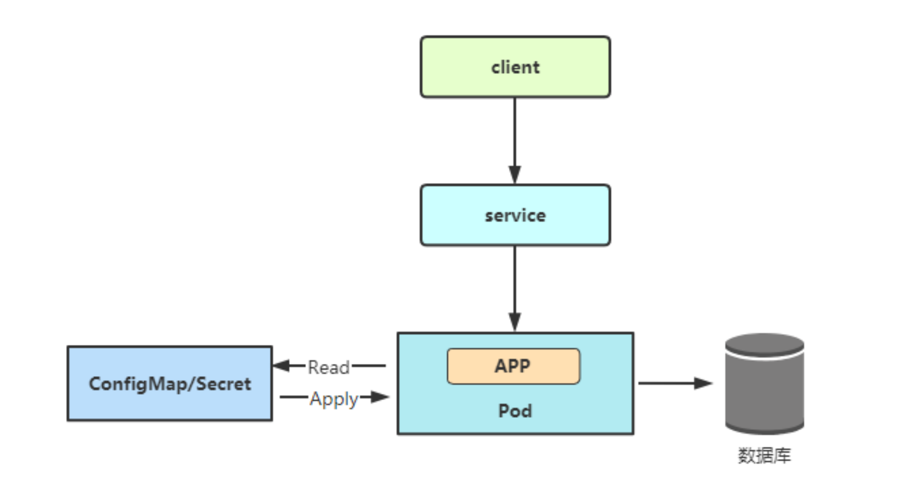

### 7.3.2 ConfigMap 存储应用配置

创建 ConfigMap 后，数据实际会存储在 K8s 中 Etcd，然后通过创建 Pod 时引用该数据。

应用场景：应用程序配置

Pod 使用 configmap 数据有两种方式：

- 变量注入

- 数据卷挂载

```yaml
apiVersion: v1
kind: ConfigMap
metadata:
  name: configmap-demo
data:
  abc: "123"
  cde: "456"
  redis.properties: |
    port: 6379
    host: 192.168.2.121
```

```yaml
apiVersion: v1
kind: Pod
metadata:
  name: configmap-demo-pod
spec:
  containers:
  - name: demo
    image: nginx 
    env:
    - name: ABCD 
      valueFrom:
        configMapKeyRef:
          name: configmap-demo
          key: abc 
    - name: CDEF 
      valueFrom:
        configMapKeyRef:
          name: configmap-demo 
          key: cde 
    volumeMounts:
    - name: config
      mountPath: "/config"
      readOnly: true
  volumes:
  - name: config
    configMap:
      name: configmap-demo
      items:
      - key: "redis.properties"
        path: "redis.properties"
```

测试：进入 pod 中验证是否注入变量和挂载

```shell
kubectl get configmap
NAME               DATA   AGE
configmap-demo     3      9m1s

kubectl get pod
NAME                                      READY   STATUS    RESTARTS   AGE
configmap-demo-pod                        1/1     Running   0          9m5s

kubectl exec -it configmap-demo-pod -- /bin/sh
echo $ABCD
ls /config
```

两种数据类型：

- 键值

- 多行数据

### 7.3.3 Secret 存储敏感信息

与 ConfigMap 类似，区别在于 Secret 主要存储敏感数据，所有的数据要经过 base64 编码。

应用场景：凭据。

kubectl create secret 支持三种数据类型：

- docker-registry：存储镜像仓库认证信息；

- generic：密码；

- tls：存储证书，例如从文件、目录或者字符串创建，例如存储 HTTPS 证书。

Pod 使用 Secret 数据与 ConfigMap 方式一样。

```shell
# 将用户名密码进行编码：
echo -n 'admin' | base64
echo -n '1f2d1e2e67df' | base64
```

```yaml
apiVersion: v1
kind: Secret
metadata:
  name: db-user-pass
type: Opaque
data:
  username: YWRtaW4=
  password: MWYyZDFlMmU2N2Rm
```

```yaml
apiVersion: v1
kind: Pod
metadata:
  name: secret-demo-pod
spec:
  containers:
  - name: demo
    image: nginx 
    env:
    - name: USER
      valueFrom:
        secretKeyRef:
          name: db-user-pass 
          key: username
    - name: PASS 
      valueFrom:
        secretKeyRef:
          name: db-user-pass 
          key: password
    volumeMounts:
    - name: config
      mountPath: "/config"
      readOnly: true
  volumes:
  - name: config
    secret:
      secretName: db-user-pass 
      items:
      - key: username 
        path: my-username
```

测试：进入 pod 中验证是否注入变量和挂载

```shell
kubectl get secret 
NAME                                 TYPE                                  DATA   AGE
db-user-pass                         Opaque                                2      12s

kubectl get pod
NAME                                      READY   STATUS    RESTARTS   AGE
configmap-demo-pod                        1/1     Running   0          7m
secret-demo-pod                           1/1     Running   0          6s

kubectl exec -it secret-demo-pod -- /bin/sh
echo $USER $PASS
ls /config
```

# 8 Kubernetes 安全

## 8.1 Kubernetes RBAC 授权

### 8.1.1 Kubernetes 安全框架

K8S 安全控制框架主要由下面 3 个阶段进行控制，每一个阶段都支持插件方式，通过 API Server 配置来启用插件。

1. Authentication（鉴权）

2. Authorization（授权）

3. Admission Control（准入控制）

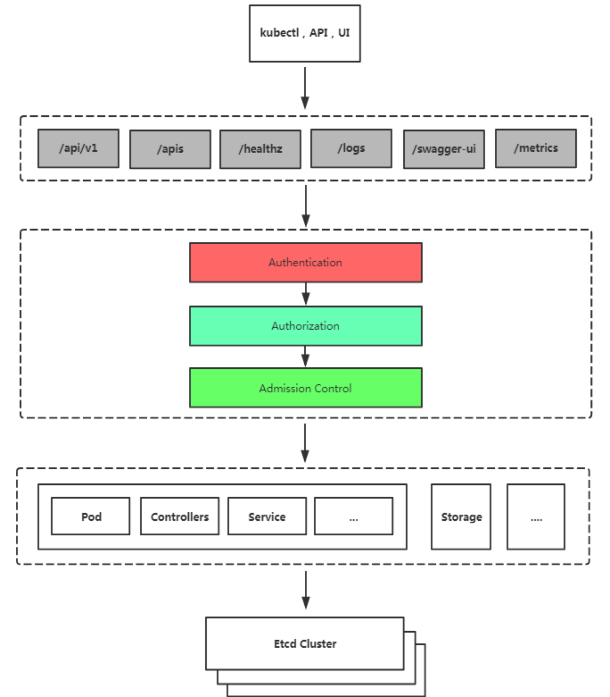

**鉴权（Authentication）**

K8s Apiserver 提供三种客户端身份认证： 

- HTTPS 证书认证：基于 CA 证书签名的数字证书认证（kubeconfig） 

- HTTP Token 认证：通过一个 Token 来识别用户（serviceaccount） 

- HTTP Base 认证：用户名+密码的方式认证（1.19版本弃用）

**授权（Authorization）**

RBAC（Role-Based Access Control，基于角色的访问控制）：负责完成授权（Authorization）工作。

RBAC 根据 API 请求属性，决定允许还是拒绝。比较常见的授权维度：

- user：用户名
- group：用户分组
- 资源，例如 pod、deployment
- 资源操作方法：get，list，create，update，patch，watch，delete
- 命名空间
- API 组

**准入控制（Admission Control）**

Adminssion Control 实际上是一个准入控制器插件列表，发送到 API Server 的请求都需要经过这个列表中的每个准入控制器插件的检查，检查不通过，则拒绝请求。

启用一个准入控制器：

```shell
kube-apiserver --enable-admission-plugins=NamespaceLifecycle,LimitRanger ...
```

关闭一个准入控制器：

```shell
kube-apiserver --disable-admission-plugins=PodNodeSelector,AlwaysDeny ...
```

查看默认启用：

```shell
kubectl exec kube-apiserver-k8s-master -n kube-system -- kube-apiserver -h | grep enable-admission-plugins
```

### 8.1.2 基于角色的权限访问控制 RBAC

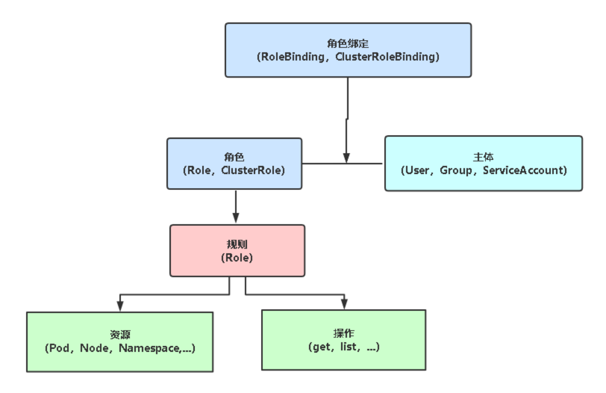

**RBAC（Role-Based Access Control，基于角色的访问控制）** ， 是 K8s 默认授权策略，并且是动态配置策略（修改即时生效）。

**主体（subject）** 

- User：用户
- Group：用户组
- ServiceAccount：服务账号

**角色**

- Role：授权特定命名空间的访问权限
- ClusterRole：授权所有命名空间的访问权限

**角色绑定**

- RoleBinding：将角色绑定到主体（即 subject） 
- ClusterRoleBinding：将集群角色绑定到主体

注：RoleBinding 在指定命名空间中执行授权，ClusterRoleBinding 在集群范围执行授权。

### 8.1.3 RBAC 授权案例

**案例：**为指定用户授权访问不同命名空间权限，例如新入职一个小弟，希望让他先熟悉K8s集群，为了安全性，先不能给他太大权限，因此先给他授权访问default命名空间 Pod 读取权限。实施大致步骤：

1. 用 K8S CA 签发客户端证书

2. 生成 kubeconfig 授权文件

3. 创建 RBAC 权限策略

4. 指定 kubeconfig 文件测试权限：`kubectl get pods --kubeconfig=./aliang.kubeconfig`

**生成 kubeconfig 授权文件：**

```shell
# 设置集群
kubectl config set-cluster kubernetes \
  --certificate-authority=/etc/kubernetes/pki/ca.crt \
  --embed-certs=true \
  --server=https://192.168.31.61:6443 \
  --kubeconfig=aliang.kubeconfig
# 设置客户端认证
kubectl config set-credentials aliang \
  --client-key=aliang-key.pem \
  --client-certificate=aliang.pem \
  --embed-certs=true \
  --kubeconfig=aliang.kubeconfig
# 设置默认上下文
kubectl config set-context kubernetes \
  --cluster=kubernetes \
  --user=aliang \
  --kubeconfig=aliang.kubeconfig
# 设置当前使用配置
kubectl config use-context kubernetes --kubeconfig=aliang.kubeconfig
```

**创建角色（权限集合）：**

```yaml
apiVersion: rbac.authorization.k8s.io/v1
kind: Role
metadata:
  namespace: default
  name: pod-reader
rules:
#    api 组，例如 apps 组，空值表示是核心 API 组，像 namespace、pod、service、pv、pvc 都在里面
- apiGroups: [""] 
  resources: ["pods"]     # 资源名称（复数），例如 pods、deployments、services
  verbs: ["get", "watch", "list"]    # 资源操作方法
```

**将用户与角色绑定：**

```shell
apiVersion: rbac.authorization.k8s.io/v1
kind: RoleBinding
metadata:
  name: read-pods
  namespace: default
subjects:
- kind: User    # 主体
  name: jane    # 主体名称
  apiGroup: rbac.authorization.k8s.io
roleRef:    # 绑定的角色
  kind: Role
  name: pod-reader    # 角色名称
  apiGroup: rbac.authorization.k8s.io
```

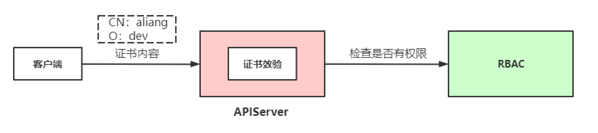

<h4 align="center">认证流程</h4>

**ServiceAccount（服务账号）简称 SA**，用于让集群内 Pod 访问 k8s Api。授权方式与 kubeconfig 方式一样。

示例：为一个服务账号分配只能创建 deployment、daemonset、statefulset 的权限。

```shell
# 创建集群角色
kubectl create clusterrole deployment-clusterrole \
  --verb=create --resource=deployments,daemonsets,statefulsets
# 创建服务账号
kubectl create serviceaccount cicd-token -n app-team1
# 将服务账号绑定角色
kubectl create rolebinding cicd-token \
  --serviceaccount=app-team1:cicd-token \
  --clusterrole=deployment-clusterrole -n app-team1
# 测试服务账号权限
kubectl --as=system:serviceaccount:app-team1:cicd-token \
  get pods -n app-team1
```

命令对应 YAML：

```yaml
apiVersion: v1
kind: ServiceAccount
metadata:
  name: cicd-token
  namespace: app-team1
---
apiVersion: rbac.authorization.k8s.io/v1
kind: ClusterRole
metadata:
  name: deployment-clusterrole
rules:
- apiGroups: ["apps"]
  resources: ["deployments","daemonsets","statefulsets"] 
  verbs: ["create"]
---
apiVersion: rbac.authorization.k8s.io/v1
kind: RoleBinding
metadata:
  name: cicd-token
  namespace: app-team1
roleRef:
  apiGroup: rbac.authorization.k8s.io
  kind: ClusterRole
  name: deployment-clusterrole
subjects:
- kind: ServiceAccount
  name: cicd-token
  namespace: app-team1
```

## 8.2 网络访问控制

### 8.2.1 网络访问控制应用场景

默认情况下，Kubernetes  集群网络没任何网络限制，Pod 可以与任何其他 Pod 通信，在某些场景下就需要进行网络控制，减少网络攻击面，提高安全性，这就会用到网络策略。

网络策略（Network Policy）：是一个 K8s 资源，用于限制 Pod 出入流量，提供 Pod 级别和 Namespace 级别网络访问控制。

网络策略的应用场景（偏重多租户下）：

- 应用程序间的访问控制，例如项目 A 不能访问项目 B 的 Pod
- 开发环境命名空间不能访问测试环境命名空间 Pod
- 当 Pod 暴露到外部时，需要做 Pod 白名单

### 8.2.2 网络策略概述

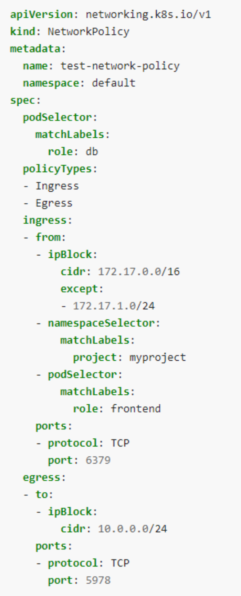


- podSelector：目标 Pod，根据标签选择；

- policyTypes：策略类型，指定策略用于入站、出站流量；

- Ingress：from 是可以访问的白名单，可以来自于 IP 段、命名空间、Pod 标签等，ports 是可以访问的端口；

- Egress：这个 Pod 组可以访问外部的 IP 段和端口。

网络策略工作流程：

1. 创建 Network Policy 资源

2. Policy Controller 监控网络策略，同步并通知节点上程序

3. 节点上 DaemonSet 运行的程序从 etcd 中获取 Policy，调用本地 Iptables 创建防火墙规则

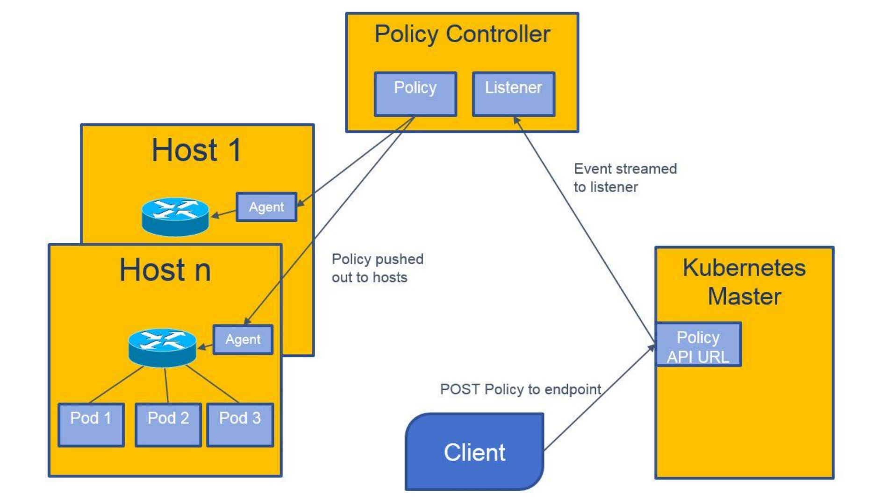

### 8.2.3 网络访问控制 3 个案例

**案例1：拒绝其他命名空间Pod访问**

需求：test 命名空间下所有 pod 可以互相访问，也可以访问其他命名空间 Pod，但其他命名空间不能访问 test 命名空间 Pod。

测试：

```shell
kubectl run busybox --image=busybox -n test -- sleep 12h
kubectl run web --image=nginx -n test
# 可以访问
kubectl exec busybox -n test -- ping <同命名空间pod IP>
# 不能访问（在 default 命名空间测试访问 test 命名空间 pod web）
kubectl exec busybox -- ping <test命名空间pod IP>
```

```yaml
apiVersion: networking.k8s.io/v1
kind: NetworkPolicy
metadata:
  name: deny-all-namespaces 
  namespace: test
spec:
  podSelector: {}    # 未配置，匹配本命名空间所有 pod
  policyTypes:
  - Ingress
  ingress:
  - from:
    - podSelector: {}    # 未配置，匹配所有 pod
```

**案例2：同一个命名空间下应用之间限制访问**

需求：将 test 命名空间携带 run=web 标签的 Pod 隔离，只允许携带 run=client1 标签的 Pod 访问80端口。

测试：

```shell
kubectl run web --image=nginx -n test
kubectl run client1 --image=busybox -n test -- sleep 12h
# 可以访问
kubectl exec client1 -n test -- wget <test命名空间pod IP>
# 不能访问
kubectl exec busybox -- wget <test命名空间pod IP>
```

```yaml
apiVersion: networking.k8s.io/v1
kind: NetworkPolicy
metadata:
  name: app-to-app
  namespace: test
spec:
  podSelector:
    matchLabels:
      run: web
  policyTypes:
  - Ingress
  ingress:
  - from:
    - podSelector:
      matchLabels:
        run: client1
    ports:
    - protocol: TCP
      port: 80
```

**案例3：只允许指定命名空间中的应用访问**

需求：只允许 dev 命名空间中的 Pod 访问 test 命名空间中的 pod 80 端口

命名空间打标签：

```shell
kubectl label namespace dev name=dev
```

测试：

```shell
kubectl run busybox --image=busybox -n dev -- sleep 12h
# 可以访问
kubectl exec busybox -n dev -- wget <test命名空间pod IP>
# 不可以访问
kubectl exec busybox -- wget <test命名空间pod IP>
```

```yaml
apiVersion: networking.k8s.io/v1
kind: NetworkPolicy
metadata:
  name: allow-port-from-namespace
  namespace: test
spec:
  podSelector: {} 
  policyTypes:
  - Ingress
  ingress:
  - from:
    - namespaceSelector:    # 匹配命名空间标签
      matchLabels:
        name: dev
    ports:
    - protocol: TCP
      port: 80
```

# 9 Kubernetes 集群维护

## 9.1 Etcd 数据库备份与恢复

Kubernetes 使用 Etcd 数据库实时存储集群中的数据，安全起见，一定要备份！

**kubeadm 部署方式备份恢复：**

备份：

```shell
ETCDCTL_API=3 etcdctl \
  snapshot save snap.db \
  --endpoints=https://127.0.0.1:2379 \
  --cacert=/etc/kubernetes/pki/etcd/ca.crt \
  --cert=/etc/kubernetes/pki/etcd/server.crt \
  --key=/etc/kubernetes/pki/etcd/server.key
```

恢复：

```shell
## 1、先暂停 kube-apiserver 和 etcd 容器
mv /etc/kubernetes/manifests /etc/kubernetes/manifests.bak
mv /var/lib/etcd/ /var/lib/etcd.bak
## 2、恢复
ETCDCTL_API=3 etcdctl \
  snapshot restore snap.db \
  --data-dir=/var/lib/etcd
## 3、启动 kube-apiserver 和 etcd 容器
mv /etc/kubernetes/manifests.bak /etc/kubernetes/manifests
```

**二进制部署方式备份恢复：**

备份：

```shell
ETCDCTL_API=3 etcdctl \
  snapshot save snap.db \
  --endpoints=https://192.168.31.71:2379 \
  --cacert=/opt/etcd/ssl/ca.pem \
  --cert=/opt/etcd/ssl/server.pem \
  --key=/opt/etcd/ssl/server-key.pem
```

恢复：

```shell
## 1、先暂停 kube-apiserver 和 etcd
systemctl stop kube-apiserver 
systemctl stop etcd
mv /var/lib/etcd/default.etcd /var/lib/etcd/default.etcd.bak
## 2、在每个节点上恢复
ETCDCTL_API=3 etcdctl snapshot restore snap.db \
  --name etcd-1 \
  --initial-cluster="etcd-1=https://192.168.31.71:2380,etcd-2=https://192.168.31.72:2380,etcd-3=https://192.168.31.73:2380" \
  --initial-cluster-token=etcd-cluster \
  --initial-advertise-peer-urls=https://192.168.31.71:2380 \
  --data-dir=/var/lib/etcd/default.etcd
## 3、启动 kube-apiserver 和 etcd
systemctl start kube-apiserver 
systemctl start etcd
```

## 9.2 K8s 集群版本升级

<h5 align="center">升级基本流程</h5>

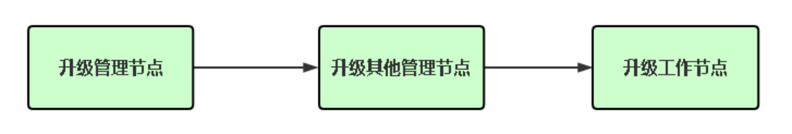

注意事项：

- 升级前必须备份所有组件及数据，例如 etcd

- 千万不要跨多个小版本进行升级，例如从 1.16 升级到 1.19

- 在测试环境经过多次演练，实操，才能上生产环境

**升级管理节点：**

```shell
## 1、查找最新版本号
yum list --showduplicates kubeadm
## 2、升级 kubeadm
yum install -y kubeadm-1.23.0-0 
## 3、驱逐 node 上的 pod，且不可调度
kubectl drain k8s-master --ignore-daemonsets
## 4、检查集群是否可以升级，并获取可以升级的版本
kubeadm upgrade plan
## 5、执行升级
kubeadm upgrade apply v1.23.0
## 6、升级 kubelet 和 kubectl
yum install -y kubelet-1.23.0-0 kubectl-1.23.0-0 
## 7、重启 kubelet
systemctl daemon-reload
systemctl restart kubelet
## 8、取消不可调度，重新上线
kubectl uncordon k8s-master
```

**升级工作节点：**

```shell
## 1、升级 kubeadm
yum install -y kubeadm-1.23.0-0 
## 2、驱逐 node 上的 pod，且不可调度
kubectl drain k8s-node1 --ignore-daemonsets
## 3、升级 kubelet 配置
kubeadm upgrade node
## 4、升级 kubelet 和 kubectl
yum install -y kubelet-1.23.0-0 kubectl-1.23.0-0 
## 5、重启 kubelet
systemctl daemon-reload
systemctl restart kubelet
## 6、取消不可调度，重新上线
kubectl uncordon k8s-node1
```

## 9.3 K8s 集群节点正确下线流程

如果你想维护某个节点或者删除节点，正确流程如下： 

```shell
## 1、获取节点列表
kubectl get node
## 2、驱逐节点上的 Pod 并设置不可调度（cordon）
kubectl drain <node_name> --ignore-daemonsets
## 3、设置可调度或者移除节点
kubectl uncordon <node_name> 
kubectl delete node <node_name>
```

## 9.4 K8s 集群故障排查

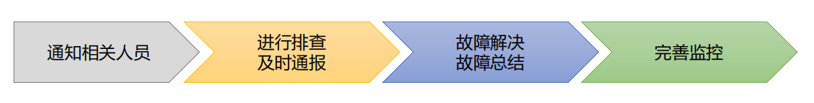

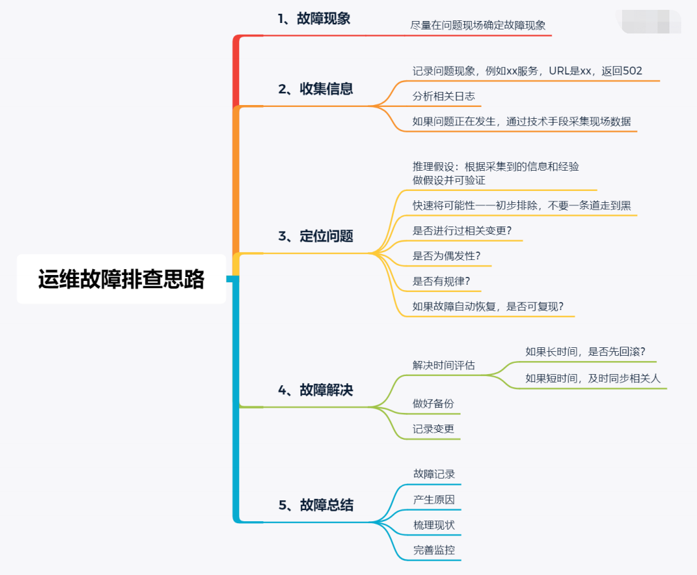

### 9.4.1 案例一

**故障现象：** `kubectl get node` 节点处于 NotReady

**排查思路：**

- 查看 kubelet 和 docker 服务是否正常

- 分析 kubelet 日志

### 9.4.2 案例二

**故障现象：** Pod 运行不正常

**排查思路：**

- 根据 Pod 状态假设：https://kubernetes.io/zh/docs/concepts/workloads/pods/pod-lifecycle/ 

- 查看资源详情：`kubectl describe TYPE/NAME`

- 查看容器日志：`kubectl logs TYPE/NAME [-c CONTAINER]`

### 9.4.3 案例三

**故障现象：** 互联网用户无法访问应用（Ingress 或者 Service 无法访问）

**排查思路：**

- Pod 正常工作吗？ 

- Service 是否关联 Pod？ 

- Service 指定 target-port 端口是否正确？ 

- 如果用名称访问，DNS 是否正常工作？ 

- kube-proxy 正常工作吗？是否正常写 iptables 规则？ 

- CNI 网络插件是否正常工作？

# 10 网站项目部署案例

## 10.1 容器交付流程

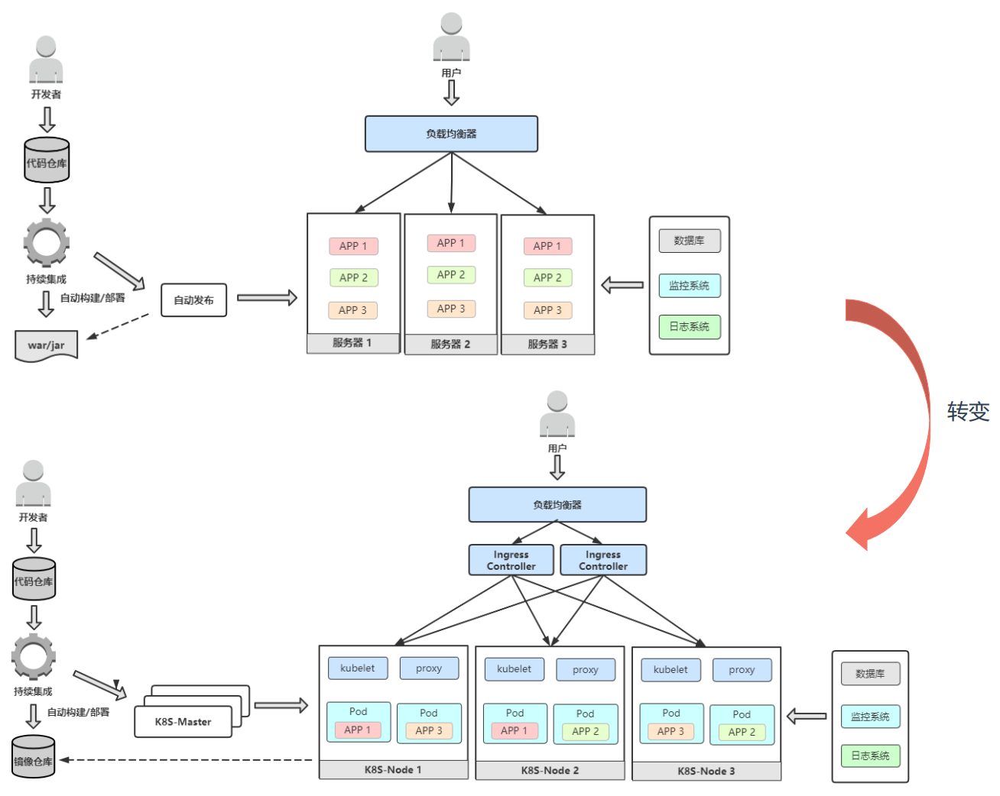

## 10.2 在 K8s 平台部署项目流程

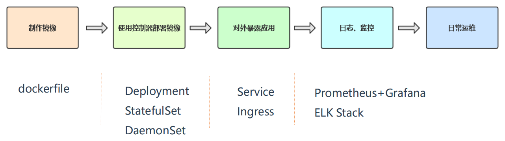

## 10.3 在 K8s 平台部署 Java 网站项目

**第一步：制作镜像**

```shell
yum install java-1.8.0-openjdk maven git -y
git clone https://github.com/lizhenliang/tomcat-java-demo
mvn clean package -Dmaven.test.skip=true    # 代码编译构建
unzip target/*.war -d target/ROOT    # 解压构建文件
```

```shell
FROM lizhenliang/tomcat
LABEL maintainer lizhenliang
COPY target/ROOT /usr/local/tomcat/webapps/ROOT
```

```shell
docker build -t image:tag .
docker push <镜像仓库地址>/<项目名>/image:tag
```

```shell
demo:1.0
demo:1.1
demo:1.2
```

```shell
docker run -d image:tag
```

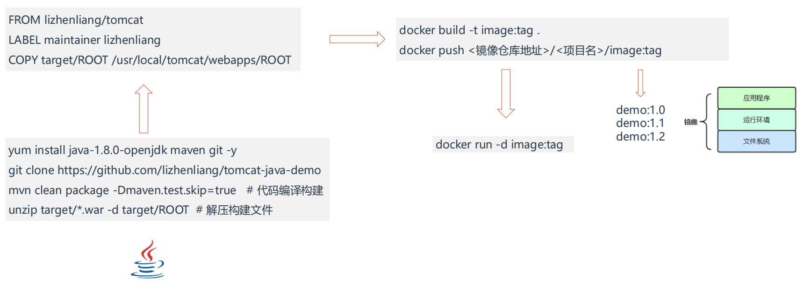

使用镜像仓库（私有仓库、公共仓库）：

1. 配置可信任（如果仓库是 HTTPS 访问不用配置）

   ```shell
   # vi /etc/docker/daemon.json
   {
     "insecure-registries": ["192.168.31.90"]
   }
   ```

2. 将镜像仓库认证凭据保存在 K8s Secret 中

   ```shell
   kubectl create secret docker-registry registry-auth \
     --docker-username=admin \
     --docker-password=Harbor12345 \
     --docker-server=192.168.31.90
   ```

3. 在 yaml 中使用这个认证凭据

   ```shell
   imagePullSecrets:
   - name: registry-auth
   ```

**第二步：使用控制器部署镜像**

```yaml
apiVersion: apps/v1
kind: Deployment
metadata:
  name: web
spec:
  replicas: 1
  selector:
    matchLabels:
      app: web
  template:
    metadata:
      labels:
        app: web
    spec:
      containers:
      - image: lizhenliang/java-demo
        name: java-demo
```

Pod 主要配置启动容器属性：

- 变量

- 资源配额

- 健康检查

- 卷挂载点

```yaml
apiVersion: v1
kind: ConfigMap
metadata:
  name: java-demo-config
data:
  application.yml: |
    server:
      port: 8080
    spring:
      datasource:
        url: jdbc:mysql://localhost:3306/test?characterEncoding=utf-8
        username: root
        password: 123456
        driver-class-name: com.mysql.jdbc.Driver
      freemarker:
        allow-request-override: false
        cache: true
        check-template-location: true
        charset: UTF-8
        content-type: text/html; charset=utf-8
        expose-request-attributes: false
        expose-session-attributes: false
        expose-spring-macro-helpers: false
        suffix: .ftl
        template-loader-path:
          - classpath:/templates/
```

<h5 align="center">使用 configmap 保存项目配置文件</h5>

```yaml
...
    volumeMounts: 
    - name: config
      mountPath: "/usr/local/tomcat/webapps/ROOT/WEB-INF/classes/application.yml"
      subPath: application.yml
  volumes:
  - name: config
    configMap:
      name: java-demo-config 
      items:
      - key: "application.yml"
        path: "application.yml"
```

<h5 align="center">Pod 配置数据卷使用 configmap</h5>

**第三步：部署数据库**

使用 deployment 部署一个 mysql 实例，service 暴露访问

```shell
kubectl apply -f mysql.yaml
kubectl get pod,svc
```

2、测试 mysql 实例是否可以访问

```shell
kubectl run mysql-client --rm -it --image=mysql:5.7.30 – bash
mysql -h10.106.166.31 -uroot -p'123456'   # 10.106.166.31为mysql ClusterIP
mysql> show databases; 
```

导入项目 sql 文件

```shell
kubectl cp db/tables_ly_tomcat.sql mysql-client:/    # 将 sql 文件拷贝到 mysql 客户端容器中
mysql -h10.106.166.31 -uroot -p'123456' 
mysql> create database test;
mysql> use test;
mysql> source /tables_ly_tomcat.sql; 
mysql> show tables;    # 只有一个 user 表
```

**第四步：对外暴露应用**

service：

```yaml
apiVersion: v1
kind: Service
metadata:
  name: java-demo 
spec:
  selector:
    project: www
    app: java-demo
  ports:
  - protocol: TCP
    port: 80
    targetPort: 8080
```

ingress：

```yaml
apiVersion: networking.k8s.io/v1 
kind: Ingress
metadata:
  name: java-demo
  annotations:
    kubernetes.io/ingress.class: "nginx"
spec:
  rules:
  - host: java.aliangedu.cn
    http:
      paths:
      - path: /
        pathType: Prefix
        backend:
          service: 
            name: java-demo 
            port:
              number: 80
```

**第五步：增加公网负载均衡器**

示例：Nginx 作为负载均衡器

```shell
upstream ingress-controller {
    server 192.168.31.72:80;
    server 192.168.31.73:80;
}

server {
    listen 80;
    server_name _;
    location / {
        proxy_pass http://ingress-controller;
        proxy_set_header Host $Host;
    }
}
```

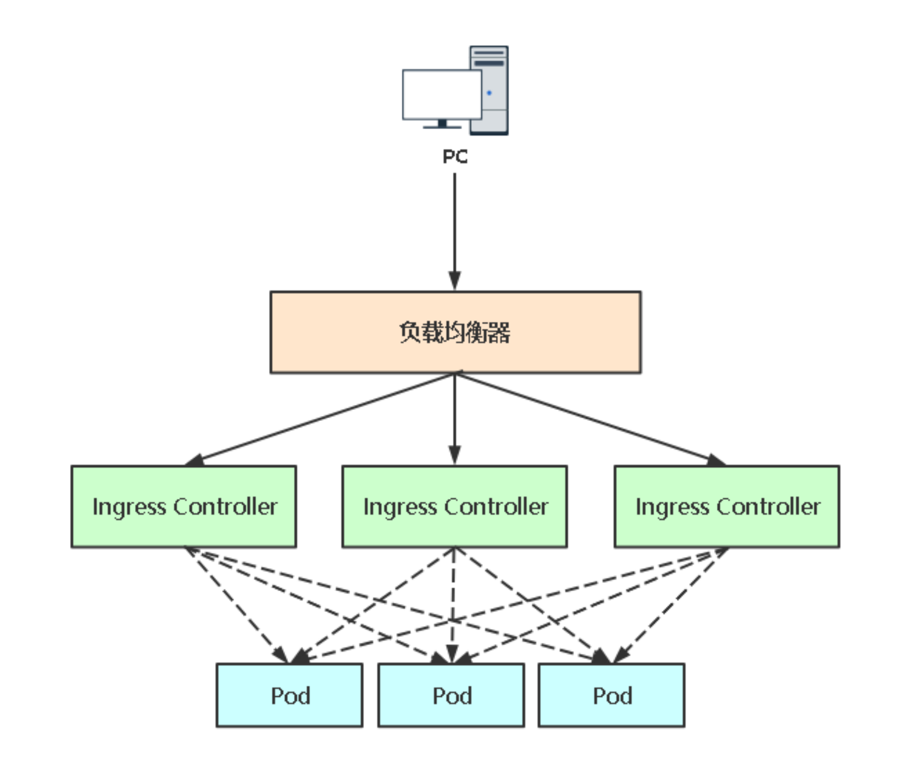

<h5 align="center">应用访问架构图</h5>

# 11 Jenkins 自动化发布网站项目（CI/CD） 

## 11.1 发布流程

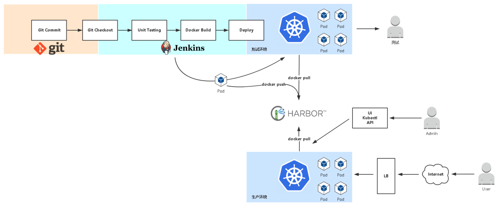

## 11.2 使用 Gitlab 作为代码仓库 & 使用 Harbor 作为镜像仓库

**Harbor 镜像仓库：**

项目地址：https://github.com/goharbor/harbor

部署步骤：

```shell
tar zxvf harbor-offline-installer-v2.0.0.tgz
cd harbor
cp harbor.yml.tmpl harbor.yml
vi harbor.yml
hostname: 192.168.31.90
https: # 先注释 https 相关配置
harbor_admin_password: Harbor12345
./prepare
./install.sh
docker-compose ps
```

**Gitlab 代码仓库：**

如果没有 Gitlab 可以使用 Docker 启动一个：

```shell
mkdir /opt/gitlab
GITLAB_HOME=/opt/gitlab    # 数据持久化目录
docker run --detach \
    --hostname gitlab.aliangedu.cn \
    --publish 443:443 \
    --publish 80:80 \
    --publish 2222:22 \
    --name gitlab \
    --restart always \
    --volume $GITLAB_HOME/config:/etc/gitlab \
    --volume $GITLAB_HOME/logs:/var/log/gitlab \
    --volume $GITLAB_HOME/data:/var/opt/gitlab \
    gitlab/gitlab-ce:latest
```

访问地址：http://IP

默认管理员用户名 root，密码从日志文件中获取：

```shell
grep "Password" /opt/gitlab/config/initial_root_password
```

随后，在 Gitlab 创建一个项目，然后提交项目代码。

## 11.3 Jenkins 发布系统部署

Jenkins 是一款开源 CI&CD 系统，用于自动化各种任务，包括构建、测试和部署。

Jenkins 官方提供了镜像：https://hub.docker.com/r/jenkins/jenkins。

使用 Deployment 来部署这个镜像，会暴露两个端口：`8080 Web` 访问端口，`50000 Slave` 通信端口，容器启动后 Jenkins 数据存储在 `/var/jenkins_home` 目录，所以需要将该目录使用 PV 持久化存储。

**配置 PV 持久化存储：**

- 部署 NFS 共享服务器
  - 在所有节点安装 NFS 软件包：`yum install nfs-utils -y`

- 找一个节点作为 NFS 共享存储服务器

  ```shell
  mkdir -p /ifs/kubernetes/jenkins-data
  vi /etc/exports
  /ifs/kubernetes 192.168.31.0/24(rw,no_root_squash)
  systemctl start nfs
  systemctl enable nfs
  ```

- 为 Jenkins 准备 PV（动态供给）

**安装后面所需的插件：**

- Jenkins 下载插件默认服务器在国外，会比较慢，建议修改国内源：

  ```shell
  # 进入到 nfs 共享目录
  cd /ifs/kubernetes/ops-jenkins-pvc-xxx
  sed -i 's/https:\/\/updates.jenkins.io\/download/https:\/\/mirrors.tuna.tsinghua.edu.cn\/jenkins/g' default.json && \
  sed -i 's/http:\/\/www.google.com/https:\/\/www.baidu.com/g' default.json
  # 重建 Pod 生效（Pod 名称改成你实际的），或者在 web 端重启，接口：http://jenkinsIP/restart
  kubectl delete pod jenkins-dccd449c7-vx6sj -n ops
  ```

- 管理 `Jenkins --> 系统配置 --> 管理插件 --> 分别搜索 --> <Git Parameter/Git/Pipeline/kubernetes/Config File Provider>`，选中点击安装。 
  - Git：拉取代码
  - Git Parameter：Git 参数化构建
  - Pipeline：流水线
  - kubernetes：连接 Kubernetes 动态创建 Slave 代理
  - Config File Provider：存储配置文件
  - Extended Choice Parameter：扩展选择框参数，支持多选

## 11.4 Jenkins 主从架构

### 11.4.1 介绍

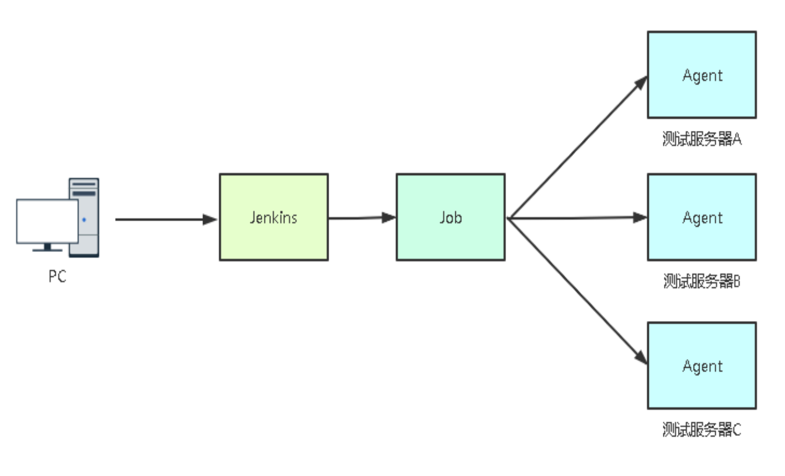

<h5 align="center">Master Slave 架构图</h5>

Jenkins Master/Slave 架构，Master（Jenkins 本身）提供 Web 页面让用户来管理项目和从节点（Slave），项目任务可以运行在 Master 本机或者分配到从节点运行，一个 Master 可以关联多个 Slave，这样好处是可以让 Slave 分担 Master 工作压力和隔离构建环境。

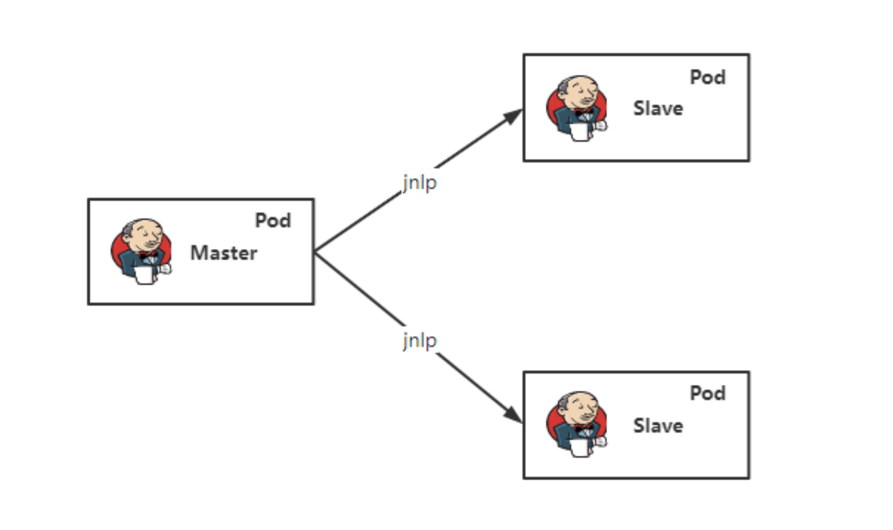

当触发 Jenkins 任务时，Jenkins 会调用 Kubernetes API 创建 Slave Pod，Pod 启动后会连接 Jenkins，接受任务并处理。

### 11.4.2 Kubernetes 插件配置

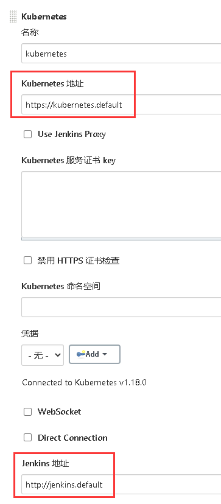

**Kubernetes 插件：** 用于 Jenkins 在 Kubernetes 集群中运行动态代理。

插件介绍：https://github.com/jenkinsci/kubernetes-plugin

**配置插件：**`管理 Jenkins --> 管理 Nodes 和云 --> 管理云 --> 添加 Kubernetes`

### 11.4.3 自定义 Jenkins-Slave 镜像

构建 Slave 镜像 Dockerfile：

```shell
FROM centos:7
LABEL maintainer iuskye

RUN yum install -y java-1.8.0-openjdk maven curl git libtool-ltdl-devel && \
  yum clean all && \
  rm -rf /var/cache/yum/* && \
  mkdir -p /usr/share/jenkins

COPY slave.jar /usr/share/jenkins/slave.jar
COPY jenkins-slave /usr/bin/jenkins-slave
COPY settings.xml /etc/maven/settings.xml
RUN chmod +x /usr/bin/jenkins-slave
COPY kubectl /usr/bin/

ENTRYPOINT ["jenkins-slave"]
```

课件 jenkins-slave 目录里涉及五个文件：

- Dockerfile：构建镜像
- slave.jar：agent 程序，接受 master 下发的任务，下载地址：http://jenkinsip:port/jnlpJars/slave.jar
- jenkins-slave：shell 脚本启动 slave.jar，下载地址：https://github.com/jenkinsci/docker-jnlp-slave/blob/master/jenkins-slave
- settings.xml：修改 maven 官方源为阿里云源
- kubectl 客户端工具
- 下载地址： https://oss.iuskye.com/files/20220407-k8s/jenkins.zip 

构建并推送到镜像仓库：

```shell
docker build -t 192.168.31.90/library/jenkins-slave-jdk:1.8 .
docker push 192.168.31.90/library/jenkins-slave-jdk:1.8
```

### 11.4.4 测试主从架构是否正常

新建项目 -> 流水线 -> Pipeline 脚本（可生成示例）：

```shell
pipeline {
    agent {
        kubernetes {
            label "jenkins-slave"
            yaml '''
apiVersion: v1
kind: Pod
metadata:
  name: jenkins-slave
spec:
  containers:
  - name: jnlp
    image: "192.168.31.90/library/jenkins-slave-jdk:1.8"
'''
        }
    }
    stages {
        stage('Main'){
            steps {
                sh 'hostname'
            }
        }
    }
}
```

## 11.5 Jenkins Pipeline（流水线）

### 11.5.1 介绍

Jenkins Pipeline 是一套运行工作流框架，将原本独立运行单个或者多个节点的任务链接起来，实现单个任务难以完成的复杂流程编排和可视化。

- Jenkins Pipeline 是一套插件，支持在 Jenkins 中实现持续集成和持续交付；
- Pipeline 通过特定语法对简单到复杂的传输管道进行建模；
- Jenkins Pipeline 的定义被写入一个文本文件，称为 Jenkinsfile。

### 11.5.2 语法

声明式：

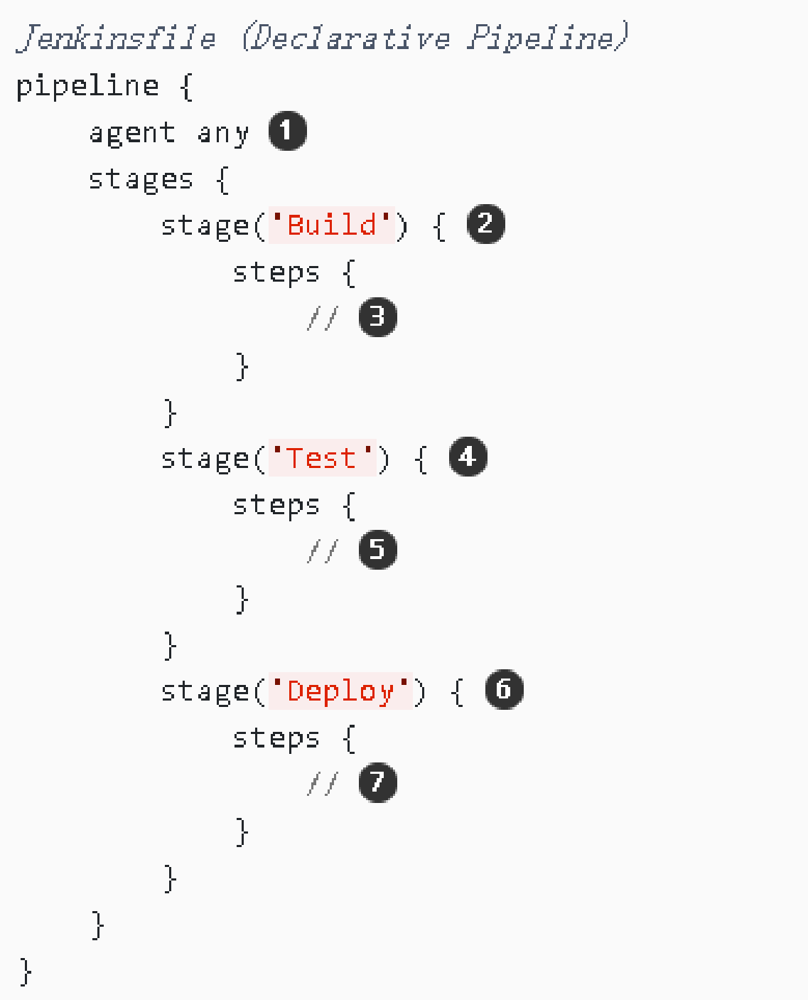

脚本式：

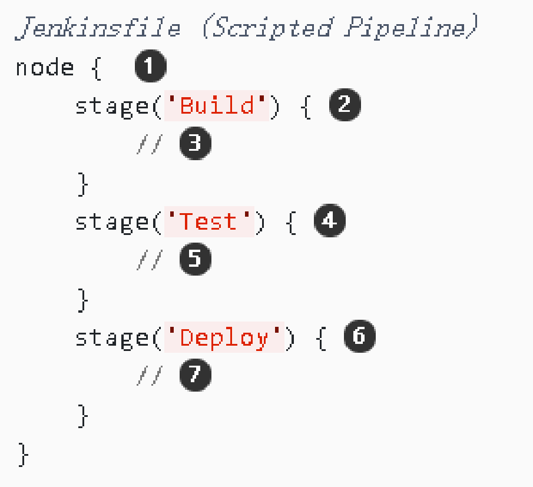

声明式：支持大部分 Groovy，具有丰富的语法特性，易于编写和设计，`pipeline { }`。

脚本式：遵循与 Groovy 相同语法，`node { }`。

- Stages 是 Pipeline 中最主要的组成部分，Jenkins 将会按照 Stages 中描述的顺序从上往下的执行。
- Stage：阶段，一个 Pipeline 可以划分为若干个 Stage，每个 Stage 代表一组操作，比如：Build、Test、Deploy
- Steps：步骤，Steps 是最基本的操作单元，可以是打印一句话，也可以是构建一个 Docker 镜像，由各类 Jenkins 插件提供，比如命令：sh ‘mvn'，就相当于我们平时 shell 终端中执行 mvn命令一样。

```shell
pipeline {
    agent any
    stages {
        stage('Build') {
            steps {
                echo 'build...'
            }
        }
        stage('Test') {
            steps {
                echo 'test...'
            }
        }
        stage('Deploy') {
            steps {
                echo 'deploy...'
            }
        }
    }
}
```

### 11.5.3 案例

- jenkins.yaml

```yaml
apiVersion: apps/v1
kind: Deployment
metadata:
  name: jenkins
spec:
  replicas: 1
  selector:
    matchLabels:
      name: jenkins 
  template:
    metadata:
      name: jenkins
      labels:
        name: jenkins
    spec:
      serviceAccountName: jenkins
      containers:
        - name: jenkins
          image: jenkins/jenkins
          ports:
            - containerPort: 8080
            - containerPort: 50000
          volumeMounts:
            - name: jenkins-home
              mountPath: /var/jenkins_home
      securityContext:
        fsGroup: 1000
      volumes:
      - name: jenkins-home
        persistentVolumeClaim:
          claimName: jenkins
          
---
apiVersion: v1
kind: PersistentVolumeClaim
metadata:
  name: jenkins
spec:
  storageClassName: "managed-nfs-storage"
  accessModes:
    - ReadWriteMany
  resources:
    requests:
      storage: 5Gi

---
apiVersion: v1
kind: Service
metadata:
  name: jenkins
spec:
  selector:
    name: jenkins
  type: NodePort
  ports:
    - name: http
      port: 80
      targetPort: 8080
      protocol: TCP
      nodePort: 30008
    - name: agent
      port: 50000
      protocol: TCP
---
apiVersion: v1
kind: ServiceAccount
metadata:
  name: jenkins

---
kind: Role
apiVersion: rbac.authorization.k8s.io/v1
metadata:
  name: jenkins
rules:
- apiGroups: [""]
  resources: ["pods","events"]
  verbs: ["create","delete","get","list","patch","update","watch"]
- apiGroups: [""]
  resources: ["pods/exec"]
  verbs: ["create","delete","get","list","patch","update","watch"]
- apiGroups: [""]
  resources: ["pods/log"]
  verbs: ["get","list","watch"]
- apiGroups: [""]
  resources: ["secrets","events"]
  verbs: ["get"]

---
apiVersion: rbac.authorization.k8s.io/v1
kind: RoleBinding
metadata:
  name: jenkins
roleRef:
  apiGroup: rbac.authorization.k8s.io
  kind: Role
  name: jenkins
subjects:
- kind: ServiceAccount
  name: jenkins
```

- Jenkinsfile

```groovy
// 公共
def registry = "192.168.31.90"
// 项目
def project = "demo"
def app_name = "java-demo"
def image_name = "${registry}/${project}/${app_name}:${BUILD_NUMBER}"
def git_address = "http://192.168.31.90:88/root/java-demo.git"
// 认证
def secret_name = "registry-auth"
def harbor_auth = "71adf267-8c6d-4c08-9f2d-41332b4f038c"
def git_auth = "f8f9e5b2-4148-48a2-bbf6-ebb1557526e1"
def k8s_auth = "3e5302c4-3f4a-4f49-8a21-3b85fbb166c0"

pipeline {
    agent {
        kubernetes {
            label "jenkins-slave"
            yaml """
kind: Pod
metadata:
  name: jenkins-slave
spec:
  containers:
  - name: jnlp
    image: "${registry}/library/jenkins-slave-jdk:1.8"
    imagePullPolicy: Always
    volumeMounts:
      - name: docker-cmd
        mountPath: /usr/bin/docker
      - name: docker-sock
        mountPath: /var/run/docker.sock
      - name: maven-cache
        mountPath: /root/.m2
  volumes:
    - name: docker-cmd
      hostPath:
        path: /usr/bin/docker
    - name: docker-sock
      hostPath:
        path: /var/run/docker.sock
    - name: maven-cache
      hostPath:
        path: /tmp/m2
"""
        }  
    }
    parameters {    
        gitParameter branch: '', branchFilter: '.*', defaultValue: 'master', description: '选择发布的分支', name: 'Branch', quickFilterEnabled: false, selectedValue: 'NONE', sortMode: 'NONE', tagFilter: '*', type: 'PT_BRANCH'
        choice (choices: ['1', '3', '5', '7'], description: '副本数', name: 'ReplicaCount')
        choice (choices: ['dev','test','prod'], description: '命名空间', name: 'Namespace')
    }
    stages {
        stage('拉取代码'){
            steps {
                checkout([$class: 'GitSCM', 
                branches: [[name: "${params.Branch}"]], 
                doGenerateSubmoduleConfigurations: false, 
                extensions: [], submoduleCfg: [], 
                userRemoteConfigs: [[credentialsId: "${git_auth}", url: "${git_address}"]]
                ])
            }
        }
        stage('代码编译'){
            steps {
                sh """
                  mvn clean package -Dmaven.test.skip=true
                """ 
            }
        }
        stage('构建镜像'){
            steps {
                withCredentials([usernamePassword(credentialsId: "${harbor_auth}", passwordVariable: 'password', usernameVariable: 'username')]) {
                sh """
                  unzip target/*.war -d target/ROOT  
                  echo '
                    FROM lizhenliang/tomcat
                    LABEL maitainer lizhenliang
                    ADD target/ROOT /usr/local/tomcat/webapps/ROOT
                  ' > Dockerfile
                  docker build -t ${image_name} .
                  docker login -u ${username} -p '${password}' ${registry}
                  docker push ${image_name}
                """
                }
            } 
        }
        stage('部署到K8S平台'){
            steps {
                configFileProvider([configFile(fileId: "${k8s_auth}", targetLocation: "admin.kubeconfig")]){
                    sh """
                        sed -i 's#IMAGE_NAME#${image_name}#' deploy.yaml
                        sed -i 's#SECRET_NAME#${secret_name}#' deploy.yaml
                        sed -i 's#REPLICAS#${ReplicaCount}#' deploy.yaml
                        kubectl apply -f deploy.yaml -n ${Namespace} --kubeconfig=admin.kubeconfig
                    """
                }
            }
        }
    }
}
```

## 11.6 Jenkins 流水线自动发布项目

### 11.6.1 思路


<h5 align="center">项目部署流程</h5>

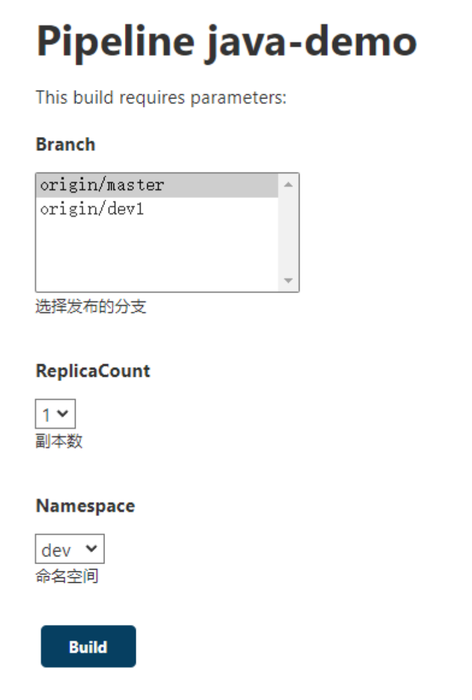

在实际工作中，会维护多个项目，如果每个服务都创建一个 item，势必给运维维护成本增加很大，因此需要编写一个通用 Pipeline 脚本，将这些项目部署差异化部分使用 Jenkins 参数化，人工交互确认发布的分支、副本数、命名空间等。

### 11.6.2 部署到 K8s 平台

**将镜像部署到 K8s 平台思路：**

将部署项目 yaml 文件提交到项目代码仓库里，在 Slave 容器里使用 kubectl apply 部署。由于 kubectl 使用kubeconfig 配置文件连接 k8s 集群，还需要通过 Config File Provider 插件将 kubeconfig 配置文件存储到 Jenkins，然后再挂载到 Slave 容器中，这样就有权限部署了（kubectl apply deploy.yaml --kubeconfig=config） 。

注：为提高安全性，kubeconfig 文件应分配权限。

除了上述方式，还可以使用 Kubernetes Continuous Deploy 插件，将资源配置（YAML）部署到 Kubernetes，这种不是很灵活性。

## 11.7 流水线脚本与源代码一起版本管理

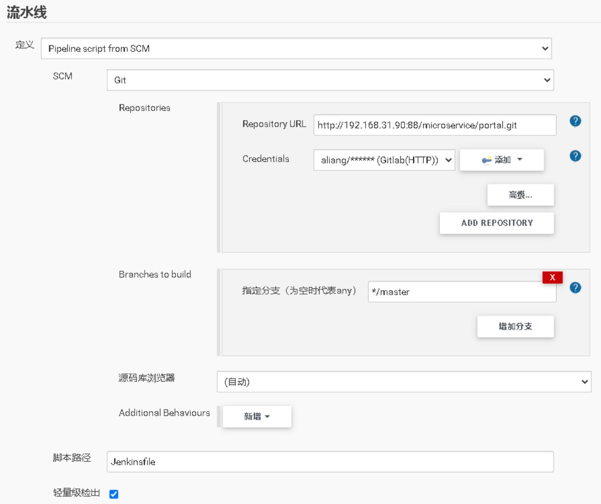

<h5 align="center">Jenkins 从 Git 仓库中读取 Jenkinsfile</h5>

## 11.8 总结

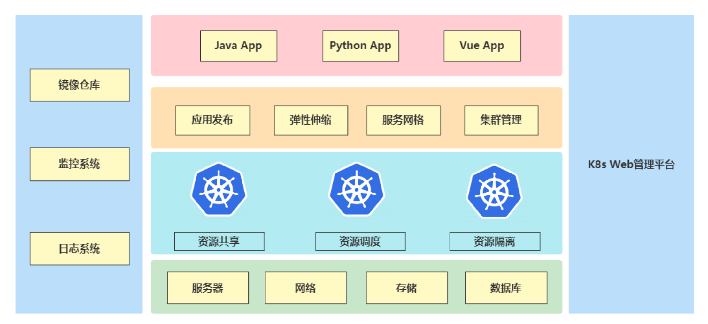

<h5 align="center">K8s 容器云平台架构</h5>

