<h1 align="center">Kubernetes CKS 学习笔记</h1>

- [1 Kubernetes 集群设置](#1-kubernetes-集群设置)
  - [1.1 K8s 安全运维概述](#11-k8s-安全运维概述)
    - [1.1.1 安全运维的重要性](#111-安全运维的重要性)
    - [1.1.2 SecDevOps](#112-secdevops)
    - [1.1.3 K8s 提供的安全机制](#113-k8s-提供的安全机制)
    - [1.1.4 K8s 安全运维实践思路](#114-k8s-安全运维实践思路)
  - [1.2 部署一套完整 K8s 高可用集群](#12-部署一套完整-k8s-高可用集群)
  - [1.3 CIS 安全基准介绍与 K8s 安全基准工具 Kube-bench](#13-cis-安全基准介绍与-k8s-安全基准工具-kube-bench)
    - [1.3.1 CIS 安全基准介绍](#131-cis-安全基准介绍)
    - [1.3.2 K8s 安全基准工具 kube-bench](#132-k8s-安全基准工具-kube-bench)
  - [1.4 Ingress 配置证书](#14-ingress-配置证书)
    - [1.4.1 Ingress 是什么](#141-ingress-是什么)
    - [1.4.2 HTTPS 重要性](#142-https-重要性)
    - [1.4.3 将一个项目对外暴露 HTTPS 访问](#143-将一个项目对外暴露-https-访问)
  - [1.5 网络策略控制集群内部网络通信](#15-网络策略控制集群内部网络通信)
    - [1.5.1 网络策略应用场景](#151-网络策略应用场景)
    - [1.5.2 网络策略概述](#152-网络策略概述)
    - [1.5.3 网络访问控制 5 个案例](#153-网络访问控制-5-个案例)
  - [1.6 课后作业](#16-课后作业)
- [2 Kubernetes 集群强化](#2-kubernetes-集群强化)
  - [2.1 K8s 安全框架](#21-k8s-安全框架)
  - [2.2 基于角色的权限访问控制：RBAC](#22-基于角色的权限访问控制rbac)
  - [2.3 RBAC 认证授权案例](#23-rbac-认证授权案例)
  - [2.4 资源配额 ResourceQuota](#24-资源配额-resourcequota)
  - [2.5 资源限制 LimitRange](#25-资源限制-limitrange)
  - [2.6 课后作业](#26-课后作业)
- [3 Kubernetes 系统强化](#3-kubernetes-系统强化)
  - [3.1 最小特权原则（POLP）](#31-最小特权原则polp)
  - [3.2 AppArmor 限制容器对资源访问](#32-apparmor-限制容器对资源访问)
  - [3.3 Seccomp 限制容器进程系统调用](#33-seccomp-限制容器进程系统调用)
  - [3.4 课后作业](#34-课后作业)
- [4 最小化微服务漏洞](#4-最小化微服务漏洞)
  - [4.1 Pod 安全上下文](#41-pod-安全上下文)
  - [4.2 Pod 安全策略](#42-pod-安全策略)
  - [4.3 OPA Gatekeeper](#43-opa-gatekeeper)
    - [4.3.1 OPA 策略引擎介绍](#431-opa-策略引擎介绍)
    - [4.3.2 OPA Gatekeeper 策略引擎](#432-opa-gatekeeper-策略引擎)
  - [4.4 Secret 存储敏感数据](#44-secret-存储敏感数据)
  - [4.5 安全沙箱运行容器](#45-安全沙箱运行容器)
    - [4.5.1 gVisor 介绍](#451-gvisor-介绍)
    - [4.5.2 gVisor 架构](#452-gvisor-架构)
    - [4.5.3 gVisor 与 Docker 集成](#453-gvisor-与-docker-集成)
    - [4.5.4 gVisor 与 Containerd 集成](#454-gvisor-与-containerd-集成)
    - [4.5.5 K8s 使用 gVisor 运行容器](#455-k8s-使用-gvisor-运行容器)
  - [4.6 课后作业](#46-课后作业)
- [5 供应链安全](#5-供应链安全)
  - [5.1 可信任软件供应链概述](#51-可信任软件供应链概述)
  - [5.2 构建镜像 Dockerfile 文件优化](#52-构建镜像-dockerfile-文件优化)
  - [5.3 镜像漏洞扫描工具 Trivy](#53-镜像漏洞扫描工具-trivy)
  - [5.4 检查 YAML 文件安全配置工具 kubesec](#54-检查-yaml-文件安全配置工具-kubesec)
  - [5.5 准入控制器 Admission Webhook](#55-准入控制器-admission-webhook)
  - [5.6 准入控制器 ImagePolicyWebhook](#56-准入控制器-imagepolicywebhook)
- [6 监控、审计和运行时安全](#6-监控审计和运行时安全)
  - [6.1 分析容器系统调用 Sysdig](#61-分析容器系统调用-sysdig)
  - [6.2 监控容器运行时 Falco](#62-监控容器运行时-falco)
  - [6.3 Kubernetes 审计日志](#63-kubernetes-审计日志)

# 1 Kubernetes 集群设置

## 1.1 K8s 安全运维概述

### 1.1.1 安全运维的重要性


- 万物互联，安全为基，企业的网络安全不可小视

- 服务器被黑事件频发

- 公司重要数据资产在运维手中

### 1.1.2 SecDevOps

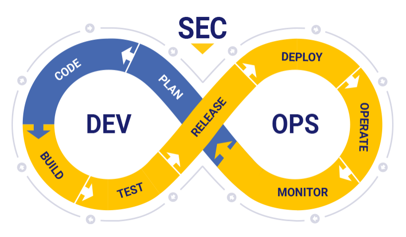

**SecDevOps** 与 DevOps 相似，是一种哲学，鼓励运维人员、开发人员、测试人员和安全人员进行更高水平协作，将信息安全放在事前考虑，将安全性注入自动化流程中，以确保整个产品周期内的信息安全。

### 1.1.3 K8s 提供的安全机制

为了保证集群以及容器应用的安全，Kubernetes 提供了多种安全机制，限制容器的行为，减少容器和集群的攻击面，保证整个系统的安全性。

- **集群安全：** TLS 证书认证、RBAC
- **Security Context：** 限制容器的行为，例如只读文件系统、特权、运行用户等

- **Pod Security Policy：** 集群级的 Pod 安全策略，自动为集群内的 Pod 配置安全策略

- **Sysctls：** 允许容器设置内核参数

- **AppArmor：** 限制容器中应用对资源的访问权限

- **Network Policies：** 控制集群中网络通信

- **Seccomp：** 限制容器内进程的系统调用

### 1.1.4 K8s 安全运维实践思路

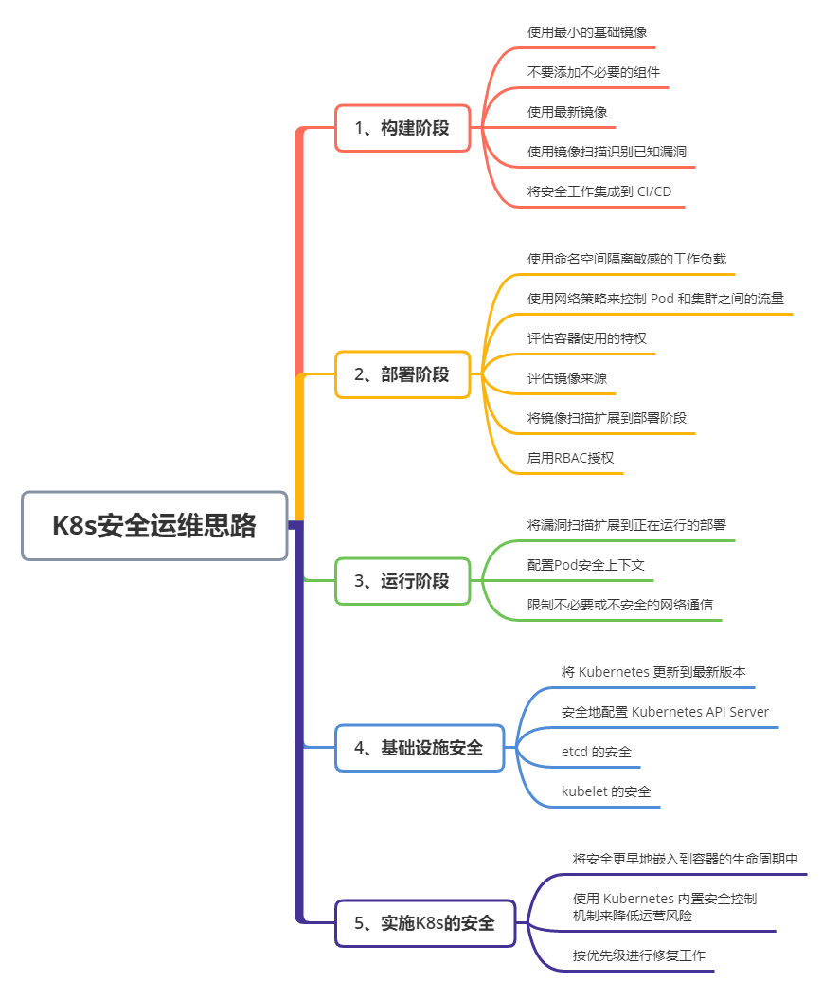

## 1.2 部署一套完整 K8s 高可用集群

本节略过，可参考《Kubernetes CKA 学习笔记》！

## 1.3 CIS 安全基准介绍与 K8s 安全基准工具 Kube-bench

### 1.3.1 CIS 安全基准介绍

互联网安全中心（CIS，Center for Internet Security），是一个非盈利组织，致力为互联网提供免费的安全防御解决方案。 

官网：https://www.cisecurity.org/

Kubernetes CIS 基准：https://www.cisecurity.org/benchmark/kubernetes/

### 1.3.2 K8s 安全基准工具 kube-bench

下载 pdf 后，根据里面的基准来检查 K8s 集群配置，但内容量太大，一般会采用相关工具来完成这项工作。

Kube-bench 是容器安全厂商 Aquq 推出的工具，以 CIS K8s 基准作为基础，来检查 K8s 是否安全部署。

主要查找不安全的配置参数、敏感的文件权限、不安全的帐户或公开端口等等。

项目地址：https://github.com/aquasecurity/kube-bench

**kube-bench 部署**

1. 下载二进制包

   https://github.com/aquasecurity/kube-bench/releases

2. 解压使用

    ```shell
    tar zxvf kube-bench_0.6.3_linux_amd64.tar.gz 
    mkdir /etc/kube-bench # 创建默认配置文件路径
    mv cfg /etc/kube-bench/cfg
    ```

**kube-bench 使用**

使用 kube-bench run 进行测试，该指令有以下常用参数：

- -s, --targets：指定要基准测试的目标，这个目标需要匹配 cfg/<version> 中的文件名称，已有目标：master, controlplane, node, etcd, policies

- --version：指定 k8s 版本，如果未指定会自动检测

- --benchmark：手动指定 CIS 基准版本，不能与 --version 一起使用

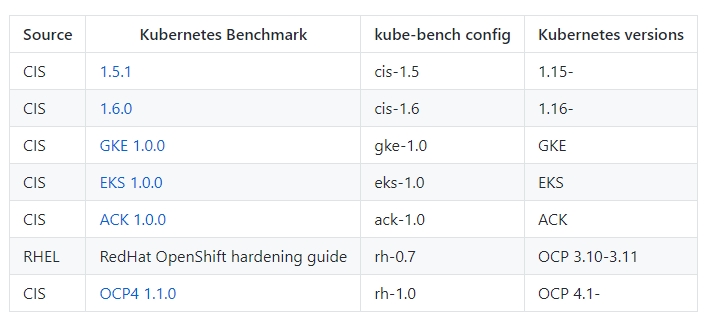

<h5 align="center">Kube-bench 与 k8s 版本支持</h5>

例如：检查 master 组件安全配置

```shell
kube-bench run --targets=master
```

执行后会逐个检查安全配置并输出修复方案及汇总信息输出：

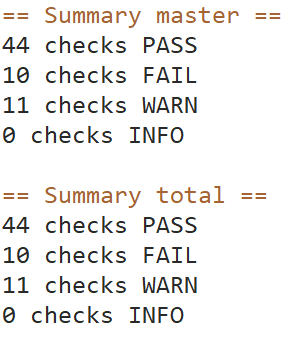

- [PASS]：测试通过

- [FAIL]：测试未通过，重点关注，在测试结果会给出修复建议

- [WARN]：警告，可做了解

- [INFO]：信息

测试项目配置文件：`/etc/kube-bench/cfg/cis-1.6/ `

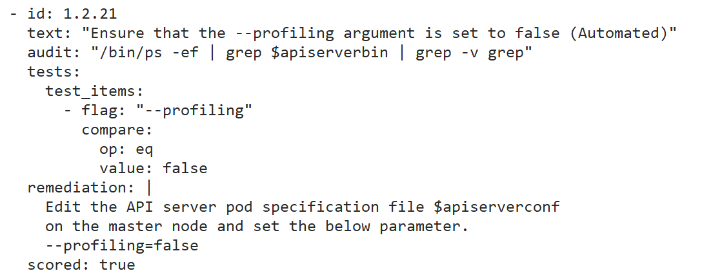

- id：编号
- text：提示的文本
- audit： 
- tests：测试项目
- remediation：修复方案
- scored：如果为 true，kube-bench 无法正常测试，则会生成 FAIL，如果为 false，无法正常测试，则会生成 WARN
- type：如果为 manual 则会生成 WARN，如果为 skip，则会生成 INFO

## 1.4 Ingress 配置证书

### 1.4.1 Ingress 是什么

- **Ingress：** K8s 中的一个抽象资源，给管理员提供一个暴露应用的入口定义方法

- **Ingress Controller：** 根据 Ingress 生成具体的路由规则，并对 Pod 负载均衡器

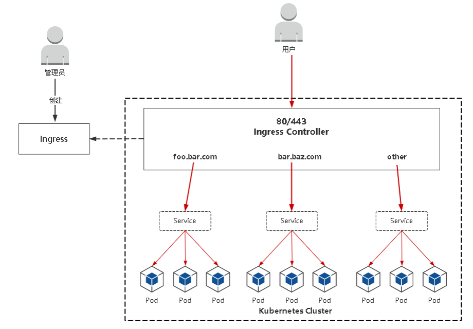

### 1.4.2 HTTPS 重要性

HTTPS 是安全的 HTTP，HTTP 协议中的内容都是明文传输，HTTPS 的目的是将这些内容加密，确保信息传输安全。最后一个字母 S 指的是 SSL/TLS 协议，它位于 HTTP 协议与 TCP/IP 协议中间。

**HTTPS 优势：**

- 加密隐私数据：防止您访客的隐私信息(账号、地址、手机号等)被劫持或窃取；
- 安全身份认证：验证网站的真实性，防止钓鱼网站；
- 防止网页篡改：防止数据在传输过程中被篡改，保护用户体验；
- 地址栏安全锁：地址栏头部的“锁”型图标，提高用户信任度；
- 提高 SEO 排名：提高搜索排名顺序，为企业带来更多访问量。

### 1.4.3 将一个项目对外暴露 HTTPS 访问

配置 HTTPS 步骤：

- 准备域名证书文件（来自：openssl/cfssl 工具自签或者权威机构颁发）

- 将证书文件保存到 Secret

  ```shell
  kubectl create secret tls web-iuskye-com --
  cert=web.iuskye.com.pem --key=web.iuskye.com-key.pem
  ```

- Ingress 规则配置 tls

- `kubectl get ingress`

- 测试，本地电脑绑定 hosts 记录对应 ingress 里面配置的域名，IP 是 `Ingress Controller Pod` 节点 IP

```yaml
apiVersion: networking.k8s.io/v1
kind: Ingress
metadata:
  name: https
spec:
  tls:
  - hosts:
    - web.aliangedu.cn
    secretName: web-aliangedu-cn
  rules:
  - host: web.aliangedu.cn
    http:
      paths:
      - path: /
        pathType: Prefix
        backend:
          service:
            name: web
            port:
            number: 80
```

## 1.5 网络策略控制集群内部网络通信

### 1.5.1 网络策略应用场景

默认情况下，Kubernetes 集群网络没任何网络限制，Pod 可以与任何其他 Pod 通信，在某些场景下就需要进行网络控制，减少网络攻击面，提高安全性，这就会用到网络策略。

网络策略（Network Policy）：是一个 K8s 资源，用于限制 Pod 出入流量，提供 Pod 级别和 Namespace 级别网络访问控制。

网络策略的应用场景：

- 应用程序间的访问控制，例如项目 A 不能访问项目 B 的 Pod

- 开发环境命名空间不能访问测试环境命名空间 Pod

- 当 Pod 暴露到外部时，需要做 Pod 白名单

- 多租户网络环境隔离

### 1.5.2 网络策略概述

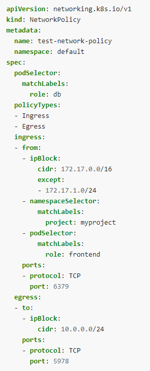

- podSelector：目标 Pod，根据标签选择；

- policyTypes：策略类型，指定策略用于入站、出站流量；

- Ingress：from 是可以访问的白名单，可以来自于 IP 段、命名空间；

- Pod标签等，ports 是可以访问的端口；

- Egress：这个 Pod 组可以访问外部的 IP 段和端口。

网络策略工作流程：

- 创建 Network Policy 资源；

- Policy Controller 监控网络策略，同步并通知节点上程序；

- 节点上 DaemonSet 运行的程序从 etcd 中获取 Policy，调用本地 Iptables 创建防火墙规则。

### 1.5.3 网络访问控制 5 个案例

**案例1：拒绝命名空间下所有 Pod 出入站流量**

需求：拒绝 test 命名空间下所有 Pod 入、出站流量

```yaml
apiVersion: networking.k8s.io/v1
kind: NetworkPolicy
metadata:
  name: deny-all
    namespace: test
spec:
  podSelector: {}    # 匹配本命名空间所有pod
  policyTypes: 
  - Ingress
  - Egress
  # ingress 和 egress 没有指定规则，则不允许任何流量进出 pod
```

**案例2：拒绝其他命名空间 Pod 访问**

需求：test 命名空间下所有 pod 可以互相访问，也可以访问其他命名空间 Pod，但其他命名空间不能访问 test 命名空间 Pod。

```yaml
apiVersion: networking.k8s.io/v1
kind: NetworkPolicy
metadata:
  name: deny-all-namespaces 
  namespace: test
spec:
  podSelector: {} 
  policyTypes:
  - Ingress
  ingress:
  - from:
    - podSelector: {}    # 匹配本命名空间所有pod
```

**案例3：允许其他命名空间 Pod 访问指定应用**

需求：允许其他命名空间访问 test 命名空间指定 Pod

```yaml
apiVersion: networking.k8s.io/v1
kind: NetworkPolicy
metadata:
  name: allow-all-namespaces 
  namespace: test
spec:
  podSelector: 
    matchLabels:
      app: web
  policyTypes:
  - Ingress
  ingress:
  - from:
    - namespaceSelector: {} # 匹配所有命名空间的pod
```

**案例4：同一个命名空间下应用之间限制访问**

需求：将 test 命名空间中标签为 run=web 的 pod 隔离，只允许标签为 run=client1 的 pod 访问 80 端口

```yaml
apiVersion: networking.k8s.io/v1
kind: NetworkPolicy
metadata:
  name: app-to-app
  namespace: test
spec:
  podSelector:
    matchLabels:
      run: web
  policyTypes:
  - Ingress
  ingress:
  - from:
    - podSelector:
      matchLabels:
        run: client1
    ports:
    - protocol: TCP
      port: 80
```

**案例5：只允许指定命名空间中的应用访问**

需求：限制 dev 命名空间标签为 env=dev 的 pod，只允许 prod 命名空间中的 pod 访问和其他所有命名空间 app=client1 标签 pod 访问

```yaml
apiVersion: networking.k8s.io/v1
kind: NetworkPolicy
metadata:
  name: dev-web
  namespace: dev
spec:
  podSelector:
    matchLabels:
      env: dev
  policyTypes:
  - Ingress
  ingress:
  # 满足允许 prod 命名空间中的 pod 访问
  - from:
    - namespaceSelector:
        matchLabels:
          env: prod
  # 允许 pod 标签为 app=client1 的 pod 访问，所有命名空间
  - from:
    - namespaceSelector: {}
      podSelector:
        matchLabels:
          app: client1
```

## 1.6 课后作业

1、网络策略

需求1：在 test 命名空间创建一个名为 deny-all 的网络策略，拒绝本命名空间所有 Pod 的 Ingress 和 Egress 流量。

需求2：限制 dev 命名空间标签为 env=dev 的 pod，只允许 prod 命名空间中的 pod 访问和其他所有命名空间 app=client1 标签 pod 访问。

2、使用 kube-bench 工具检查集群组件配置文件存在的问题与修复，并重启对应组件确保新配置生效。

修复：1.2.21 Ensure that the --profiling argument is set to false (Automated)。

注：自由发挥，实现需求即可。

# 2 Kubernetes 集群强化

## 2.1 K8s 安全框架

K8S 安全控制框架主要由下面 3 个阶段进行控制，每一个阶段都支持插件方式，通过 API Server 配置来启用插件。

1. Authentication（鉴权）

2. Authorization（授权）

3. Admission Control（准入控制）

**鉴权（Authentication）**

K8s Apiserver 提供三种客户端身份认证： 

- HTTPS 证书认证：基于 CA 证书签名的数字证书认证（kubeconfig） 

- HTTP Token 认证：通过一个 Token 来识别用户（serviceaccount） 

- HTTP Base 认证：用户名 + 密码的方式认证（1.19版本弃用）

**授权（Authorization）**

RBAC（Role-Based Access Control，基于角色的访问控制）：负责完成授权（Authorization）工作。

RBAC 根据 API 请求属性，决定允许还是拒绝。

比较常见的授权维度：

- user：用户名

- group：用户分组

- 资源，例如 pod、deployment

- 资源操作方法：get，list，create，update，patch，watch，delete

- 命名空间

- API 组

**准入控制（Admission Control）**

Adminssion Control 实际上是一个准入控制器插件列表，发送到 API Server 的请求都需要经过这个列表中的每个准入控制器插件的检查，检查不通过，则拒绝请求。

启用一个准入控制器：

```shell
kube-apiserver --enable-admission-plugins=NamespaceLifecycle,LimitRanger ...
```

关闭一个准入控制器：

```shell
kube-apiserver --disable-admission-plugins=PodNodeSelector,AlwaysDeny ...
```

查看默认启用：

```shell
kubectl exec kube-apiserver-k8s-master -n kube-system -- kube-apiserver -h | grep enable-admission-plugins
```

## 2.2 基于角色的权限访问控制：RBAC

**RBAC（Role-Based Access Control，基于角色的访问控制）** ，是 K8s 默认授权策略，并且是动态配置策略（修改即时生效）。

**主体（subject）** 

- User：用户

- Group：用户组

- ServiceAccount：服务账号

**角色**

- Role：授权特定命名空间的访问权限

- ClusterRole：授权所有命名空间的访问权限

**角色绑定**

- RoleBinding：将角色绑定到主体（即 subject） 

- ClusterRoleBinding：将集群角色绑定到主体

注：RoleBinding 在指定命名空间中执行授权，ClusterRoleBinding 在集群范围执行授权。

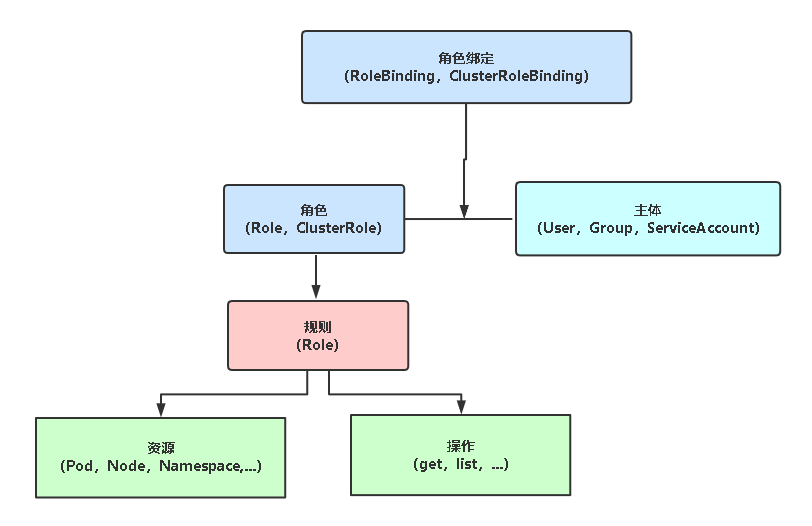

k8s 预定好了四个集群角色供用户使用，使用 `kubectl get clusterrole` 查看，其中 `systemd:` 开头的为系统内部使用。

| **内置集群角色** | **描述**                                                     |
| ---------------- | ------------------------------------------------------------ |
| cluster-admin    | 超级管理员，对集群所有权限                                   |
| admin            | 主要用于授权命名空间所有读写权限                             |
| edit             | 允许对命名空间大多数对象读写操作，不允许查看或者修改角色、角色绑定 |
| view             | 允许对命名空间大多数对象只读权限，不允许                     |

## 2.3 RBAC 认证授权案例

**案例1：对用户授权访问K8s（TLS证书）**

**需求：** 为指定用户授权访问不同命名空间权限，例如新入职一个小弟，希望让他先熟悉 K8s 集群，为了安全性，先不能给他太大权限，因此先给他授权访问 default 命名空间 Pod 读取权限。

实施大致步骤：

1. 用 K8S CA 签发客户端证书

2. 生成 kubeconfig 授权文件

3. 创建 RBAC 权限策略

4. 指定 kubeconfig 文件测试权限：`kubectl get pods --kubeconfig=./iuskye.kubeconfig`

角色权限分配：

```yaml
apiVersion: rbac.authorization.k8s.io/v1
kind: Role
metadata:
  namespace: default
  name: pod-reader
rules:
- apiGroups: [""]    # api 组，例如 apps 组，空值表示是核心 API 组，像 namespace、pod、service、pv、pvc 都在里面
  resources: ["pods"]    # 资源名称（复数），例如 pods、deployments、services
  verbs: ["get", "watch", "list"]    # 资源操作方法
```

将主体与角色绑定：

```yaml
apiVersion: rbac.authorization.k8s.io/v1
kind: RoleBinding
metadata:
  name: read-pods
  namespace: default
subjects:
- kind: User    # 主体
  name: jane    # 主体名称
  apiGroup: rbac.authorization.k8s.io
roleRef:    # 绑定的角色
  kind: Role
  name: pod-reader    # 角色名称
  apiGroup: rbac.authorization.k8s.io
```

**用户组：** 用户组的好处是无需单独为某个用户创建权限，统一为这个组名进行授权，所有的用户都以组的身份访问资源。

**例如：为 dev 用户组统一授权**

1. 将 certs.sh 文件中的 aliang-csr.json 下的 O 字段改为 dev，并重新生成证书和 kubeconfig 文件

2. 将 dev 用户组绑定 Role（pod-reader） 

3. 测试，只要 O 字段都是 dev，这些用户持有的 kubeconfig 文件都拥有相同的权限

```yaml
apiVersion: rbac.authorization.k8s.io/v1
kind: RoleBinding
metadata:
  name: read-pods
  namespace: default
subjects:
- kind: Group 
  name: dev
  apiGroup: rbac.authorization.k8s.io
roleRef: 
  kind: Role
  name: pod-reader 
  apiGroup: rbac.authorization.k8s.io
```

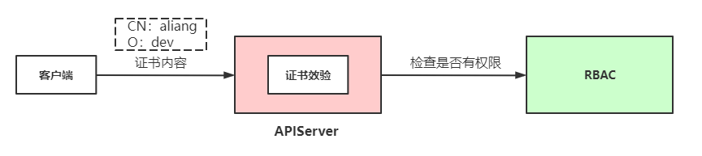

<h5 align="center">TLS 证书认证流程</h5>

**案例2：对应用程序授权访问K8s（ServiceAccount）**

先了解下 ServiceAccount，简称 SA，是一种用于让程序访问 K8s API 的服务账号。

- 当创建 namespace 时，会自动创建一个名为 default 的SA，这个 SA 没有绑定任何权限

- 当 default SA 创建时，会自动创建一个 default-token-xxx 的 secret，并自动关联到 SA

- 当创建 Pod 时，如果没有指定 SA，会自动为 pod 以 volume 方式挂载这个default SA，在容器目录：`/var/run/secrets/kubernetes.io/serviceaccount`

验证默认SA权限：`kubectl --as=system:serviceaccount:default:default get pods`

**需求：授权容器中 Python 程序对 K8s API 访问权限**

实施大致步骤：

1. 创建 Role

2. 创建 ServiceAccount

3. 将 ServiceAccount 与 Role绑定

4. 为 Pod 指定自定义的 SA

5. 进入容器里执行 Python 程序测试操作 K8s API 权限

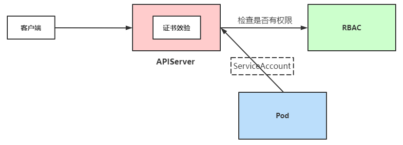

<h5 align="center">ServiceAccount 认证流程</h5>

命令行使用：授权 SA 只能查看 test 命名空间控制器的权限

```shell
# 创建角色
kubectl create role role-test --verb=get,list \
  --resource=deployments,daemonsets,statefulsets -n test
# 创建服务账号
kubectl create serviceaccount app-demo -n test
# 将服务账号绑定角色
kubectl create rolebinding role-test:app-demo \
  --serviceaccount=test:app-demo --role=role-test -n test
# 测试
kubectl --as=system:serviceaccount:test:app-demo \
  get pods -n test
```

```yaml
apiVersion: v1
kind: ServiceAccount
metadata:
  name: app-demo
  namespace: test
---
apiVersion: rbac.authorization.k8s.io/v1
kind: Role
metadata:
  name: role-test
  namespace: test
rules:
- apiGroups: ["apps"]
  resources: ["deployments","daemonsets","statefulsets"] 
  verbs: ["get", "list"]
---
apiVersion: rbac.authorization.k8s.io/v1
kind: RoleBinding
metadata:
  name: role-test:app-demo
  namespace: test
roleRef:
  apiGroup: rbac.authorization.k8s.io
  kind: Role
  name: role-test
subjects:
- kind: ServiceAccount
  name: app-demo
  namespace: test
```

<h5 align="center">命令对应的 YAML</h5>

## 2.4 资源配额 ResourceQuota

当多个团队、多个用户共享使用 K8s 集群时，会出现不均匀资源使用，默认情况下先到先得，这时可以通过 `ResourceQuota` 来对命名空间资源使用总量做限制，从而解决这个问题。

使用流程：k8s 管理员为每个命名空间创建一个或多个 ResourceQuota 对象，定义资源使用总量，K8s 会跟踪命名空间资源使用情况，当超过定义的资源配额会返回拒绝。

ResourceQuota功能是一个准入控制插件，默认已经启用。

| **支持的资源**                                               | **描述**                                                  |
| ------------------------------------------------------------ | --------------------------------------------------------- |
| limits.cpu/memory                                            | 所有Pod上限资源配置总量不超过该值（所有非终止状态的Pod）  |
| requests.cpu/memory                                          | 所有Pod请求资源配置总量不超过该值（所有非终止状态的Pod）  |
| cpu/memory                                                   | 等同于requests.cpu/requests.memory                        |
| requests.storage                                             | 所有PVC请求容量总和不超过该值                             |
| persistentvolumeclaims                                       | 所有PVC数量总和不超过该值                                 |
| <storage-class-name>.storageclass.storage.k8s.io/requests.storage | 所有与<storage-class-name>相关的PVC请求容量总和不超过该值 |
| <storage-class-name>.storageclass.storage.k8s.io/persistentvolumeclaims | 所有与<storage-class-name>相关的PVC数量总和不超过该值     |
| pods、count/deployments.apps、count/statfulsets.apps、count/services（services.loadbalancers、services.nodeports）、count/secrets、count/configmaps、count/job.batch、count/cronjobs.batch | 创建资源数量不超过该值                                    |

计算资源配额：

```yaml
apiVersion: v1
kind: ResourceQuota
metadata:
  name: compute-resources
  namespace: test
spec:
  hard:
    requests.cpu: "4"
    requests.memory: 10Gi
    limits.cpu: "6"
    limits.memory: 12Gi
```

存储资源配额：

```yaml
apiVersion: v1
kind: ResourceQuota
metadata:
  name: storage-resources
  namespace: test
spec:
  hard:
    requests.storage: "10G"
    managed-nfsstorage.storageclass.storage.k8s.io/requests.storage: "5G"
```

对象数量配额： 

```yaml
apiVersion: v1
kind: ResourceQuota
metadata:
  name: object-counts
  namespace: test
spec:
  hard:
    pods: "10"
    count/deployments.apps: "3"
    count/services: "3"
```

查看配额：

```shell
kubectl get quota -n test
```

## 2.5 资源限制 LimitRange

默认情况下，K8s 集群上的容器对计算资源没有任何限制，可能会导致个别容器资源过大导致影响其他容器正常工作，这时可以使用 LimitRange 定义容器默认 CPU 和内存请求值或者最大上限。

LimitRange 限制维度：

- 限制容器配置 requests.cpu/memory，limits.cpu/memory 的最小、最大值

- 限制容器配置 requests.cpu/memory，limits.cpu/memory 的默认值 

- 限制PVC配置 requests.storage 的最小、最大值

计算资源最大、最小限制： 

```yaml
apiVersion: v1
kind: LimitRange
metadata:
  name: cpu-memory-min-max
  namespace: test
spec:
  limits:
  - max: # 容器能设置limit的最大值
      cpu: 1
      memory: 1Gi
    min: # 容器能设置request的最小值
      cpu: 200m 
      memory: 200Mi
    type: Container
```

计算资源默认值限制： 

```yaml
apiVersion: v1
kind: LimitRange
metadata:
  name: cpu-memory-min-max 
  namespace: test
spec:
  limits:
  - default:
      cpu: 500m
      memory: 500Mi
    defaultRequest:
      cpu: 300m
      memory: 300Mi
    type: Container
```

存储资源最大、最小限制：

```yaml
apiVersion: v1
kind: LimitRange
metadata:
  name: storage-min-max
  namespace: test
spec:
  limits:
  - type: PersistentVolumeClaim
    max:
      storage: 10Gi
    min:
      storage: 1Gi
```

查看限制：

```shell
kubectl get limits -n test
kubectl describe limits -n test
```

## 2.6 课后作业

1、创建一个名为 backend-sa 的 serviceaccount，授权只能查看 default 命名空间下 pod，再创建一个 deployment 使用这个 serviceaccount。 

2、为 default 命名空间下创建的容器默认请求值（resources.requests）cpu=200m，memory=200Mi

注：自由发挥，实现需求即可。

# 3 Kubernetes 系统强化

## 3.1 最小特权原则（POLP）

**最小特权原则 (Principle of least privilege，POLP) ：** 是一种信息安全概念，即为用户提供执行其工作职责所需的最小权限等级或许可。最小特权原则被广泛认为是网络安全的最佳实践，也是保护高价值数据和资产的特权访问的基本方式。

**最小特权原则 (POLP) 重要性：**

- **减少网络攻击面：** 当今，大多数高级攻击都依赖于利用特权凭证。通过限制超级用户和管理员权限，最小权限执行有助于减少总体网络攻击面。

- **阻止恶意软件的传播：** 通过在服务器或者在应用系统上执行最小权限，恶意软件攻击（例如 SQL 注入攻击）将很难提权来增加访问权限并横向移动破坏其他软件、设备。

- **有助于简化合规性和审核：** 许多内部政策和法规要求都要求组织对特权帐户实施最小权限原则，以防止对关键业务系 统的恶意破坏。最小权限执行可以帮助组织证明对特权活动的完整审核跟踪的合规性。

**在团队中实施最小特权原则 (POLP) ：** 

- 在所有服务器、业务系统中，审核整个环境以查找特权帐户（例如SSH账号、管理后台账号、跳板机账号）； 

- 减少不必要的管理员权限，并确保所有用户和工具执行工作时所需的权限；

- 定期更改管理员账号密码；

- 监控管理员账号操作行为，告警通知异常活动。

## 3.2 AppArmor 限制容器对资源访问

**AppArmor（Application Armor）** 是一个 Linux 内核安全模块，可用于限制主机操作系统上运行的进程的功能。每个进程都可以拥有自己的安全配置文件。安全配置文件用来允许或禁止特定功能，例如网络访问、文件读/写/执行权限等。

Linux 发行版内置：Ubuntu、Debian。

**Apparmor 两种工作模式：**

- Enforcement（强制模式） ：在这种模式下，配置文件里列出的限制条件都会得到执行，并且对于违反这些限制条件的程序会进行日志记录。

- Complain（投诉模式）：在这种模式下，配置文件里的限制条件不会得到执行，Apparmor 只是对程序的行为进行记录。一般用于调试。

**常用命令：** 

- `apparmor_status`：查看AppArmor配置文件的当前状态的
- `apparmor_parser`：将AppArmor配置文件加载到内核中 
  - `apparmor_parser <profile>`    # 加载到内核中
  - `apparmor_parser -r <profile>`    # 重新加载配置
  - `apparmor_parser -R <profile>`    # 删除配置
- `aa-complain`：将AppArmor配置文件设置为投诉模式，需要安装apparmor-utils软件包

- `aa-enforce`：将AppArmor配置文件设置为强制模式，需要安装apparmor-utils软件包

**K8s 使用 AppArmor 的先决条件：**

- K8s 版本 v1.4+，检查是否支持：`kubectl describe node | grep AppArmor`

- Linux 内核已启用 AppArmor，查看： `cat /sys/module/apparmor/parameters/enabled`

- 容器运行时需要支持 AppArmor，目前 Docker 已支持

AppArmor 目前处于测试阶段，因此在注解中指定 AppArmor 策略配置文件。

示例：

```yaml
apiVersion: v1
kind: Pod
metadata:
  name: hello-apparmor
  annotations:
    container.apparmor.security.beta.kubernetes.io/<container_name>: localhost/<profile_ref>
...
```

- <container_name> Pod中容器名称

- <profile_ref> Pod 所在宿主机上策略名，默认目录 /etc/apparmor.d

**案例：容器文件系统访问限制**

步骤：

1、将自定义策略配置文件保存到 /etc/apparmor.d/

2、加载配置文件到内核：apparmor_parser <profile>

3、Pod 注解指定策略配置名

示例：限制容器对目录或者文件的访问

```shell
vi /etc/apparmor.d/k8s-deny-write

#include <tunables/global>
profile k8s-deny-write flags=(attach_disconnected) {
  #include <abstractions/base>
  file, # 允许所有文件读写
  deny /bin/** w, # 拒绝所有文件写
  deny /data/www/** w,
}
```

- 第一行：导入依赖，遵循 C 语言约定

- 第二行：指定策略名

- 第三行：{} 策略块

访问文件权限模式：

| 字符 | 描述     |
| ---- | -------- |
| r    | 读       |
| w    | 写       |
| a    | 追加     |
| k    | 文件锁定 |
| l    | 链接     |
| x    | 可执行   |

匹配目录和文件：

| 通配符 | 描述                             | 示例                                                        |
| ------ | -------------------------------- | ----------------------------------------------------------- |
| *      | 在目录级别匹配零个或多个字符     | /dir/* 匹配目录中的任何文件                                 |
| *      | 在目录级别匹配零个或多个字符     | /dir/a* 匹配目录中以a开头的任意文件                         |
| *      | 在目录级别匹配零个或多个字符     | /dir/*.png 匹配目录中以.png结尾的任意文件                   |
| *      | 在目录级别匹配零个或多个字符     | /dir/a*/ 匹配/dir里面以a开头的目录                          |
| *      | 在目录级别匹配零个或多个字符     | /dir/*a/ 匹配/dir里面以a结尾的目录                          |
| **     | 在多个目录级别匹配零个或多个字符 | /dir/** 匹配/dir目录或者/dir目录下任何文件和目录            |
| **     | 在多个目录级别匹配零个或多个字符 | /dir/**/ 匹配/dir或者/dir下面任何目录                       |
| []     | 字符串，匹配其中任意字符         | /dir/\[^.]* 匹配/dir目录中以 . 之外的任何文件               |
| [^]    | 字符串，匹配其中任意字符         | /dir/**\[^/] 匹配/dir目录或者/dir下面的任何目录中的任何文件 |

示例：限制容器对目录或者文件的访问

```yaml
apiVersion: v1
kind: Pod
metadata:
  name: hello-apparmor
  annotations:
    container.apparmor.security.beta.kubernetes.io/hello: localhost/k8s-deny-write
spec:
  containers:
  - name: hello
    image: busybox
    command: [ "sh", "-c", "echo 'Hello AppArmor!' && sleep 1h" ]
```

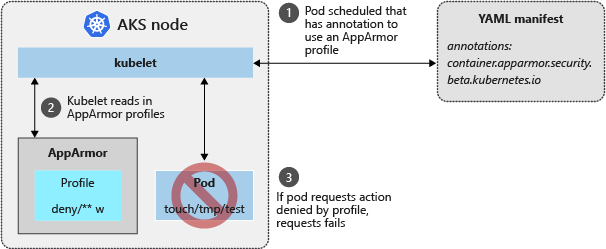

<h5 align="center">工作流程</h5>

## 3.3 Seccomp 限制容器进程系统调用

对于 Linux 来说，用户层一切资源相关操作都需要通过系统调用来完成；系统调用实现技术层次上解耦，内核只关心系统调用 API 的实现，而不必关心谁调用的。

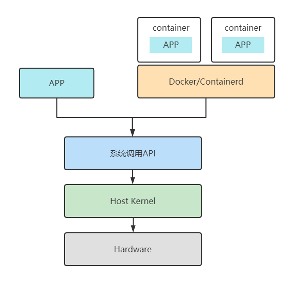

<h5 align="center">调用关系图</h5>

**Seccomp（Secure computing mode）** 是一个 Linux 内核安全模块，可用于应用进程允许使用的系统调用。

容器实际上是宿主机上运行的一个进程，共享宿主机内核，如果所有容器都具有任何系统调用的能力，那么容器如果被入侵，就很轻松绕过容器隔离更改宿主机系统权限或者进入宿主机。这就可以使用Seccomp机制限制容器系统调用，有效减少攻击面。

Linux发行版内置：CentOS、Ubuntu。

Seccomp 在Kubernetes 1.3 版本引入，在 1.19 版本成为 GA 版本，因此 K8s 中使用 Seccomp 可以通过以下两种方式：

- 1.19 版本之前

  ```yaml
  annotations:
    seccomp.security.alpha.kubernetes.io/pod: "localhost/<profile>"
  ```

- 1.19 版本+

  ```yaml
  apiVersion: v1
  kind: Pod
  metadata:
    name: hello-seccomp
  spec:
    securityContext:
    seccompProfile:
      type: Localhost
      # Pod 所在宿主机上策略文件名，默认目录：/var/lib/kubelet/seccomp
      localhostProfile: <profile>
    containers:
  ...
  ```

示例：禁止容器使用 chmod

```shell
mkdir /var/lib/kubelet/seccomp
vi /var/lib/kubelet/seccomp/chmod.json
{
  "defaultAction": "SCMP_ACT_ALLOW",
  "syscalls": [
    {
      "names": [
        "chmod"
      ],
      "action": "SCMP_ACT_ERRNO"
    }
  ]
}
```

**seccomp 基本配置文件包括三个元素：** 

- defaultAction：在 syscalls 部分未定义的任何系统调用默认动作为允许

- syscalls

  - names 系统调用名称，可以换行写多个

  - SCMP_ACT_ERRNO 阻止系统调用

大多数容器运行时都提供一组允许或不允许的默认系统调用。通过使用 runtime/default 注释 或将 Pod 或容器的安全上下文中的 seccomp 类型设置为 RuntimeDefault，可以轻松地在 Kubernetes 中应用默认值。

Docker 默认配置说明：https://docs.docker.com/engine/security/seccomp/

## 3.4 课后作业

1、在工作节点上加载课堂上讲解的 apparmor 策略文件 k8s-deny-write，并在 Pod 中应用该策略；

2、在工作节点上加载课堂上讲解的 seccomp 文件，禁止容器里使用 chmod 命令，并在 Pod 中应用该策略。

# 4 最小化微服务漏洞

## 4.1 Pod 安全上下文

**安全上下文（Security Context）：** K8s 对 Pod 和容器提供的安全机制，可以设置 Pod 特权和访问控制。

**安全上下文限制维度：**

- 自主访问控制（Discretionary Access Control）：基于用户 ID（UID）和组 ID（GID），来判定对对象（例如文件）的访问权限；
- 安全性增强的 Linux（SELinux）： 为对象赋予安全性标签；
- 以特权模式或者非特权模式运行；
- Linux Capabilities: 为进程赋予 root 用户的部分特权而非全部特权；
- AppArmor：定义 Pod 使用 AppArmor 限制容器对资源访问限制；
- Seccomp：定义 Pod 使用 Seccomp 限制容器进程的系统调用；
- AllowPrivilegeEscalation： 禁止容器中进程（通过 SetUID 或 SetGID 文件模式）获得特权提升。当容器以特权模式运行或者具有 CAP_SYS_ADMIN 能力时，AllowPrivilegeEscalation 总为 True；
- readOnlyRootFilesystem：以只读方式加载容器的根文件系统。

**案例 1：设置容器以普通用户运行**

背景：容器中的应用程序默认以root账号运行的，这个root与宿主机root账号是相同的，拥有大部分对Linux内核的系统调用权限，这样是不安全的，所以我们应该将容器以普通用户运行，减少应用程序对权限的使用。

可以通过两种方法设置普通用户：

- Dockerfile 里使用 USER 指定运行用户
- K8s 里指定 spec.securityContext.runAsUser，指定容器默认用户 UID

```yaml
spec:
  securityContext:
    runAsUser: 1000 # 镜像里必须有这个用户UID
    fsGroup: 1000 # 数据卷挂载后的目录属组设置为该组
  containers:
  - image: lizhenliang/flask-demo:root
    name: web
    securityContext:
      allowPrivilegeEscalation: false # 不允许提权
```

**案例2：避免使用特权容器**

背景：容器中有些应用程序可能需要访问宿主机设备、修改内核等需求，在默认情况下，容器没这个有这个能力，因此这时会考虑给容器设置特权模式。

启用特权模式：

```yaml
containers:
  - image: lizhenliang/flask-demo:root
    name: web
    securityContext:
      privileged: true
```

启用特权模式就意味着，你要为容器提供了访问 Linux 内核的所有能力，这是很危险的，为了减少系统调用的供给，可以使用 Capabilities 为容器赋予仅所需的能力。

**Linux Capabilities：** Capabilities 是一个内核级别的权限，它允许对内核调用权限进行更细粒度的控制，而不是简单地以 root 身份能力授权。

Capabilities 包括更改文件权限、控制网络子系统和执行系统管理等功能。在 securityContext 中，可以添加或删除 Capabilities，做到容器精细化权限控制。

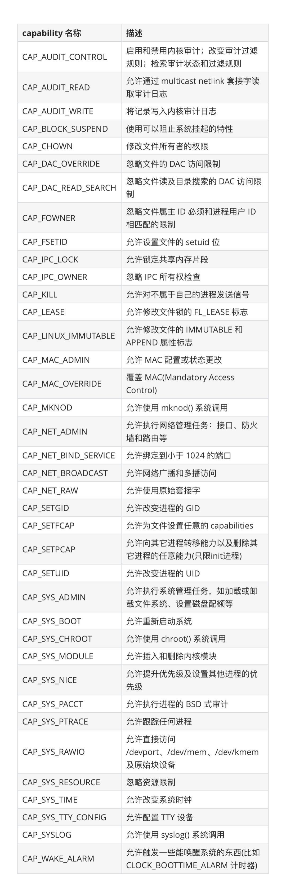

示例 1：容器默认没有挂载文件系统能力，添加 SYS_ADMIN 增加这个能力。

```yaml
apiVersion: v1
kind: Pod
metadata:
  name: cap-pod 
spec:
  containers:
  - image: busybox
    name: test
    command: 
    - sleep
    - 24h
    securityContext:
      capabilities:
        add: ["SYS_ADMIN"]
```

案例 2：只读挂载容器文件系统，防止恶意二进制文件创建。

```yaml
apiVersion: v1
kind: Pod
metadata:
  name: cap-pod
spec:
  containers:
  - image: busybox
    name: test
    command: 
    - sleep
    - 24h
    securityContext:
      readOnlyRootFilesystem: true
```

## 4.2 Pod 安全策略

**PodSecurityPolicy（简称 PSP）：** Kubernetes 中 Pod 部署时重要的安全校验手段，能够有效地约束应用运行时行为安全。使用 PSP 对象定义一组 Pod 在运行时必须遵循的条件及相关字段的默认值，只有 Pod 满足这些条件才会被 K8s 接受。

Pod 安全策略限制维度：

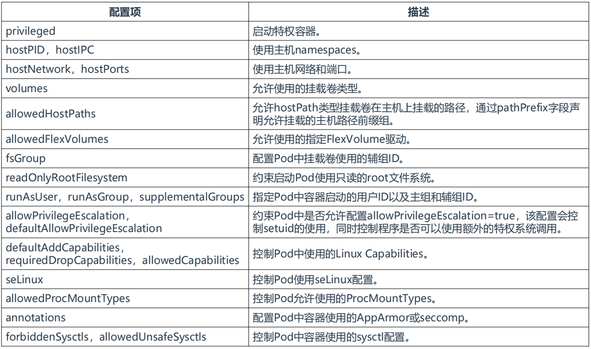

Pod 安全策略实现为一个准入控制器，默认没有启用，当启用后会强制实施 Pod 安全策略，没有满足的 Pod 将无法创建。因此，建议在启用 PSP 之前先添加策略并对其授权。

启用 Pod 安全策略：

```shell
vi /etc/kubernetes/manifests/kube-apiserver.yaml
...
- --enable-admission-plugins=NodeRestriction,PodSecurityPolicy
...
systemctl restart kubelet
```

下图所示，用户使用SA （ServiceAccount）创建了一个 Pod，K8s 会先验证这个 SA 是否可以访问 PSP 资源权限，如果可以访问，会进一步验证 Pod 配置是否满足 PSP 规则，如果不满足会拒绝部署。因此，需要实施需要有这几点：

- 创建 SA 服务账号
- 创建 Role 并绑定 SA
- 还需要创建一个 Role 使用 PSP 资源权限，再绑定 SA

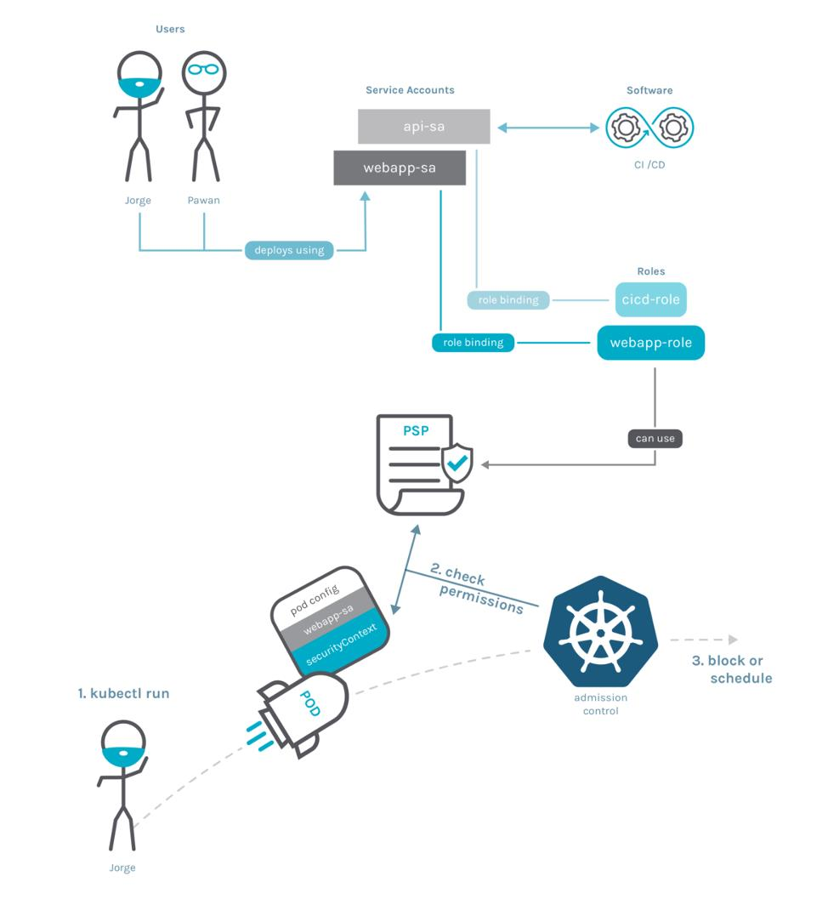

<h5 align="center">PSP 工作流程</h5>

示例 1：禁止创建特权模式的 Pod

```yaml
apiVersion: policy/v1beta1
kind: PodSecurityPolicy
metadata:
  name: psp-example
spec:
  privileged: false # 不允许特权Pod
  # 下面是一些必要的字段
  seLinux:
    rule: RunAsAny
  supplementalGroups:
    rule: RunAsAny
  runAsUser:
    rule: RunAsAny 
  fsGroup:
    rule: RunAsAny
  volumes:
  - '*'
```

```shell
# 创建SA
kubectl create serviceaccount aliang
# 将SA绑定到系统内置Role
kubectl create rolebinding aliang --clusterrole=edit --serviceaccount=default:aliang
# 创建使用PSP权限的Role
kubectl create role psp:unprivileged --verb=use --resource=podsecuritypolicy --resource-name=psp-example
# 将SA绑定到Role
kubectl create rolebinding aliang:psp:unprivileged --role=psp:unprivileged --serviceaccount=default:aliang
```

示例 2：禁止没指定普通用户运行的容器（runAsUser）

```yaml
apiVersion: policy/v1beta1
kind: PodSecurityPolicy
metadata:
  name: psp-example
spec:
  privileged: false # 不允许特权Pod
  # 下面是一些必要的字段
  seLinux:
    rule: RunAsAny
  supplementalGroups:
    rule: RunAsAny
  runAsUser:
    rule: MustRunAsNonRoot 
  fsGroup:
    rule: RunAsAny
  volumes:
  - '*'
```

## 4.3 OPA Gatekeeper

### 4.3.1 OPA 策略引擎介绍

PSP 不足与状况：

- 将在 1.21 版本弃用 PSP，在 1.25 版本删除 PSP
- 仅支持 Pod 策略
- 使用复杂，权限模型存在缺陷，控制不明确

弃用文章：https://kubernetes.io/blog/2021/04/06/podsecuritypolicy-deprecation-past-present-and-future/

替代提案：https://github.com/kubernetes/enhancements/issues/2579

**OPA（Open Policy Agent）：** 是一个开源的、通用策略引擎，可以将策略编写为代码。提供一个种高级声明性语言 -Rego 来编写策略，并把决策这一步骤从复杂的业务逻辑中解耦出来。OPA 可以用来做什么？

- 拒绝不符合条件的 YAML 部署
- 允许使用哪些仓库中的镜像
- 允许在哪个时间段访问系统
- 等......

### 4.3.2 OPA Gatekeeper 策略引擎

Gatekeeper 是基于 OPA 的一个 Kubernetes 策略解决方案，可替代 PSP 或者部分 RBAC 功能。 

- OPA 官网：https://www.openpolicyagent.org/
- Gatekeeper 项目：https://github.com/open-policy-agent/gatekeeper
- Gatekeeper 文档：https://open-policy-agent.github.io/gatekeeper/website/docs/howto/

当在集群中部署了 Gatekeeper 组件，APIServer 所有的创建、更新或者删除操作都会触发 Gatekeeper 来处理，如果不满足策略则拒绝。

**部署 Gatekeeper：**

```shell
kubectl apply -f https://raw.githubusercontent.com/open-policy-agent/gatekeeper/release-3.7/deploy/gatekeeper.yaml
```

Gatekeeper 的策略由两个资源对象组成：

- Template：策略逻辑实现的地方，使用 rego 语言
- Contsraint：负责 Kubernetes 资源对象的过滤或者为 Template 提供输入参数

案例 1：禁止容器启用特权

模板：

```yaml
apiVersion: templates.gatekeeper.sh/v1beta1
kind: ConstraintTemplate
metadata:
  name: privileged 
spec:
  crd:
    spec:
      names:
        kind: privileged
  targets:
  - target: admission.k8s.gatekeeper.sh
    rego: |
      package admission
      violation[{"msg": msg}] { # 如果violation为true（表达式通过）说明违反约束
        containers = input.review.object.spec.template.spec.containers
        c_name := containers[0].name
        containers[0].securityContext.privileged # 如果返回true，说明违反约束
        msg := sprintf("提示：'%v'容器禁止启用特权！",[c_name])
      }

# 查看资源
kubectl get ConstraintTemplate
```

约束：

```yaml
apiVersion: constraints.gatekeeper.sh/v1beta1
kind: privileged
metadata:
  name: privileged
spec:
  match: # 匹配的资源
    kinds:
    - apiGroups: ["apps"]
      kinds:
      - "Deployment"
      - "DaemonSet"
      - "StatefulSet“

# 查看资源
kubectl get constraints
```

案例 2：只允许使用特定的镜像仓库

模板：

```yaml
apiVersion: templates.gatekeeper.sh/v1beta1
kind: ConstraintTemplate
metadata:
  name: image-check
spec:
  crd:
    spec:
      names:
        kind: image-check
      validation:
        openAPIV3Schema: 
          properties: # 需要满足条件的参数
            prefix:
              type: string
  targets:
  - target: admission.k8s.gatekeeper.sh
    rego: |
      package image
      violation[{"msg": msg}] { 
        containers = input.review.object.spec.template.spec.containers
        image := containers[0].image
        not startswith(image, input.parameters.prefix) 
        # 镜像地址开头不匹配并取反则为true，说明违反约束
        msg := sprintf("提示：'%v'镜像地址不在可信任仓库！", [image])
      }
```

约束：

```yaml
apiVersion: constraints.gatekeeper.sh/v1beta1
kind: image-check
metadata:
  name: image-check
spec:
  match:
    kinds:
    - apiGroups: ["apps"] 
      kinds:
      - "Deployment"
      - "DaemonSet"
      - "StatefulSet"
  parameters: # 传递给opa的参数
    prefix: "lizhenliang/"
```

## 4.4 Secret 存储敏感数据

Secret 是一个用于存储敏感数据的资源，所有的数据要经过 base64 编码，数据实际会存储在 K8s 中 Etcd，然后通过创建 Pod 时引用该数据。

应用场景：凭据。

Pod 使用 secret 数据有两种方式：

- 变量注入

- 数据卷挂载

kubectl create secret 支持三种数据类型：

- docker-registry：存储镜像仓库认证信息

- generic：从文件、目录或者字符串创建，例如存储用户名密码

- tls：存储证书，例如 HTTPS 证书

示例：将 Mysql 用户密码保存到 Secret 中存储。

```yaml
apiVersion: v1
kind: Secret
metadata:
  name: mysql
type: Opaque
data:
  mysql-root-password: "MTIzNDU2"
---
apiVersion: apps/v1
kind: Deployment
metadata:
  name: mysql
spec:
  selector:
    matchLabels:
      app: mysql
  template:
    metadata:
      labels:
        app: mysql
    spec:
      containers:
      - name: db
        image: mysql:5.7.30
        env:
        - name: MYSQL_ROOT_PASSWORD
          valueFrom:
            secretKeyRef:
              name: mysql
              key: mysql-root-password
```

## 4.5 安全沙箱运行容器

### 4.5.1 gVisor 介绍


所知，容器的应用程序可以直接访问 Linux 内核的系统调用，容器在安全隔离上还是比较弱，虽然内核在不断地增强自身的安全特性，但由于内核自身代码极端复杂，CVE 漏洞层出不穷。所以要想减少这方面安全风险，就是做好安全隔离，阻断容器内程序对物理机内核的依赖。Google 开源的一种 gVisor 容器沙箱技术就是采用这种思路 gVisor 隔离容器内应用和内核之间访问，提供了大部分 Linux 内核的系统调用，巧妙的将容器内进程的系统调用转化为对 gVisor 的访问。

gVisor 兼容 OCI，与 Docker 和 K8s 无缝集成，很方面使用。

项目地址：https://github.com/google/gvisor

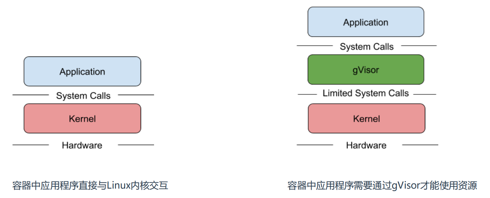

### 4.5.2 gVisor 架构

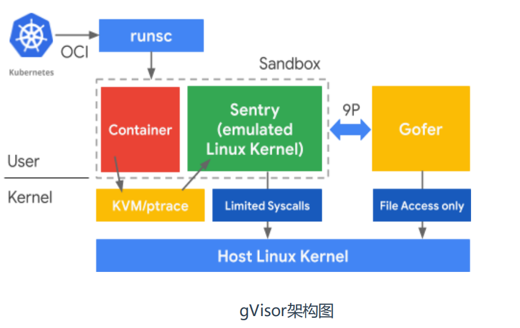

gVisor 由 3 个组件构成： 

- Runsc 是一种 Runtime 引擎，负责容器的创建与销毁。 

- Sentry 负责容器内程序的系统调用处理。
- Gofer 负责文件系统的操作代理，IO 请求都会由它转接到 Host 上。

### 4.5.3 gVisor 与 Docker 集成

gVisor 内核要求：Linux 3.17+

如果用的是 CentOS7 则需要升级内核，Ubuntu 不需要。

CentOS7内核升级步骤：

```shell
rpm --import https://www.elrepo.org/RPM-GPG-KEY-elrepo.org
rpm -Uvh http://www.elrepo.org/elrepo-release-7.0-2.el7.elrepo.noarch.rpm
yum --enablerepo=elrepo-kernel install kernel-ml-devel kernel-ml –y
grub2-set-default 0
reboot
uname -r
```

1、准备 gVisor 二进制文件

```shell
sha512sum -c runsc.sha512
rm -f *.sha512
chmod a+x runsc
mv runsc /usr/local/bin
```

2、Docker 配置使用 gVisor

```shell
runsc install    # 查看加的配置/etc/docker/daemon.json
systemctl restart docker
```

参考文档：https://gvisor.dev/docs/user_guide/install/

使用 runsc 运行容器：

```shell
docker run -d --runtime=runsc nginx
```

使用 dmesg 验证：

```shell
docker run --runtime=runsc -it nginx dmesg
```

已经测试过的应用和工具：https://gvisor.dev/docs/user_guide/compatibility/

### 4.5.4 gVisor 与 Containerd 集成

切换 Containerd 容器引擎：

1、准备配置

```shell
cat > /etc/sysctl.d/99-kubernetes-cri.conf << EOF
net.bridge.bridge-nf-call-iptables = 1
net.ipv4.ip_forward = 1
net.bridge.bridge-nf-call-ip6tables = 1
EOF
sysctl -system
```

2、安装

```shell
cd /etc/yum.repos.d
wget http://mirrors.aliyun.com/dockerce/linux/centos/docker-ce.repo
yum install -y containerd.io
```

3、修改配置文件

- pause 镜像地址
- Cgroup 驱动改为 systemd
- 增加 runsc 容器运行时
- 配置 docker 镜像加速器

```shell
mkdir -p /etc/containerd
containerd config default > /etc/containerd/config.toml

vi /etc/containerd/config.toml
...
[plugins."io.containerd.grpc.v1.cri"]
  sandbox_image = "registry.aliyuncs.com/google_containers/pause:3.2" 
      ...
    [plugins."io.containerd.grpc.v1.cri".containerd.runtimes.runc.options]
        SystemdCgroup = true
        ...
      [plugins."io.containerd.grpc.v1.cri".containerd.runtimes.runsc]
        runtime_type = "io.containerd.runsc.v1"
    [plugins."io.containerd.grpc.v1.cri".registry.mirrors."docker.io"]
      endpoint = ["https://b9pmyelo.mirror.aliyuncs.com"]
    ...

systemctl restart containerd
```

4、配置 kubelet 使用 containerd

```shell
vi /etc/sysconfig/kubelet 
KUBELET_EXTRA_ARGS=--container-runtime=remote --container-runtimeendpoint=unix:///run/containerd/containerd.sock --cgroup-driver=systemd
systemctl restart kubelet
```

5、验证

```shell
kubectl get node -o wide
```

containerd 也有 ctr 管理工具，但功能比较简单，一般使用 crictl 工具检查和调试容器。

项目地址：https://github.com/kubernetes-sigs/cri-tools/

准备 crictl 连接 containerd 配置文件：

```shell
cat > /etc/crictl.yaml << EOF
runtime-endpoint: unix:///run/containerd/containerd.sock
EOF
```

下面是 docker 与 crictl 命令对照表：

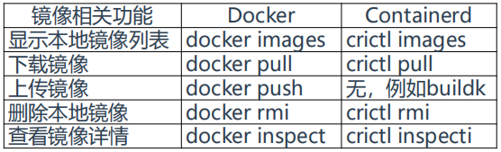

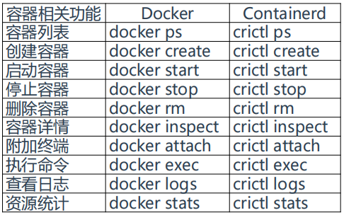

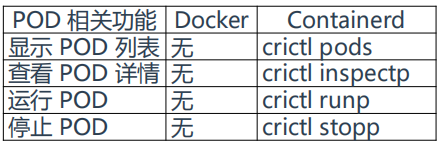

### 4.5.5 K8s 使用 gVisor 运行容器

**RuntimeClass** 是一个用于选择容器运行时配置的特性，容器运行时配置用于运行 Pod 中的容器。

创建 RuntimeClass：

```yaml
apiVersion: node.k8s.io/v1 # RuntimeClass 定义于 node.k8s.io API 组
kind: RuntimeClass
metadata:
  name: gvisor # 用来引用 RuntimeClass 的名字
handler: runsc # 对应的 CRI 配置的名称
```

创建 Pod 测试 gVisor：

```yaml
apiVersion: v1
kind: Pod
metadata:
  name: nginx-gvisor
spec:
  runtimeClassName: gvisor
  containers:
  - name: nginx
    image: nginx

kubectl get pod nginx-gvisor -o wide
kubectl exec nginx-gvisor -- dmesg
```

## 4.6 课后作业

1、创建一个 PSP 策略，防止创建特权 Pod，再创建一个 ServiceAccount，使用 `kubectl –as` 验证 PSP 策略效果；

2、使用 containerd 作为容器运行时，准备好 gVisor，创建一个 RuntimeClass，创建一个 Pod 在 gVisor 上运行。

# 5 供应链安全

## 5.1 可信任软件供应链概述

**可信任软件供应链：** 指在建设基础架构过程中，涉及的软件都是可信任的。

在 K8s 领域可信软件供应链主要是指镜像，因为一些软件交付物都是镜像，部署的最小载体。

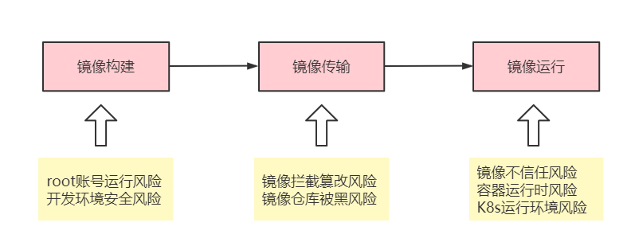

## 5.2 构建镜像 Dockerfile 文件优化

- **减少镜像层：** 一次 RUN 指令形成新的一层，尽量 Shell 命令都写在一行，减少镜像层；
- **清理无用文件：** 清理对应的残留数据，例如 yum 缓存；
- **清理无用的软件包：** 基础镜像默认会带一些 debug 工具，可以删除掉，仅保留应用程序所需软件，防止黑客利用；
- **选择最小的基础镜像：** 例如 alpine；
- **使用非 root 用户运行：** USER 指令指定普通用户。

示例：构建python web镜像

```shell
FROM python
RUN useradd python
RUN mkdir /data/www -p
COPY . /data/www
RUN chown -R python /data
RUN pip install flask -i https://mirrors.aliyun.com/pypi/simple/
WORKDIR /data/www
USER python
CMD python main.py
```

## 5.3 镜像漏洞扫描工具 Trivy

**Trivy：** 是一种用于容器镜像、文件系统、Git 仓库的漏洞扫描工具。发现目标软件存在的漏洞。

Trivy 易于使用，只需安装二进制文件即可进行扫描，方便集成 CI 系统。

项目地址：https://github.com/aquasecurity/trivy


示例：

```shell
# 容器镜像扫描
trivy image nginx
trivy image -i nginx.tar
# 打印指定（高危、严重）漏洞信息
trivy image -s HIGH nginx
trivy image -s HIGH, CRITICAL nginx
# JSON格式输出并保存到文件
trivy image nginx -f json -o /root/output.json
```

## 5.4 检查 YAML 文件安全配置工具 kubesec

**kubesec：** 是一个针对 K8s 资源清单文件进行安全配置评估的工具，根据安全配置最佳实践来验证并给出建议。

官网：https://kubesec.io

项目地址：https://github.com/controlplaneio/kubesec

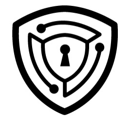

示例：

```shell
kubesec scan deployment.yaml
```

或者使用容器环境执行检查

```shell
docker run -i kubesec/kubesec scan /dev/stdin < deployment.yaml
```

**kubesec 内置一个 HTTP 服务器，可以直接启用，远程调用。**

- 二进制

  ```shell
  kubesec http 8080 &
  ```

- Docker容器

  ```shell
  docker run -d -p 8080:8080 kubesec/kubesec http 8080
  ```

示例：

```shell
curl -sSX POST --data-binary @deployment.yaml http://192.168.31.71:8080/scan
```

## 5.5 准入控制器 Admission Webhook

**Admission Webhook：** 准入控制器 Webhook 是准入控制插件的一种，用于拦截所有向 APISERVER 发送的请求，并且可以修改请求或拒绝请求。

Admission webhook 为开发者提供了非常灵活的插件模式，在 kubernetes 资源持久化之前，管理员通过程序可以对指定资源做校验、修改等操作。例如为资源自动打标签、pod 设置默认 SA，自动注入 sidecar 容器等。

相关 Webhook 准入控制器：

- MutatingAdmissionWebhook：修改资源，理论上可以监听并修改任何经过 ApiServer 处理的请求

- ValidatingAdmissionWebhook：验证资源

- ImagePolicyWebhook：镜像策略，主要验证镜像字段是否满足条件

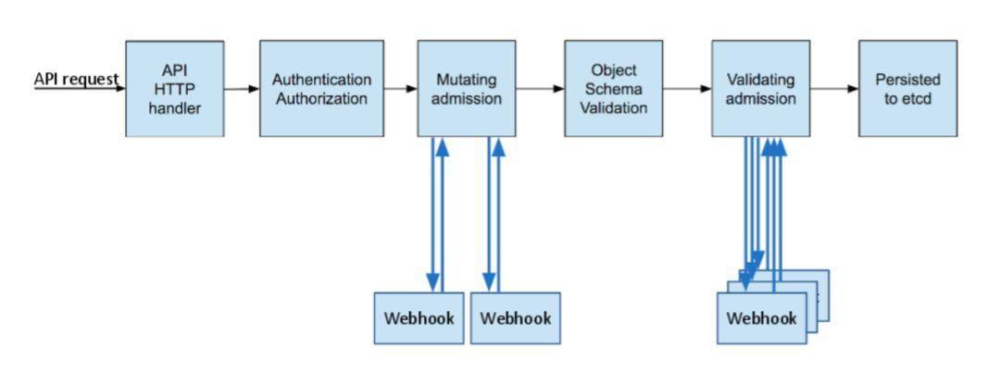

## 5.6 准入控制器 ImagePolicyWebhook

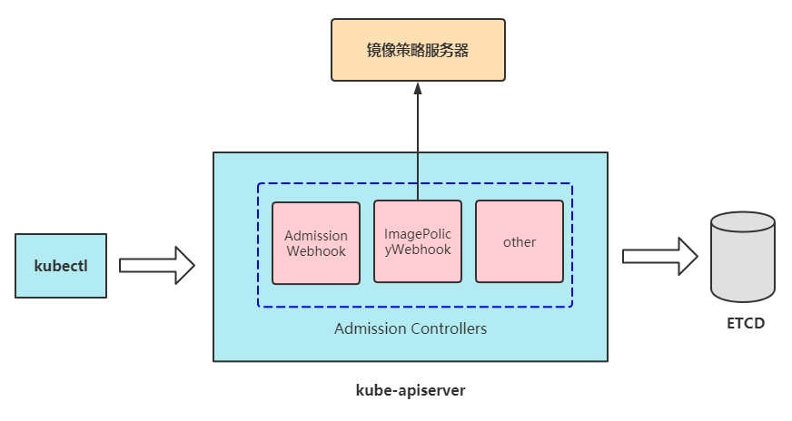

<h5 align="center">工作流程图</h5>

1、启用准入控制插件

```shell
--enable-admission-plugins=NodeRestriction,ImagePolicyWebhook
--admission-control-config-file=/etc/kubernetes/image-policy/admission_configuration.yaml
# 并使用 hostpath 数据卷将宿主机 /etc/kubernetes/image-policy 目录挂载到容器中
```

2、准备配置文件

```yaml
# /etc/kubernetes/image-policy/admission_configuration.yaml
apiVersion: apiserver.config.k8s.io/v1
kind: AdmissionConfiguration
plugins:
- name: ImagePolicyWebhook
  configuration:
    imagePolicy:
      kubeConfigFile: /etc/kubernetes/image-policy/connect_webhook.yaml # 连接镜像策略服务器配置文件
      allowTTL: 50 # 控制批准请求的缓存时间，单位秒
      denyTTL: 50 # 控制拒绝请求的缓存时间，单位秒
      retryBackoff: 500 # 控制重试间隔，单位毫秒
      defaultAllow: true # 确定webhook后端失效时的行为
```

```yaml
apiVersion: v1
kind: Config
clusters:
- cluster:
    certificate-authority: /etc/kubernetes/image-policy/webhook.pem # 数字证书，用于验证远程服务
    server: https://192.168.31.73:8080/image_policy # 镜像策略服务器地址，必须是https
  name: webhook
contexts:
- context:
    cluster: webhook
    user: apiserver
  name: webhook
current-context: webhook 
preferences: {}
users:
- name: apiserver
  user:
    client-certificate: /etc/kubernetes/image-policy/apiserver-client.pem # webhook准入控制器使用的证书
client-key: /etc/kubernetes/image-policy/apiserver-client-key.pem # 对应私钥证书
```

注：涉及的证书文件，下一步生成，拷贝到该文件中对应路径

3、部署镜像服务器

自己用 python 开发一个简单的 webhook 端点服务器，作用是拒绝部署的镜像乜有指定标签（即latest）。

  3.1 自签HTTPS证书

  3.2 Docker 容器启动镜像策略服务

  ```shell
  docker run -d -u root --name=image-policy-webhook \ -v $PWD/webhook.pem:/data/www/webhook.pem \ -v $PWD/webhook-key.pem:/data/www/webhook-key.pem \ -e PYTHONUNBUFFERED=1 -p 8080:8080 \
  lizhenliang/image-policy-webhook
  ```

4、测试

```shell
kubectl create deployment web1 --image=nginx:1.16
kubectl create deployment web2 --image=nginx
```

# 6 监控、审计和运行时安全

## 6.1 分析容器系统调用 Sysdig

Sysdig：一个非常强大的系统监控、分析和故障排查工具。汇聚 strace+tcpdump+htop+iftop+lsof 工具功能于一身！

sysdig 除了能获取系统资源利用率、进程、网络连接、系统调用等信息，还具备了很强的分析能力，例如：

- 按照CPU使用率对进程排序
- 按照数据包对进程排序
- 打开最多的文件描述符进程
- 查看进程打开了哪些文件
- 查看进程的HTTP请求报文
- 查看机器上容器列表及资源使用情况

项目地址：https://github.com/draios/sysdig

文档：https://github.com/draios/sysdig/wiki

sysdig 通过在内核的驱动模块注册系统调用的 hook，这样当有系统调用发生和完成的时候，它会把系统调用信息拷贝到特定的 buffer，然后用户态组件对数据信息处理（解压、解析、过滤等），并最终通过 sysdig 命令行和用户进行交互。

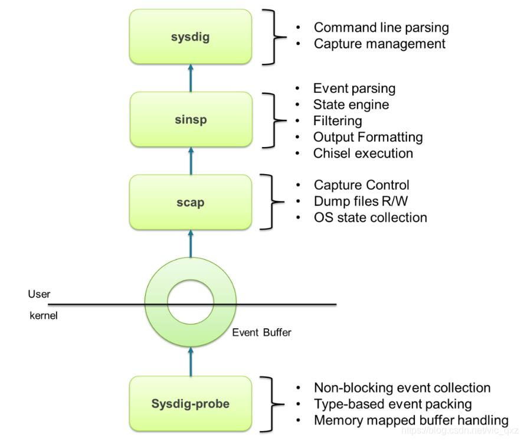

安装 sysdig：

```shell
rpm --import https://s3.amazonaws.com/download.draios.com/DRAIOS-GPG-KEY.public 
curl -s -o /etc/yum.repos.d/draios.repo https://s3.amazonaws.com/download.draios.com/stable/rpm/draios.repo
yum install epel-release -y
yum install sysdig -y /usr/bin/sysdig-probe-loader    # 加载驱动模块
```

**sysdig 常用参数：**

- -l, --list：列出可用于过滤和输出的字段
- -M <num_seconds> ：多少秒后停止收集
- -p <output_format>, --print=<output_format> ：指定打印事件时使用的格式
- 使用 -pc 或 -pcontainer 容器友好的格式
- 使用 -pk 或 -pkubernetes k8s 友好的格式
- -c <chiselname> <chiselargs>：指定内置工具，可直接完成具体的数据聚合、分析工作
- -w <filename>：保存到文件中
- -r <filename>：从文件中读取

执行 sysdig 命令，实时输出大量系统调用。示例：`59509 23:59:19.023099531 0 kubelet (1738) < epoll_ctl`。

格式：`%evt.num %evt.outputtime %evt.cpu %proc.name (%thread.tid) %evt.dir %evt.type %evt.info`。

- evt.num： 递增的事件号
- evt.time： 事件发生的时间
- evt.cpu： 事件被捕获时所在的 CPU，也就是系统调用是在哪个 CPU 执行的
- proc.name： 生成事件的进程名字
- thread.tid： 线程的 id，如果是单线程的程序，这也是进程的 pid
- evt.dir： 事件的方向（direction），> 代表进入事件，< 代表退出事件
- evt.type： 事件的名称，比如 open、stat等，一般是系统调用
- evt.args： 事件的参数。如果是系统调用，这些对应着系统调用的参数

自定义格式输出：`sysdig -p "user:%user.name time:%evt.time proc_name:%proc.name"`

**sysdig 过滤：**

- fd：根据文件描述符过滤，比如 fd 标号（fd.num）、fd 名字（fd.name） 
- process：根据进程信息过滤，比如进程 id（proc.id）、进程名（proc.name） 
- evt：根据事件信息过滤，比如事件编号、事件名
- user：根据用户信息过滤，比如用户 id、用户名、用户 home 目录
- syslog：根据系统日志过滤，比如日志的严重程度、日志的内容
- container：根据容器信息过滤，比如容器ID、容器名称、容器镜像

查看完整过滤器列表：`sysdig -l`

**示例：**

1、查看一个进程的系统调用

```shell
sysdig proc.name=kubelet
```

2、查看建立TCP连接的事件

```shell
sysdig evt.type=accept
```

3、查看/etc目录下打开的文件描述符

```shell
sysdig fd.name contains /etc
```

4、查看容器的系统调用

```shell
sysdig -M 10 container.name=web
```

注：还支持运算操作符，=、!=、>=、>、<、<=、contains、in 、exists、and、or、not。

**Chisels：**实用的工具箱，一组预定义的功能集合，用来分析特定的场景。

**sysdig –cl** 列出所有 Chisels，以下是一些常用的：

- topprocs_cpu：输出按照 CPU 使用率排序的进程列表，例如 sysdig -c 
- topprocs_net：输出进程使用网络 TOP
- topprocs_file：进程读写磁盘文件 TOP
- topfiles_bytes：读写磁盘文件 TOP
- netstat：列出网络的连接情况

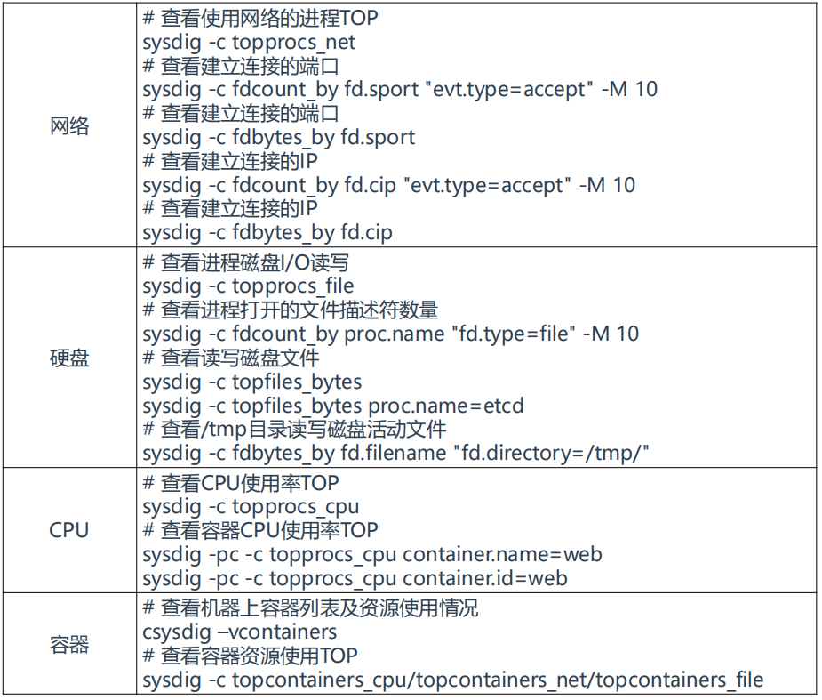

其他常用命令：

`sysdig -c netstat`

`sysdig -c ps`

`sysdig -c lsof`

## 6.2 监控容器运行时 Falco

Falco 是一个 Linux 安全工具，它使用系统调用来保护和监控系统。

Falco 最初是由 Sysdig 开发的，后来加入 CNCF 孵化器，成为首个加入 CNCF 的运行时安全项目。

Falco 提供了一组默认规则，可以监控内核态的异常行为，例如：

- 对于系统目录/etc, /usr/bin, /usr/sbin的读写行为
- 文件所有权、访问权限的变更
- 从容器打开shell会话
- 容器生成新进程
- 特权容器启动

项目地址：https://github.com/falcosecurity/falco

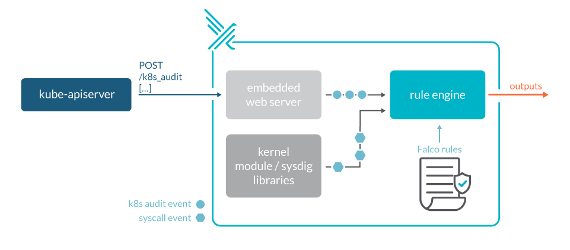

<h5 align="center">Falco 架构</h5>

安装 falco：

```shell
rpm --import https://falco.org/repo/falcosecurity-3672BA8F.asc
curl -s -o /etc/yum.repos.d/falcosecurity.repo https://falco.org/repo/falcosecurity-rpm.repo
yum install epel-release -y
yum update
yum install falco -y
systemctl start falco
systemctl enable falco
```

falco 配置文件目录：`/etc/falco`

- falco.yaml falco 配置与输出告警通知方式
- falco_rules.yaml 规则文件，默认已经定义很多威胁场景
- falco_rules.local.yaml 自定义扩展规则文件
- k8s_audit_rules.yaml K8s 审计日志规则

安装文档：https://falco.org/zh/docs/installation

告警规则示例（falco_rules.local.yaml）：

```yaml
- rule: The program "sudo" is run in a container
  desc: An event will trigger every time you run sudo in a container
  condition: evt.type = execve and evt.dir=< and container.id != host and proc.name = sudo
  output: "Sudo run in container (user=%user.name %container.info parent=%proc.pname 
cmdline=%proc.cmdline)"
  priority: ERROR
  tags: [users, container]
```

参数说明：

- rule：规则名称，唯一
- desc：规则的描述
- condition： 条件表达式
- output：符合条件事件的输出格式
- priority：告警的优先级
- tags：本条规则的 tags 分类

**威胁场景测试：**

1、监控系统二进制文件目录读写（默认规则）

2、监控根目录或者/root目录写入文件（默认规则）

3、监控运行交互式Shell的容器（默认规则）

4、监控容器创建的不可信任进程（自定义规则）

验证：`tail -f /var/log/messages`（告警通知默认输出到标准输出和系统日志）

监控容器创建的不可信任进程规则，在 falco_rules.local.yaml 文件添加：

```yaml
- rule: Unauthorized process on nginx containers
  condition: spawned_process and container and container.image startswith nginx and not proc.name in (nginx)
  desc: test
  output: "Unauthorized process on nginx containers (user=%user.name container_name=%container.name 
container_id=%container.id image=%container.image.repository shell=%proc.name parent=%proc.pname 
cmdline=%proc.cmdline terminal=%proc.tty)"
  priority: WARNING
```

condition表达式解读：

- spawned_process 运行新进程
- container 容器
- container.image startswith nginx 以 nginx 开头的容器镜像
- not proc.name in (nginx) 不属于 nginx 的进程名称（允许进程名称列表）

重启 falco 应用新配置文件：

```shell
systemctl restart falco
```

**Falco 支持五种输出告警通知的方式：**

- 输出到标准输出（默认启用）
- 输出到文件
- 输出到 Syslog（默认启用）
- 输出到 HTTP 服务
- 输出到其他程序（命令行管道方式）

告警配置文件：`/etc/falco/falco.yaml`

例如输出到指定文件：

```yaml
file_output:
  enabled: true
  keep_alive: false
  filename: /var/log/falco_events.log
```

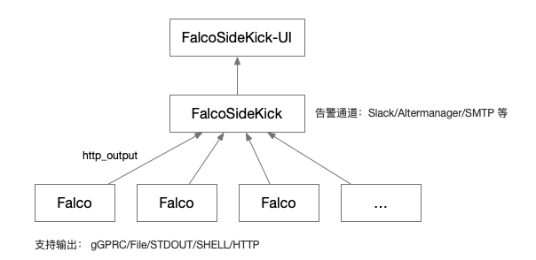

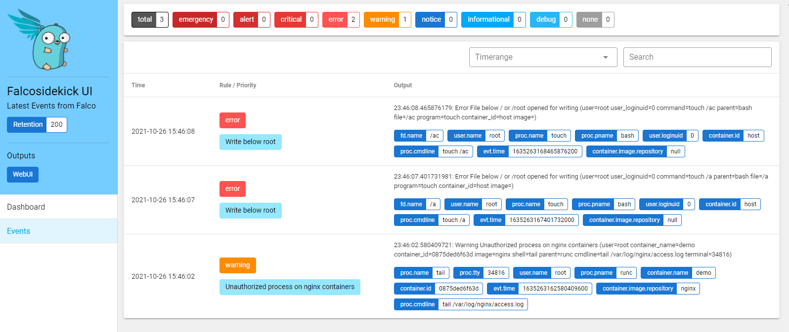

- FalcoSideKick：一个集中收集并指定输出，支持大量方式输出，例如 Influxdb、Elasticsearch 等。
  - 项目地址 https://github.com/falcosecurity/falcosidekick

- FalcoSideKick-UI：告警通知集中图形展示系统
  - 项目地址 https://github.com/falcosecurity/falcosidekick-ui

**部署 Falco UI：**

```shell
docker run -d \ -p 2801:2801 \
--name falcosidekick \ -e WEBUI_URL=http://192.168.31.71:2802 \
falcosecurity/falcosidekick

docker run -d \ -p 2802:2802 \
--name falcosidekick-ui \
falcosecurity/falcosidekick-ui
```

UI 访问地址：http://192.168.31.71:2802/ui/

**修改 falco 配置文件指定 http 方式输出：**

```shell
json_output: true
json_include_output_property: true
http_output:
  enabled: true
  url: "http://192.168.31.71:2801/"
```

## 6.3 Kubernetes 审计日志

在 Kubernetes 集群中，API Server 的审计日志记录了哪些用户、哪些服务请求操作集群资源，并且可以编写不同规则，控制忽略、存储的操作日志。

审计日志采用 JSON 格式输出，每条日志都包含丰富的元数据，例如请求的URL、HTTP 方法、客户端来源等，你可以使用监控服务来分析API流量，以检测趋势或可能存在的安全隐患。

这些可能服务会访问 API Server： 

- 管理节点（controller-manager、scheduler） 
- 工作节点（kubelet、kube-proxy） 
- 集群服务（CoreDNS、Calico、HPA等） 
- kubectl、API、Dashboard

**事件和阶段：**

当客户端向 API Server 发出请求时，该请求将经历一个或多个阶段：

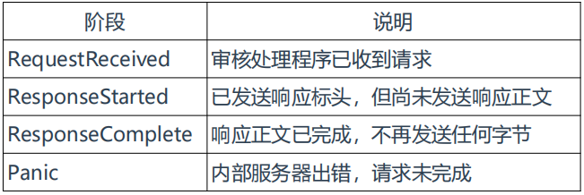

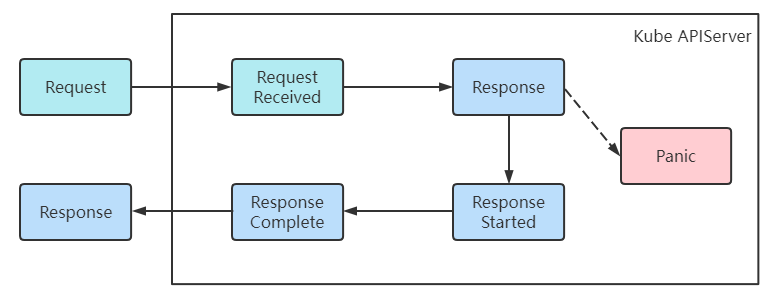

<h5 align="center">ApiServer 处理请求流程图</h5>

Kubernetes 审核策略文件包含一系列规则，描述了记录日志的级别，采集哪些日志，不采集哪些日志。

规则级别如下表所示：

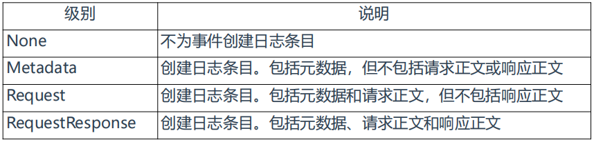

示例：

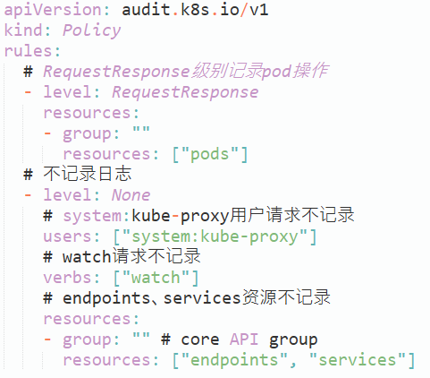

参考资料：https://kubernetes.io/zh/docs/tasks/debug-application-cluster/audit/

日志格式示例：

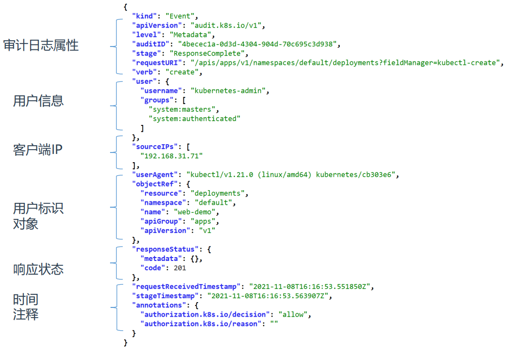

审计日志支持写入本地文件和 Webhook（发送到外部 HTTP API）两种方式。

启用审计日志功能：

```yaml
vi /etc/kubernetes/manifests/kube-apiserver.yaml
… 
  - --audit-policy-file=/etc/kubernetes/audit/audit-policy.yaml
  - --audit-log-path=/var/log/k8s_audit.log
  - --audit-log-maxage=30
  - --audit-log-maxbackup=10
  - --audit-log-maxsize=100
...
volumeMounts:
  ...
  - mountPath: /etc/kubernetes/audit/audit-policy.yaml
    name: audit
  - mountPath: /var/log/k8s_audit.log
    name: audit-log
  volumes:
  - name: audit
  hostPath:
    path: /etc/kubernetes/audit/audit-policy.yaml
    type: File
  - name: audit-log
  hostPath:
    path: /var/log/k8s_audit.log
    type: FileOrCreate
```

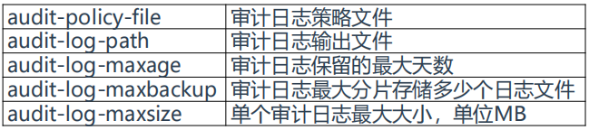

注：需要使用 hostpath 数据卷将宿主机策略文件和日志文件挂载到容器中。

示例：只记录指定资源操作日志

```yaml
apiVersion: audit.k8s.io/v1
kind: Policy
# 忽略步骤，不为RequestReceived阶段生成审计日志
omitStages:
  - "RequestReceived"
rules:
  # 不记录日志
  - level: None
  users:
    - system:apiserver
    - system:kube-controller-manager
    - system:kube-scheduler
    - system:kube-proxy
    - kubelet
  # 针对资源记录日志
  - level: Metadata
    resources: 
    - group: ""
      resources: ["pods"]
  # - group: "apps"
  # resources: ["deployments"]
  # 其他资源不记录日志
  - level: None
```

**收集审计日志方案：**

- 审计日志文件 + filebeat
- 审计 webhook + logstash
- 审计 webhook + falco